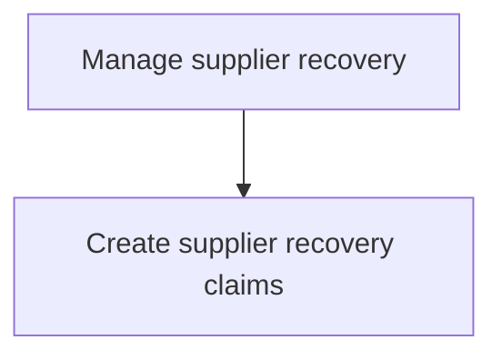
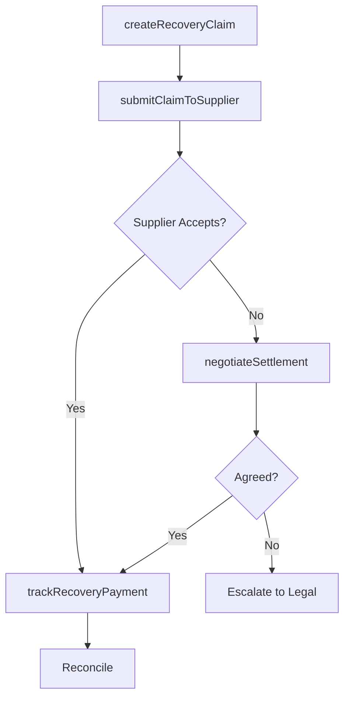

# Manage supplier recovery

> Business-as-Code definition for supplier warranty cost recovery. Models the creation, submission, negotiation, and settlement of recovery claims against suppliers responsible for product defects or warranty costs.

## Overview

Managing the process of recovering warranty-related costs from suppliers when product defects are attributed to supplied components or materials. This includes creating recovery claims, negotiating settlements, tracking payments, and reconciling recovered amounts against warranty expenditures.

## Process Hierarchy



## GraphDL

```yaml
manage:
  object: Supplier Recovery
  actor: SupplierRecoveryAnalyst
  result: RecoverySettlement
```

## Actions

| Action | Description |
|--------|-------------|
| createRecoveryClaim | Generate a cost recovery claim against a responsible supplier |
| submitClaimToSupplier | Send recovery claim documentation to the supplier for review |
| negotiateSettlement | Negotiate recovery amount and payment terms with supplier |
| trackRecoveryPayment | Monitor and record supplier recovery payments received |

## Events

| Event | Description |
|-------|-------------|
| recoveryClaimCreated | Supplier recovery claim generated with supporting evidence |
| claimSubmittedToSupplier | Recovery claim sent to supplier for adjudication |
| settlementNegotiated | Recovery amount and terms agreed upon with supplier |
| recoveryPaymentTracked | Supplier payment received and recorded |

## Searches

| Search | Description |
|--------|-------------|
| getRecoveryClaims | List recovery claims by supplier, status, or amount |
| getRecoveryPayments | Query payments received from suppliers by period |
| getRecoveryRate | Calculate recovery rate by supplier or product line |

## Process Flow



## RACI Matrix

| Activity | Responsible | Accountable | Consulted | Informed |
|----------|-------------|-------------|-----------|----------|
| createRecoveryClaim | Supplier Recovery Analyst | Warranty Manager | Quality | Finance |
| submitClaimToSupplier | Supplier Recovery Analyst | Procurement Manager | Legal | Supplier |
| negotiateSettlement | Procurement Manager | VP Procurement | Legal, Finance | Warranty Manager |

## Sub-Processes

| ID | Name | Description |
|----|------|-------------|
| 6.3.3.1 | Create supplier recovery claims | Preparing and filing recovery claims against suppliers for warranty costs incurred due to defective components or materials, including documentation and cost substantiation. |

## Related Processes

| Process | Relationship |
|---------|-------------|
| 6.3.2 Process warranty claims | Upstream - supplier-liable claims trigger recovery |
| 6.1.6.3 Agree on warranty responsibilities with suppliers | Upstream - agreements define recovery terms |

## Related Departments

| Department | Role |
|-----------|------|
| Procurement | Manages supplier relationships and recovery negotiations |
| Finance | Tracks recovery payments and reconciles accounts |
| Legal | Supports dispute resolution and contract enforcement |

## Related Occupations

| Occupation | Involvement |
|-----------|-------------|
| Supplier Recovery Analyst | Creates and tracks recovery claims |
| Procurement Specialist | Negotiates recovery settlements with suppliers |

## KPIs

| KPI | Description | Unit |
|-----|-------------|------|
| Supplier Recovery Rate | Percentage of eligible warranty costs recovered from suppliers | % |
| Recovery Cycle Time | Average days from claim creation to payment receipt | Days |
| Recovery Amount | Total dollar amount recovered from suppliers per period | USD |

## Usage

```typescript
import { manageSupplierRecovery } from '@headlessly/manage-supplier-recovery'

const recovery = manageSupplierRecovery()

// Create a recovery claim
const claim = await recovery.createRecoveryClaim({
  warrantyClaimId: 'WC-2025-001',
  supplierId: 'SUP-500',
  defectType: 'component-failure',
  amount: 2500.00,
  evidence: ['root-cause-report', 'inspection-photos']
})

// Track recovery payment
await recovery.trackRecoveryPayment({
  claimId: claim.id,
  amountReceived: 2500.00,
  paymentDate: '2025-04-15'
})
```
