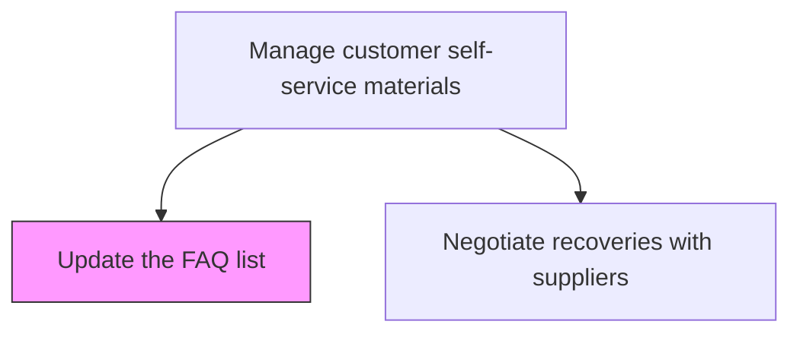
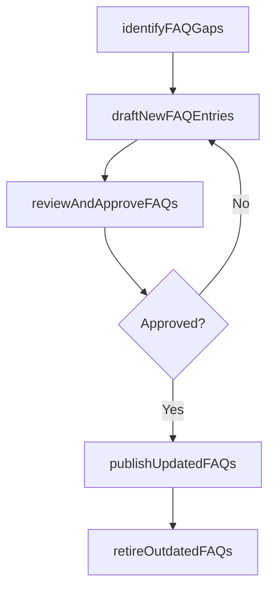

# Update the FAQ list

> Business-as-Code definition for FAQ list maintenance. Models the review, update, and publication of frequently asked questions to support customer self-service resolution.

## Overview

Reviewing, updating, and publishing the frequently asked questions list to support customer self-service resolution. Analyze customer inquiry patterns to identify FAQ gaps, draft new entries, submit for subject matter expert review, publish approved updates to the self-service portal, and retire obsolete entries.

## Process Hierarchy



## GraphDL

```yaml
update:
  object: FAQ List
  actor: KnowledgeContentManager
  result: UpdatedFAQList
```

## Actions

| Action | Description |
|--------|-------------|
| identifyFAQGaps | Analyze customer inquiries and support tickets to find unanswered questions |
| draftNewFAQEntries | Write clear answers for newly identified frequently asked questions |
| reviewAndApproveFAQs | Submit new and updated FAQ entries for subject matter expert review |
| publishUpdatedFAQs | Release approved FAQ updates to the customer self-service portal |
| retireOutdatedFAQs | Remove or archive FAQ entries that are no longer relevant |

## Events

| Event | Description |
|-------|-------------|
| faqGapsIdentified | Missing FAQ topics detected from customer inquiry analysis |
| newFAQEntriesDrafted | New FAQ answers written and submitted for review |
| faqsReviewedAndApproved | FAQ entries validated by subject matter experts |
| updatedFAQsPublished | Approved FAQ updates released to the self-service portal |
| outdatedFAQsRetired | Obsolete FAQ entries removed from the active list |

## Searches

| Search | Description |
|--------|-------------|
| getFAQList | Retrieve current FAQ entries by category or product |
| getFAQPerformance | Query FAQ usage metrics including views and helpfulness ratings |
| getTopUnansweredQuestions | List the most common customer questions without FAQ coverage |

## Process Flow



## RACI Matrix

| Activity | Responsible | Accountable | Consulted | Informed |
|----------|-------------|-------------|-----------|----------|
| identifyFAQGaps | Knowledge Content Manager | Customer Service Manager | Data Analytics | Product Team |
| reviewAndApproveFAQs | Subject Matter Expert | Knowledge Content Manager | Legal | Marketing |
| publishUpdatedFAQs | Knowledge Content Manager | Customer Service Manager | IT | Customer Service |

## Related Processes

| Process | Relationship |
|---------|-------------|
| 6.3.4 Manage customer self-service materials | Parent - FAQ management is part of self-service content strategy |
| 6.2.2 Manage customer service problems, requests, and inquiries | Upstream - inquiry patterns inform FAQ updates |

## Related Departments

| Department | Role |
|-----------|------|
| Knowledge Management | Creates and maintains FAQ content |
| Customer Service | Identifies FAQ gaps from customer interactions |
| Product Management | Provides technical accuracy review |

## Related Occupations

| Occupation | Involvement |
|-----------|-------------|
| Knowledge Content Manager | Authors and publishes FAQ content |
| Technical Writer | Drafts clear and accurate FAQ responses |

## KPIs

| KPI | Description | Unit |
|-----|-------------|------|
| FAQ Coverage Rate | Percentage of top customer questions covered by FAQ entries | % |
| FAQ Helpfulness Score | Average customer rating of FAQ usefulness | Score 1-5 |
| Self-Service Deflection Rate | Percentage of inquiries resolved through FAQ without agent contact | % |

## Usage

```typescript
import { updateFAQList } from '@headlessly/update-faq-list'

const client = updateFAQList()

// Identify FAQ gaps from recent inquiries
const gaps = await client.identifyFAQGaps({
  period: '2025-Q1',
  minOccurrences: 20,
  excludeExistingFAQs: true
})

// Publish updated FAQs
await client.publishUpdatedFAQs({
  faqIds: ['FAQ-101', 'FAQ-102'],
  channel: 'customer-portal',
  notifySubscribers: true
})
```
