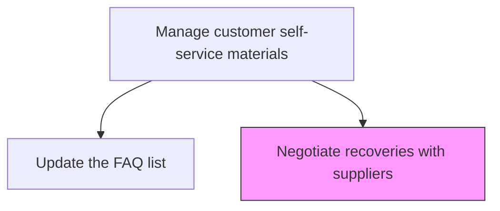
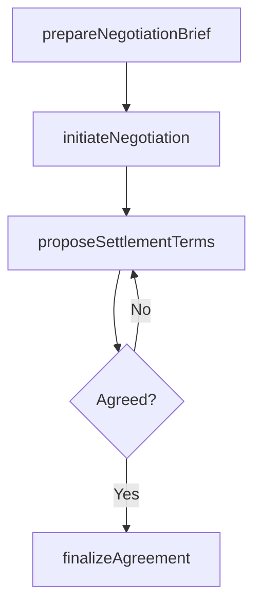

# Negotiate recoveries with suppliers

> Business-as-Code definition for supplier recovery negotiation. Models the negotiation of warranty cost recovery terms, settlement amounts, and payment arrangements with responsible suppliers.

## Overview

Arranging the returns of recalled products to suppliers.

## Process Hierarchy



## GraphDL

```yaml
negotiate:
  object: Recoveries With Suppliers
  actor: RecoveryNegotiator
  result: NegotiatedSettlement
```

## Actions

| Action | Description |
|--------|-------------|
| prepareNegotiationBrief | Compile evidence, claim amounts, and contractual terms for negotiation |
| initiateNegotiation | Open recovery negotiation discussions with the supplier |
| proposeSettlementTerms | Present the recovery amount and payment terms to the supplier |
| finalizeAgreement | Reach mutual agreement on recovery amount and payment schedule |

## Events

| Event | Description |
|-------|-------------|
| negotiationBriefPrepared | Recovery negotiation documentation compiled |
| negotiationInitiated | Supplier recovery discussions opened |
| settlementTermsProposed | Recovery proposal presented to supplier |
| agreementFinalized | Recovery settlement terms agreed and documented |

## Searches

| Search | Description |
|--------|-------------|
| getOpenNegotiations | List active supplier recovery negotiations by status |
| getNegotiationHistory | Retrieve past negotiation outcomes with a supplier |
| getSettlementTerms | Query agreed settlement terms and payment schedules |

## Process Flow



## RACI Matrix

| Activity | Responsible | Accountable | Consulted | Informed |
|----------|-------------|-------------|-----------|----------|
| prepareNegotiationBrief | Recovery Negotiator | Procurement Manager | Legal, Quality | Finance |
| finalizeAgreement | Procurement Manager | VP Procurement | Legal | Finance |

## Related Processes

| Process | Relationship |
|---------|-------------|
| 6.3.3.1 Create supplier recovery claims | Upstream - submitted claims enter negotiation |
| 6.1.6.3 Agree on warranty responsibilities with suppliers | Related - responsibility agreements define negotiation framework |

## Related Departments

| Department | Role |
|-----------|------|
| Procurement | Leads supplier recovery negotiations |
| Legal | Supports contract interpretation and dispute resolution |
| Finance | Tracks recovery settlements and payments |

## Related Occupations

| Occupation | Involvement |
|-----------|-------------|
| Recovery Negotiator | Conducts supplier recovery negotiations |
| Procurement Manager | Approves settlement terms |

## KPIs

| KPI | Description | Unit |
|-----|-------------|------|
| Recovery Rate | Percentage of claimed amount recovered from suppliers | % |
| Negotiation Cycle Time | Average days from negotiation start to settlement | Days |
| Settlement Acceptance Rate | Percentage of proposals accepted by suppliers | % |

## Usage

```typescript
import { negotiateRecoveriesWithSuppliers } from '@headlessly/negotiate-recoveries-with-suppliers'

const client = negotiateRecoveriesWithSuppliers()

// Prepare negotiation brief
const brief = await client.prepareNegotiationBrief({
  supplierId: 'SUP-500',
  claimIds: ['RC-2025-001', 'RC-2025-002'],
  totalAmount: 45000
})

// Finalize agreement
await client.finalizeAgreement({
  negotiationId: brief.negotiationId,
  agreedAmount: 42000,
  paymentSchedule: 'net-30'
})
```
