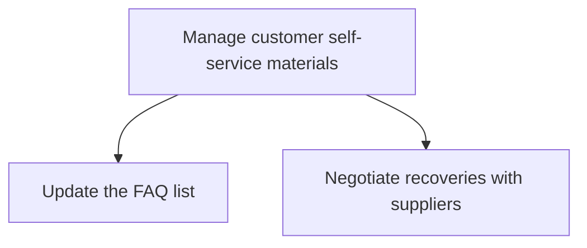
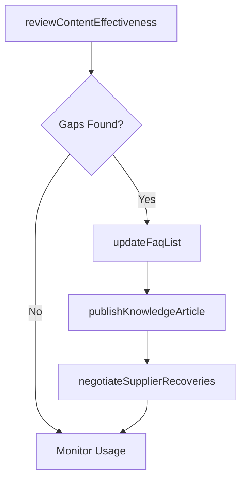

# Manage customer self-service materials

> Business-as-Code definition for customer self-service content management. Models FAQ maintenance, knowledge base updates, troubleshooting guide creation, and supplier recovery negotiation for self-service programs.

## Overview

Creating and maintaining customer-facing self-service materials including FAQ lists, troubleshooting guides, knowledge base articles, and product documentation. Ensures customers can independently resolve common issues, reducing contact center volume and improving customer satisfaction.

## Process Hierarchy



## GraphDL

```yaml
manage:
  object: Customer Self-service Materials
  actor: KnowledgeBaseManager
  result: SelfServiceContentLibrary
```

## Actions

| Action | Description |
|--------|-------------|
| updateFaqList | Add, revise, or remove frequently asked questions |
| publishKnowledgeArticle | Create or update knowledge base articles for customer self-service |
| reviewContentEffectiveness | Analyze self-service content usage and resolution rates |
| negotiateSupplierRecoveries | Arrange return logistics and cost recovery with suppliers |

## Events

| Event | Description |
|-------|-------------|
| faqListUpdated | FAQ content revised and published |
| knowledgeArticlePublished | Knowledge base article created or updated |
| contentEffectivenessReviewed | Self-service content utilization analysis completed |
| supplierRecoveriesNegotiated | Supplier recovery terms agreed for recalled products |

## Searches

| Search | Description |
|--------|-------------|
| getKnowledgeArticles | Search knowledge base articles by topic, product, or keyword |
| getFaqItems | List FAQ entries by category or product line |
| getContentMetrics | Query self-service content usage and deflection metrics |

## Process Flow



## RACI Matrix

| Activity | Responsible | Accountable | Consulted | Informed |
|----------|-------------|-------------|-----------|----------|
| updateFaqList | Knowledge Base Manager | VP Customer Service | Product, Support Agents | Marketing |
| publishKnowledgeArticle | Technical Writer | Knowledge Base Manager | Subject Matter Experts | Customer Service |
| reviewContentEffectiveness | Content Analyst | Knowledge Base Manager | Data Analytics | VP Customer Service |

## Sub-Processes

| ID | Name | Description |
|----|------|-------------|
| 6.3.4.1 | Update the FAQ list | Reviewing, revising, and expanding frequently asked questions based on common customer inquiries, emerging product issues, and new feature releases. |
| 6.3.4.2 | Negotiate recoveries with suppliers | Arranging the returns of recalled products to suppliers. |

## Related Processes

| Process | Relationship |
|---------|-------------|
| 6.2.2 Manage customer service problems, requests, and inquiries | Parallel - self-service deflects inquiries from contact center |
| 6.3.2 Process warranty claims | Supporting - self-service guides help customers with claims |

## Related Departments

| Department | Role |
|-----------|------|
| Knowledge Management | Creates and maintains self-service content |
| Customer Service | Identifies common issues for content creation |
| Product Management | Provides technical input for troubleshooting guides |

## Related Occupations

| Occupation | Involvement |
|-----------|-------------|
| Technical Writer | Authors FAQ and knowledge base content |
| Knowledge Base Manager | Oversees content strategy and quality |

## KPIs

| KPI | Description | Unit |
|-----|-------------|------|
| Self-Service Deflection Rate | Percentage of issues resolved through self-service | % |
| Article Helpfulness Score | Customer rating of knowledge base article usefulness | Score (1-5) |
| Content Coverage | Percentage of known issues with published self-service content | % |

## Usage

```typescript
import { manageCustomerSelfServiceMaterials } from '@headlessly/manage-customer-self-service-materials'

const selfService = manageCustomerSelfServiceMaterials()

// Update FAQ list
await selfService.updateFaqList({
  action: 'add',
  category: 'billing',
  question: 'How do I update my payment method?',
  answer: 'Navigate to Account Settings and select Payment Methods...'
})

// Review content effectiveness
const metrics = await selfService.reviewContentEffectiveness({
  period: '2025-Q1',
  minViews: 100,
  sortBy: 'resolution-rate'
})
```
