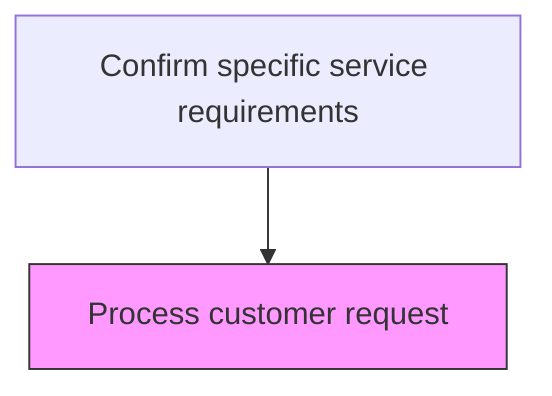
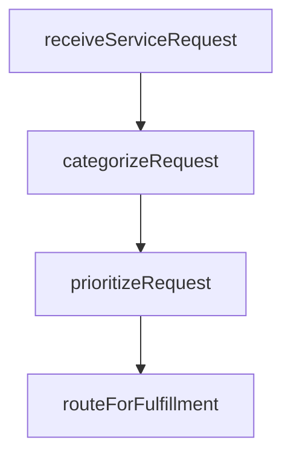

# Process customer request

> Business-as-Code definition for customer service request processing. Models the intake, categorization, prioritization, and routing of individual customer after-sales service requests.

## Overview

Soliciting or acquiring information using various sources such as databases, customer interactions, and customer request forms. Hand them further up the hierarchy to deal with them. Categorize the user's request, determining if the request is supportable and prioritizing the request.

## Process Hierarchy



## GraphDL

```yaml
process:
  object: Customer Request
  actor: ServiceRequestProcessor
  result: ServiceRequestProcessorResult
```

## Actions

| Action | Description |
|--------|-------------|
| receiveServiceRequest | Accept the customer service request through available intake channels |
| categorizeRequest | Classify the request by type, product, and service needed |
| prioritizeRequest | Assign priority based on customer tier, urgency, and service level agreement |
| routeForFulfillment | Direct the categorized request to the appropriate service team or queue |

## Events

| Event | Description |
|-------|-------------|
| customerRequestReceived | Customer service request logged and acknowledged |
| requestValidated | Service request details verified and validated against service catalog |
| serviceEligibilityConfirmed | Customer eligibility for requested service confirmed |
| requestPrioritized | Service request assigned priority level based on SLA and urgency |

## Searches

| Search | Description |
|--------|-------------|
| getServiceRequests | List pending service requests by status, priority, or customer |
| getServiceCatalog | Retrieve available services and eligibility criteria |
| getCustomerEntitlements | Query customer service entitlements and contract coverage |
| getRequestHistory | Retrieve previous service request history for a customer |

## Process Flow



## RACI Matrix

| Activity | Responsible | Accountable | Consulted | Informed |
|----------|-------------|-------------|-----------|----------|
| receiveServiceRequest | Service Request Coordinator | Service Operations Manager | Product Team | Customer |
| validateServiceEligibility | Service Request Coordinator | Service Operations Manager | Contract Team | Sales |
| prioritizeRequest | Service Dispatcher | Service Operations Manager | Field Service | Customer |

## Related Processes

| Process | Relationship |
|---------|-------------|
| 6.3.5.1.2 Create customer profile | Downstream - validated request triggers customer profile creation |
| 6.3.5.1.3 Generate service order | Downstream - processed requests generate service orders |
| 6.2.1 Plan and manage customer service workforce | Related - request volume informs workforce planning |

## Related Departments

| Department | Role |
|-----------|------|
| Customer Service | Receives and validates customer service requests |
| Service Operations | Manages service catalog and eligibility rules |
| IT | Provides request management system infrastructure |

## Related Occupations

| Occupation | Involvement |
|-----------|-------------|
| Service Request Coordinator | Processes and validates incoming customer requests |
| Customer Service Representative | Communicates with customers during request intake |
| Service Catalog Manager | Maintains service offerings and eligibility criteria |

## KPIs

| KPI | Description | Unit |
|-----|-------------|------|
| Request Acknowledgment Time | Average time from request receipt to customer acknowledgment | Minutes |
| Validation Accuracy | Percentage of requests correctly validated on first pass | % |
| Eligibility Verification Rate | Percentage of requests with verified entitlements before scheduling | % |

## Usage

```typescript
import { processCustomerRequest } from '@headlessly/process-customer-request'

const client = processCustomerRequest()

// Process an incoming customer request
const request = await client.receiveServiceRequest({
  customerId: 'CUST-2025-100',
  serviceType: 'product-repair',
  productSerial: 'SN-X200-001',
  urgency: 'standard'
})

// Validate service eligibility
const eligibility = await client.validateServiceEligibility({
  requestId: request.id,
  checkWarranty: true,
  checkServiceContract: true
})
```
