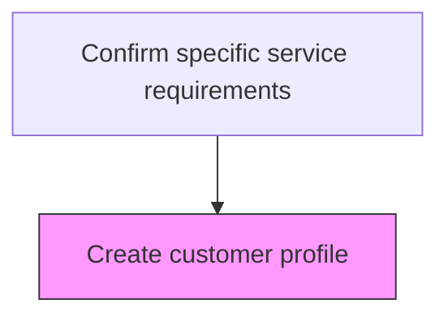
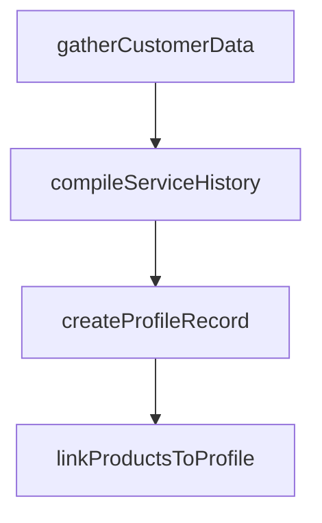

# Create customer profile

> Business-as-Code definition for customer service profile creation. Models the establishment of customer profiles containing product ownership, service history, and preference data to support personalized service delivery.

## Overview

Documenting the individual customer service requirements solicited, along with personal information of the customers, in order to generate customized profiles that hasten the delivery process.

## Process Hierarchy



## GraphDL

```yaml
create:
  object: Customer Profile
  actor: CustomerProfileSpecialist
  result: CustomerProfileResult
```

## Actions

| Action | Description |
|--------|-------------|
| gatherCustomerData | Collect customer contact details, product ownership, and service preferences |
| compileServiceHistory | Aggregate prior service interactions, repairs, and warranty claims |
| createProfileRecord | Generate the customer service profile in the CRM system |
| linkProductsToProfile | Associate registered products and active warranties with the customer profile |

## Events

| Event | Description |
|-------|-------------|
| customerProfileCreated | New customer service profile established in the system |
| serviceHistoryCompiled | Customer previous service interactions and equipment compiled |
| preferencesCaptured | Customer communication and service preferences recorded |
| profileLinkedToRequest | Customer profile associated with the active service request |

## Searches

| Search | Description |
|--------|-------------|
| getCustomerProfile | Retrieve customer service profile by ID or contact details |
| getServiceHistory | Query past service interactions for a customer |
| getEquipmentRegistry | List customer registered products and equipment |
| getProfileCompleteness | Check customer profile completeness and missing fields |

## Process Flow



## RACI Matrix

| Activity | Responsible | Accountable | Consulted | Informed |
|----------|-------------|-------------|-----------|----------|
| createProfileRecord | Customer Profile Specialist | Customer Service Manager | Data Management | IT |
| compileServiceHistory | Customer Profile Specialist | Customer Service Manager | CRM Team | Sales |
| linkProductsToProfile | Customer Profile Specialist | Customer Service Manager | Product Team | Warranty |

## Related Processes

| Process | Relationship |
|---------|-------------|
| 6.3.5.1.1 Process customer request | Upstream - validated request initiates profile creation |
| 6.3.5.1.3 Generate service order | Downstream - profile supports service order generation |
| 6.3.1 Register products | Related - product registration provides equipment data |

## Related Departments

| Department | Role |
|-----------|------|
| Customer Service | Creates and maintains customer service profiles |
| Data Management | Ensures profile data quality and deduplication |
| IT | Provides CRM system for profile management |

## Related Occupations

| Occupation | Involvement |
|-----------|-------------|
| Customer Profile Specialist | Creates and validates customer service profiles |
| Data Quality Analyst | Ensures accuracy and completeness of customer data |
| CRM Administrator | Manages customer profile system configuration |

## KPIs

| KPI | Description | Unit |
|-----|-------------|------|
| Profile Creation Time | Average time to create a complete customer service profile | Minutes |
| Profile Completeness Rate | Percentage of profiles with all required fields populated | % |
| Duplicate Profile Rate | Percentage of new profiles matching existing customer records | % |

## Usage

```typescript
import { createCustomerProfile } from '@headlessly/create-customer-profile'

const profiler = createCustomerProfile()

// Gather customer data and create the profile record
const profile = await profiler.createProfileRecord({
  customerId: 'CUST-2025-100',
  contactInfo: { email: 'customer@example.com', phone: '+1-555-0100' },
  preferredChannel: 'email'
})

// Link registered products to the profile
await profiler.linkProductsToProfile({
  profileId: profile.id,
  products: [{ serial: 'SN-X200-001', purchaseDate: '2025-01-15' }]
})
```
