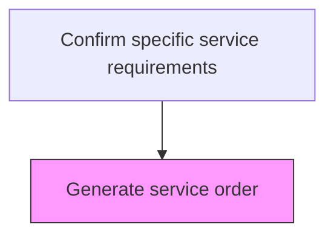
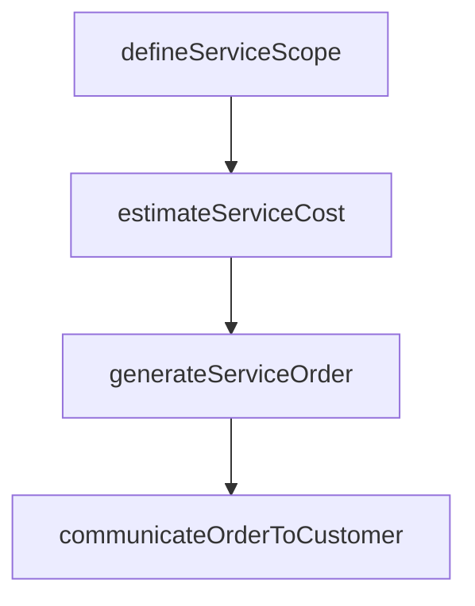

# Generate service order

> Business-as-Code definition for service order generation. Models the creation of formal service orders that authorize and specify the after-sales service work to be performed for a customer.

## Overview

Designing a short-term agreement between the service provider and customer. One-time services are ordered by the service recipient and resource-related billing is performed upon completion. Use the service order to document service and customer service work.

## Process Hierarchy



## GraphDL

```yaml
generate:
  object: Service Order
  actor: ServiceOrderCoordinator
  result: ServiceOrderResult
```

## Actions

| Action | Description |
|--------|-------------|
| defineServiceScope | Specify the service tasks, parts, and labor required for the order |
| estimateServiceCost | Calculate the estimated cost including labor, parts, and travel |
| generateServiceOrder | Create the formal service order with all specifications and approvals |
| communicateOrderToCustomer | Send the service order details and scheduling information to the customer |

## Events

| Event | Description |
|-------|-------------|
| serviceOrderGenerated | Service order created with all required specifications |
| partsRequirementIdentified | Required parts and materials identified for the service order |
| serviceOrderPrioritized | Service order assigned scheduling priority based on SLA |
| orderReadyForScheduling | Service order validated and released for resource scheduling |

## Searches

| Search | Description |
|--------|-------------|
| getServiceOrders | List service orders by status, type, priority, or assigned technician |
| getPartsAvailability | Check parts and materials availability for a service order |
| getOrderBacklog | Query pending service orders and backlog by region or type |
| getSLADeadlines | Retrieve upcoming SLA deadline dates for open service orders |

## Process Flow



## RACI Matrix

| Activity | Responsible | Accountable | Consulted | Informed |
|----------|-------------|-------------|-----------|----------|
| generateServiceOrder | Service Order Coordinator | Service Operations Manager | Parts Management | Customer |
| identifyPartsRequirements | Service Order Coordinator | Service Operations Manager | Warehouse | Procurement |
| prioritizeForScheduling | Service Dispatcher | Service Operations Manager | Field Service | Customer |

## Related Processes

| Process | Relationship |
|---------|-------------|
| 6.3.5.1.2 Create customer profile | Upstream - customer profile provides context for order generation |
| 6.3.5.2 Identify and schedule resources | Downstream - generated orders are queued for resource scheduling |
| 6.3.5.3 Provide service to specific customers | Downstream - orders drive service delivery execution |

## Related Departments

| Department | Role |
|-----------|------|
| Service Operations | Creates and manages service orders |
| Parts Management | Verifies parts availability for service requirements |
| Customer Service | Communicates order status to customers |

## Related Occupations

| Occupation | Involvement |
|-----------|-------------|
| Service Order Coordinator | Creates and validates service orders |
| Parts Planner | Verifies component availability for orders |
| Service Dispatcher | Prioritizes orders for scheduling |

## KPIs

| KPI | Description | Unit |
|-----|-------------|------|
| Order Generation Time | Average time from request approval to service order creation | Hours |
| Order Accuracy Rate | Percentage of service orders requiring no rework or correction | % |
| Parts Availability Match | Percentage of service orders with all required parts in stock | % |

## Usage

```typescript
import { generateServiceOrder } from '@headlessly/generate-service-order'

const client = generateServiceOrder()

// Generate a service order
const order = await client.generateServiceOrder({
  requestId: 'REQ-2025-456',
  serviceType: 'product-repair',
  priority: 'standard',
  requiredParts: ['PART-A100', 'PART-B200']
})

// Check parts availability
const parts = await client.checkPartsAvailability({
  orderId: order.id,
  warehouse: 'regional-west'
})
```
