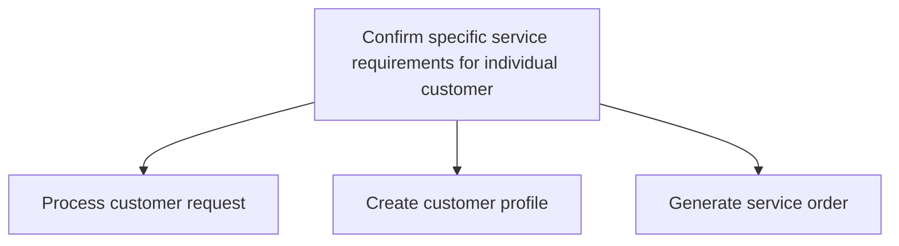
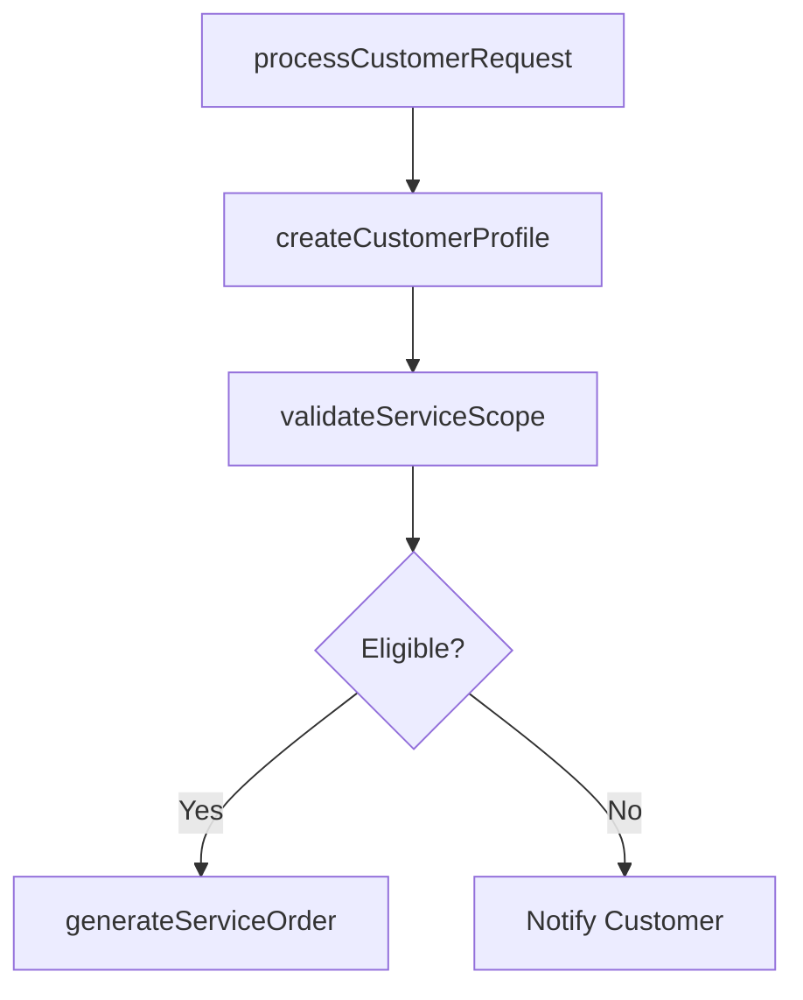

# Confirm specific service requirements for individual customer

> Business-as-Code definition for individual customer service requirements confirmation. Models request intake, customer profile creation, and service order generation.

## Overview

Acquiring or soliciting information about specific service requirements for individual customers through the customer service function. Obtain information about customer specific requests, process these requests, and create customer profiles to generate a service order.

## Process Hierarchy



## GraphDL

```yaml
confirm:
  object: Specific Service Requirements For Individual Customer
  actor: ServiceCoordinator
  result: ServiceOrder
```

## Actions

| Action | Description |
|--------|-------------|
| processCustomerRequest | Intake and validate customer service request details and requirements |
| createCustomerProfile | Document customer information, product details, and service history |
| generateServiceOrder | Create formal service order with scope, timeline, and resource requirements |
| validateServiceScope | Confirm service requirements are within warranty or contract terms |

## Events

| Event | Description |
|-------|-------------|
| customerRequestProcessed | Customer service request validated and documented |
| customerProfileCreated | Customer profile established with service history and product details |
| serviceOrderGenerated | Formal service order created and ready for scheduling |
| serviceScopeValidated | Service requirements confirmed within applicable terms |

## Searches

| Search | Description |
|--------|-------------|
| getCustomerProfile | Retrieve customer profile and service history by customer ID |
| getServiceOrders | List service orders by customer, product, or status |
| getServiceEligibility | Check customer eligibility for service based on warranty or contract |

## Process Flow



## RACI Matrix

| Activity | Responsible | Accountable | Consulted | Informed |
|----------|-------------|-------------|-----------|----------|
| processCustomerRequest | Service Coordinator | Service Manager | Customer | Field Service |
| createCustomerProfile | Service Coordinator | Service Manager | IT | Customer |
| generateServiceOrder | Service Coordinator | Service Manager | Field Service | Scheduling |

## Sub-Processes

| ID | Name | Description |
|----|------|-------------|
| 6.3.5.1.1 | Process customer request | Soliciting or acquiring information using various sources such as databases, customer interactions,  |
| 6.3.5.1.2 | Create customer profile | Documenting the individual customer service requirements solicited, along with personal information  |
| 6.3.5.1.3 | Generate service order | Designing a short-term agreement between the service provider and customer. One-time services are or |

## Related Processes

| Process | Relationship |
|---------|-------------|
| 6.3.5.2 Identify and schedule resources to meet service requirements | Downstream - service orders drive resource scheduling |
| 6.3.5.3 Provide service to specific customers | Downstream - confirmed requirements guide service delivery |

## Related Departments

| Department | Role |
|-----------|------|
| Customer Service | Receives requests and confirms service requirements |
| Field Service | Provides technical input on service scope and feasibility |
| Information Technology | Maintains CRM and service order management systems |

## Related Occupations

| Occupation | Involvement |
|-----------|-------------|
| Service Coordinator | Processes requests and generates service orders |
| Customer Service Representative | Interfaces with customer to gather requirements |

## KPIs

| KPI | Description | Unit |
|-----|-------------|------|
| Service Order Accuracy | Percentage of service orders requiring zero rework | % |
| Request Processing Time | Average time from request receipt to service order creation | Hours |
| Customer Profile Completeness | Percentage of profiles with all required fields populated | % |

## Usage

```typescript
import { confirmSpecificServiceRequirementsForIndividualCustomer } from '@headlessly/confirm-specific-service-requirements-for-individual-customer'

const serviceReqs = confirmSpecificServiceRequirementsForIndividualCustomer()

// Process a customer request
const request = await serviceReqs.processCustomerRequest({
  customerId: 'CUST-5678',
  productId: 'PROD-1234',
  issueDescription: 'Unit not powering on after firmware update',
  requestedDate: '2025-06-15'
})

// Generate service order
const order = await serviceReqs.generateServiceOrder({
  requestId: request.id,
  serviceType: 'on-site-repair',
  priority: 'standard'
})
```
