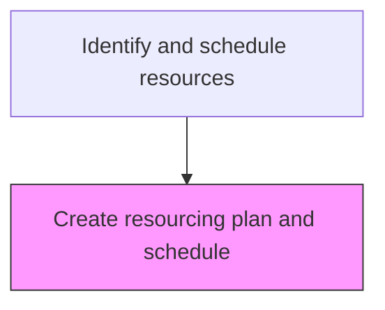
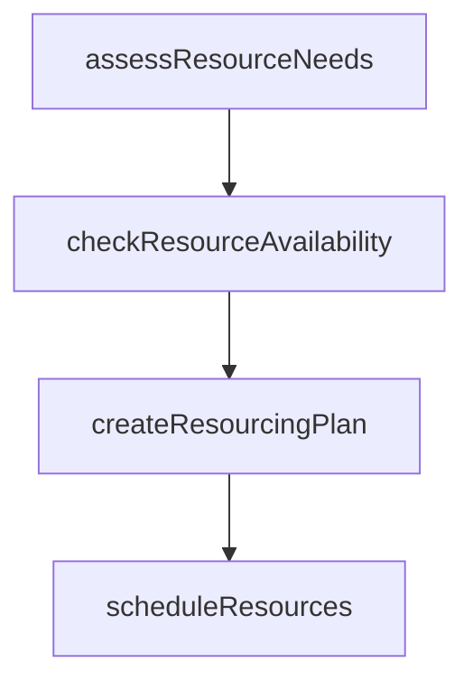

# Create resourcing plan and schedule

> Business-as-Code definition for service resourcing plan creation. Models the identification and scheduling of personnel, parts, and equipment needed to fulfill service orders.

## Overview

Developing a plan for sourcing and deploying the resources required to fulfill customer service needs. Document a detailed summary of all types of resources (equipment, finance, personnel, time, etc.) required to complete customer service requests and procure these resources. Identify and assess various sources in order to effectively create a resourcing plan.

## Process Hierarchy



## GraphDL

```yaml
create:
  object: Resourcing Plan And Schedule
  actor: ServiceResourcePlanner
  result: ServiceResourceResult
```

## Actions

| Action | Description |
|--------|-------------|
| assessResourceNeeds | Determine technician skills, parts, and equipment required for service orders |
| checkResourceAvailability | Query availability of required technicians and parts inventory |
| createResourcingPlan | Build the resource allocation plan matching needs to availability |
| scheduleResources | Book technicians, reserve parts, and confirm equipment for service delivery |

## Events

| Event | Description |
|-------|-------------|
| resourcingPlanCreated | Resource allocation plan developed for service demand |
| technicianCapacityAssessed | Available technician capacity evaluated against demand |
| scheduleOptimized | Resource schedule optimized for efficiency and coverage |
| resourceConflictsResolved | Scheduling conflicts between orders identified and resolved |

## Searches

| Search | Description |
|--------|-------------|
| getTechnicianAvailability | Query technician availability by skill, location, and date |
| getResourceUtilization | Retrieve resource utilization rates by team or region |
| getScheduleConflicts | Identify scheduling conflicts for a given period |
| getSkillsMatrix | List available technicians by skill certification and experience |

## Process Flow



## RACI Matrix

| Activity | Responsible | Accountable | Consulted | Informed |
|----------|-------------|-------------|-----------|----------|
| createResourcingPlan | Resource Planner | Service Operations Manager | HR | Field Service |
| assessTechnicianCapacity | Resource Planner | Service Operations Manager | Training | Scheduling |
| resolveResourceConflicts | Resource Planner | Field Service Manager | Service Dispatch | Customer Service |

## Related Processes

| Process | Relationship |
|---------|-------------|
| 6.3.5.1.3 Generate service order | Upstream - service orders drive resource planning |
| 6.3.5.2.2 Create service order fulfillment schedule | Downstream - resource plan feeds order scheduling |
| 6.2.1 Plan and manage customer service workforce | Related - workforce plans inform resource capacity |

## Related Departments

| Department | Role |
|-----------|------|
| Service Operations | Develops resource plans and manages technician scheduling |
| Human Resources | Provides workforce data and availability |
| Field Service | Executes scheduled service assignments |

## Related Occupations

| Occupation | Involvement |
|-----------|-------------|
| Resource Planner | Develops resource allocation plans for service delivery |
| Service Scheduler | Assigns technicians to service orders |
| Field Service Manager | Oversees field technician deployment |

## KPIs

| KPI | Description | Unit |
|-----|-------------|------|
| Resource Utilization Rate | Percentage of available technician capacity scheduled for service | % |
| Schedule Adherence | Percentage of planned schedules executed without changes | % |
| Skill Match Rate | Percentage of orders assigned to technicians with matching skills | % |

## Usage

```typescript
import { createResourcingPlanAndSchedule } from '@headlessly/create-resourcing-plan-and-schedule'

const client = createResourcingPlanAndSchedule()

// Create a resourcing plan
const plan = await client.createResourcingPlan({
  period: '2025-W15',
  region: 'west-coast',
  demandForecast: 120
})

// Assess technician capacity
const capacity = await client.assessTechnicianCapacity({
  planId: plan.id,
  skillRequirements: ['electrical', 'mechanical']
})
```
