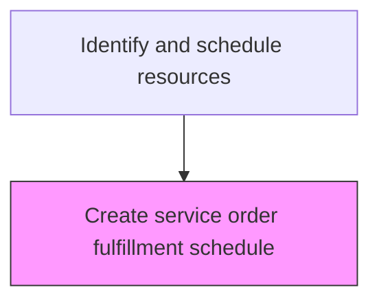
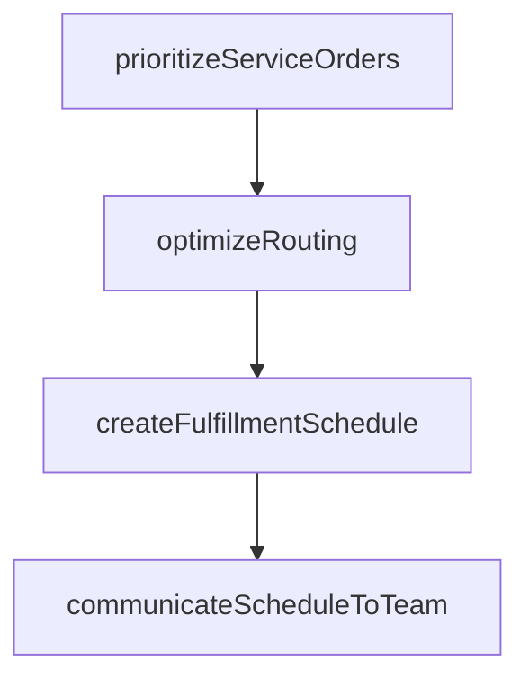

# Create service order fulfillment schedule

> Business-as-Code definition for service order fulfillment scheduling. Models the creation and optimization of schedules for executing service orders within committed timeframes.

## Overview

Designing a detailed summary of customer service order requirements, along with information concerning the timing and duration for these services. Categorize the customer needs. Monitor the services delivered.

## Process Hierarchy



## GraphDL

```yaml
create:
  object: Service Order Fulfillment Schedule
  actor: FulfillmentScheduler
  result: FulfillmentResult
```

## Actions

| Action | Description |
|--------|-------------|
| prioritizeServiceOrders | Rank service orders by urgency, SLA commitment, and customer tier |
| optimizeRouting | Plan efficient service routes minimizing travel time between appointments |
| createFulfillmentSchedule | Generate the detailed schedule of service appointments by technician |
| communicateScheduleToTeam | Distribute the fulfillment schedule to assigned technicians and dispatchers |

## Events

| Event | Description |
|-------|-------------|
| fulfillmentScheduleCreated | Service order fulfillment schedule published |
| ordersAssignedToTechnicians | Service orders matched to available technicians |
| routesOptimized | Service delivery routes optimized for travel efficiency |
| customerAppointmentsConfirmed | Service appointment times confirmed with customers |

## Searches

| Search | Description |
|--------|-------------|
| getFulfillmentSchedule | Retrieve the service order fulfillment schedule by date or technician |
| getUnscheduledOrders | List service orders awaiting schedule assignment |
| getRouteDetails | Query planned service routes by technician or date |
| getAppointmentSlots | Retrieve available appointment slots by location and date |

## Process Flow



## RACI Matrix

| Activity | Responsible | Accountable | Consulted | Informed |
|----------|-------------|-------------|-----------|----------|
| createFulfillmentSchedule | Service Scheduler | Service Operations Manager | Field Service | Customer Service |
| optimizeRoutes | Route Optimizer | Service Operations Manager | Logistics | Field Service |
| confirmAppointments | Customer Appointment Coordinator | Service Operations Manager | Customer | Field Service |

## Related Processes

| Process | Relationship |
|---------|-------------|
| 6.3.5.2.1 Create resourcing plan and schedule | Upstream - resource plan drives fulfillment scheduling |
| 6.3.5.3 Provide service to specific customers | Downstream - schedule drives daily service execution |
| 6.3.5.4 Ensure quality of service | Downstream - schedule adherence affects service quality |

## Related Departments

| Department | Role |
|-----------|------|
| Service Operations | Creates and manages fulfillment schedules |
| Logistics | Optimizes service delivery routes |
| Customer Service | Confirms appointments with customers |

## Related Occupations

| Occupation | Involvement |
|-----------|-------------|
| Service Scheduler | Creates service order fulfillment schedules |
| Route Optimizer | Plans efficient service delivery routes |
| Customer Appointment Coordinator | Confirms service appointments with customers |

## KPIs

| KPI | Description | Unit |
|-----|-------------|------|
| Schedule Fill Rate | Percentage of available slots filled with service orders | % |
| Appointment Confirmation Rate | Percentage of scheduled appointments confirmed by customers | % |
| Route Efficiency | Average travel time between service appointments | Minutes |

## Usage

```typescript
import { createServiceOrderFulfillmentSchedule } from '@headlessly/create-service-order-fulfillment-schedule'

const client = createServiceOrderFulfillmentSchedule()

// Create fulfillment schedule
const schedule = await client.createFulfillmentSchedule({
  date: '2025-04-15',
  region: 'west-coast',
  optimizeRoutes: true
})

// Confirm customer appointment
await client.confirmAppointment({
  orderId: 'SO-2025-789',
  scheduledDate: '2025-04-15',
  timeWindow: '09:00-12:00'
})
```
