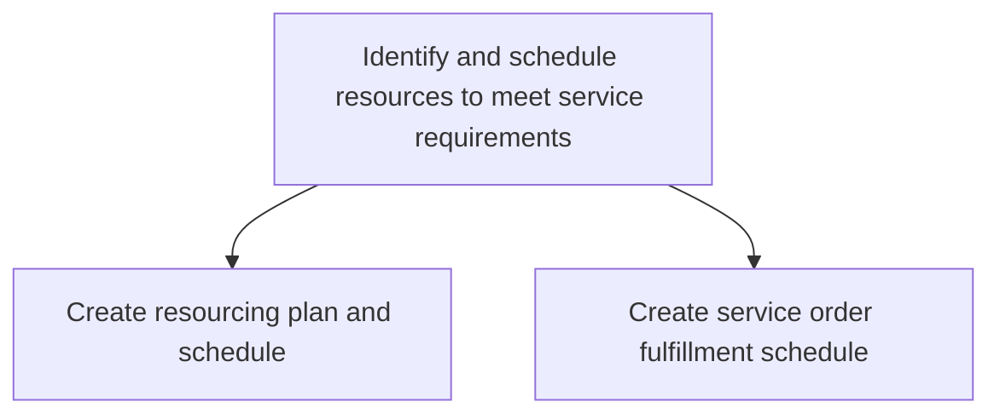
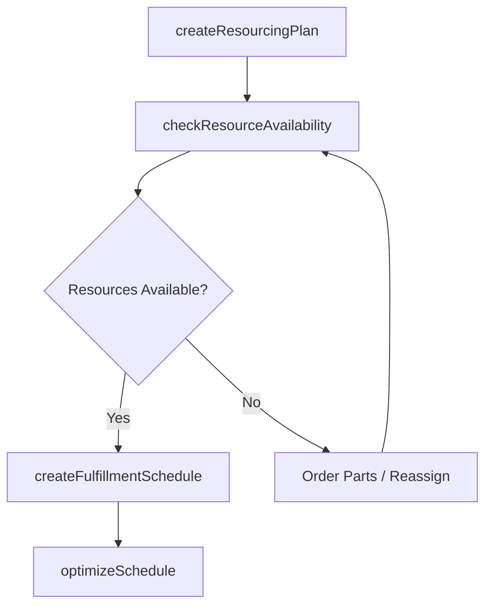

# Identify and schedule resources to meet service requirements

> Business-as-Code definition for service resource identification and scheduling. Models resourcing plan creation, technician allocation, parts availability checks, and fulfillment schedule generation.

## Overview

Determining and scheduling the resources required to fulfill customer service requirements. Create a detailed schedule about the service orders and development of these service orders.

## Process Hierarchy



## GraphDL

```yaml
identify:
  object: And Schedule Resources To Meet Service Requirements
  actor: ServiceScheduler
  result: FulfillmentSchedule
```

## Actions

| Action | Description |
|--------|-------------|
| createResourcingPlan | Determine required technicians, parts, and tools for service orders |
| checkResourceAvailability | Verify availability of service personnel, parts, and equipment |
| createFulfillmentSchedule | Build detailed timeline for service order execution with resource assignments |
| optimizeSchedule | Rebalance service schedules to minimize travel time and maximize utilization |

## Events

| Event | Description |
|-------|-------------|
| resourcingPlanCreated | Resource requirements identified and plan documented |
| resourceAvailabilityChecked | Service personnel and parts availability confirmed |
| fulfillmentScheduleCreated | Service order execution timeline published |
| scheduleOptimized | Service schedule rebalanced for efficiency |

## Searches

| Search | Description |
|--------|-------------|
| getAvailableTechnicians | List service technicians by skill, location, and availability |
| getPartsAvailability | Check spare parts inventory for required service components |
| getFulfillmentSchedule | Retrieve scheduled service orders by date, technician, or region |

## Process Flow



## RACI Matrix

| Activity | Responsible | Accountable | Consulted | Informed |
|----------|-------------|-------------|-----------|----------|
| createResourcingPlan | Service Scheduler | Service Manager | Field Technicians | Customer |
| checkResourceAvailability | Service Scheduler | Service Manager | Parts Warehouse | Procurement |
| createFulfillmentSchedule | Service Scheduler | Service Manager | Field Technicians | Customer |

## Sub-Processes

| ID | Name | Description |
|----|------|-------------|
| 6.3.5.2.1 | Create resourcing plan and schedule | Developing a plan for sourcing and deploying the resources required to fulfill customer service need |
| 6.3.5.2.2 | Create service order fulfillment schedule | Designing a detailed summary of customer service order requirements, along with information concerni |

## Related Processes

| Process | Relationship |
|---------|-------------|
| 6.3.5.1 Confirm specific service requirements for individual customer | Upstream - confirmed requirements drive resource planning |
| 6.3.5.3 Provide service to specific customers | Downstream - scheduled resources enable service delivery |

## Related Departments

| Department | Role |
|-----------|------|
| Service Operations | Schedules resources and manages fulfillment timelines |
| Field Service | Provides technician availability and skill data |
| Parts and Inventory | Confirms spare parts availability for service orders |

## Related Occupations

| Occupation | Involvement |
|-----------|-------------|
| Service Scheduler | Creates and optimizes service fulfillment schedules |
| Dispatch Coordinator | Assigns technicians to service orders based on skills and proximity |

## KPIs

| KPI | Description | Unit |
|-----|-------------|------|
| Schedule Adherence Rate | Percentage of service orders completed within scheduled window | % |
| Resource Utilization Rate | Percentage of available technician hours scheduled for service | % |
| First-Time Fix Rate | Percentage of service orders resolved with correct resources on first visit | % |

## Usage

```typescript
import { identifyAndScheduleResourcesToMeetServiceRequirements } from '@headlessly/identify-and-schedule-resources-to-meet-service-requirements'

const scheduling = identifyAndScheduleResourcesToMeetServiceRequirements()

// Create a resourcing plan
const plan = await scheduling.createResourcingPlan({
  serviceOrderId: 'SO-2025-4567',
  requiredSkills: ['hvac-certified', 'electrical'],
  estimatedDuration: '4-hours',
  requiredParts: ['compressor-unit', 'thermal-sensor']
})

// Create fulfillment schedule
const schedule = await scheduling.createFulfillmentSchedule({
  resourcingPlanId: plan.id,
  preferredDate: '2025-06-20',
  timeWindow: 'morning'
})
```
