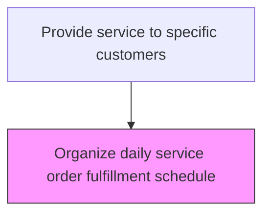
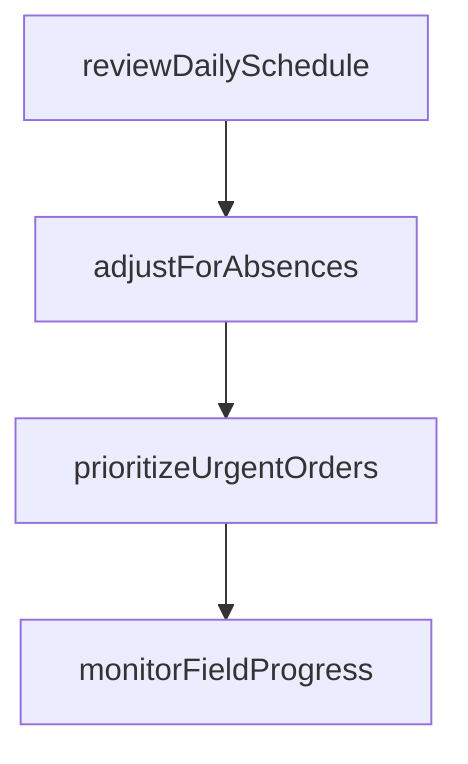

# Organize daily service order fulfillment schedule

> Business-as-Code definition for daily service schedule organization. Models the day-of coordination, adjustment, and management of service order fulfillment schedules.

## Overview

Laying out a daily plan of specific service orders that need to be fulfilled. Document and systematically order these activities to ensure high effectiveness and efficiency.

## Process Hierarchy



## GraphDL

```yaml
organize:
  object: Daily Service Order Fulfillment Schedule
  actor: ServiceDispatcher
  result: ServiceResult
```

## Actions

| Action | Description |
|--------|-------------|
| reviewDailySchedule | Examine the planned service appointments for the day and confirm readiness |
| adjustForAbsences | Redistribute appointments to cover technician absences or delays |
| prioritizeUrgentOrders | Elevate emergency service requests into the daily schedule |
| monitorFieldProgress | Track real-time completion status of in-progress service appointments |

## Events

| Event | Description |
|-------|-------------|
| dailyScheduleOrganized | Daily service fulfillment schedule finalized and distributed |
| workOrdersPrioritized | Day service orders sequenced by priority and route |
| technicianBriefingCompleted | Technicians briefed on daily assignments and special instructions |
| scheduleAdjustmentsMade | Emergency or priority changes incorporated into daily schedule |

## Searches

| Search | Description |
|--------|-------------|
| getDailySchedule | Retrieve the daily service order schedule by technician or area |
| getEmergencyOrders | List emergency service orders requiring same-day scheduling |
| getTechnicianWorkload | Query current workload and capacity for each technician |
| getScheduleChanges | Track modifications made to the original daily schedule |

## Process Flow



## RACI Matrix

| Activity | Responsible | Accountable | Consulted | Informed |
|----------|-------------|-------------|-----------|----------|
| organizeDailySchedule | Service Dispatcher | Field Service Manager | Service Operations | Technicians |
| briefTechnicians | Field Service Supervisor | Field Service Manager | Service Dispatch | Customer Service |
| adjustForEmergencies | Service Dispatcher | Field Service Manager | Customer Service | Technicians |

## Related Processes

| Process | Relationship |
|---------|-------------|
| 6.3.5.2.2 Create service order fulfillment schedule | Upstream - fulfillment schedule feeds daily organization |
| 6.3.5.3.2 Execute product repair | Downstream - organized schedule guides repair execution |
| 6.3.5.3.3 Manage service order fulfillment | Related - daily schedule supports fulfillment management |

## Related Departments

| Department | Role |
|-----------|------|
| Field Service | Organizes and executes daily service schedules |
| Service Operations | Provides scheduling support and priority guidance |
| Customer Service | Handles customer communications for schedule changes |

## Related Occupations

| Occupation | Involvement |
|-----------|-------------|
| Service Dispatcher | Organizes and distributes daily service schedules |
| Field Service Supervisor | Briefs technicians and manages daily priorities |
| Customer Service Agent | Communicates schedule changes to customers |

## KPIs

| KPI | Description | Unit |
|-----|-------------|------|
| Daily Schedule Completion Rate | Percentage of scheduled service orders completed each day | % |
| Schedule Change Frequency | Number of modifications to the daily schedule per day | Count |
| On-Time Start Rate | Percentage of service appointments starting within the scheduled window | % |

## Usage

```typescript
import { organizeDailyServiceOrderFulfillmentSchedule } from '@headlessly/organize-daily-service-order-fulfillment-schedule'

const client = organizeDailyServiceOrderFulfillmentSchedule()

// Organize daily schedule
const dailySchedule = await client.organizeDailySchedule({
  date: '2025-04-15',
  region: 'west-coast',
  includePriority: true
})

// Handle emergency order insertion
await client.insertEmergencyOrder({
  scheduleId: dailySchedule.id,
  orderId: 'SO-2025-URGENT-01',
  priority: 'critical'
})
```
