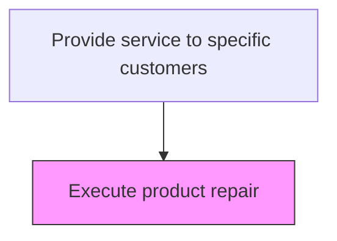
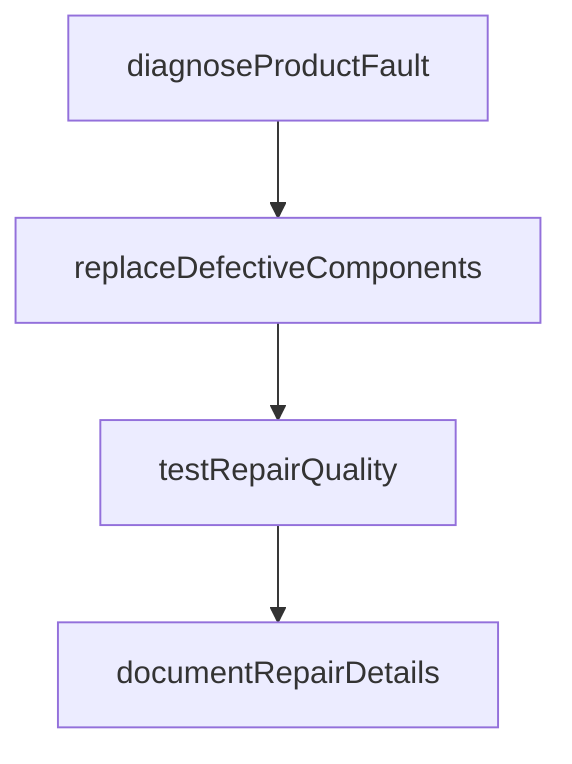

# Execute product repair

> Business-as-Code definition for product repair execution. Models the on-site or depot repair of customer products including diagnosis, parts replacement, and quality verification.

## Overview

Dispatching and delivering the resources needed for the specific service requirements from the source/warehouse. Manage the dispatch, transportation, and delivery of the services.

## Process Hierarchy



## GraphDL

```yaml
execute:
  object: Product Repair
  actor: ServiceTechnician
  result: ServiceResult
```

## Actions

| Action | Description |
|--------|-------------|
| diagnoseProductFault | Identify the specific malfunction through testing and inspection |
| replaceDefectiveComponents | Remove failed parts and install replacement components |
| testRepairQuality | Verify the repair through functional testing and quality checks |
| documentRepairDetails | Record repair actions, parts used, and test results in the service record |

## Events

| Event | Description |
|-------|-------------|
| productDiagnosisCompleted | Product fault diagnosed and repair plan determined |
| repairExecuted | Product repair work performed according to specifications |
| repairQualityVerified | Completed repair tested and validated for proper function |
| repairDocumented | Repair details, parts used, and labor recorded in service record |

## Searches

| Search | Description |
|--------|-------------|
| getRepairOrders | List repair orders by status, product type, or technician |
| getRepairProcedures | Retrieve standard repair procedures for a product model |
| getPartsUsed | Query parts consumed during repair for a service order |
| getRepairHistory | Retrieve repair history for a specific product serial number |

## Process Flow



## RACI Matrix

| Activity | Responsible | Accountable | Consulted | Informed |
|----------|-------------|-------------|-----------|----------|
| diagnoseProductFault | Field Service Technician | Field Service Manager | Technical Specialist | Customer |
| executeRepair | Field Service Technician | Field Service Manager | Parts Coordinator | Service Operations |
| verifyRepairQuality | Field Service Technician | Quality Manager | Technical Specialist | Customer |

## Related Processes

| Process | Relationship |
|---------|-------------|
| 6.3.5.3.1 Organize daily service order fulfillment schedule | Upstream - daily schedule directs repair assignments |
| 6.3.5.3.3 Manage service order fulfillment | Related - repair status feeds fulfillment tracking |
| 6.3.5.4 Ensure quality of service | Downstream - repair outcomes drive quality assessment |

## Related Departments

| Department | Role |
|-----------|------|
| Field Service | Performs product diagnosis, repair, and quality verification |
| Parts Management | Provides replacement parts for repairs |
| Quality Assurance | Defines repair standards and verification procedures |

## Related Occupations

| Occupation | Involvement |
|-----------|-------------|
| Field Service Technician | Diagnoses faults and performs product repairs |
| Technical Specialist | Provides expertise for complex repair procedures |
| Parts Coordinator | Manages parts logistics for repair operations |

## KPIs

| KPI | Description | Unit |
|-----|-------------|------|
| First-Time Fix Rate | Percentage of repairs completed successfully on first visit | % |
| Mean Time to Repair | Average elapsed time from diagnosis to completed repair | Hours |
| Repair Quality Rate | Percentage of repairs passing quality verification | % |

## Usage

```typescript
import { executeProductRepair } from '@headlessly/execute-product-repair'

const client = executeProductRepair()

// Execute a product repair
const repair = await client.executeRepair({
  orderId: 'SO-2025-789',
  productSerial: 'SN-X200-001',
  diagnosisCode: 'motor-failure',
  partsUsed: ['PART-M100']
})

// Verify repair quality
await client.verifyRepairQuality({
  repairId: repair.id,
  testProcedure: 'functional-test',
  passed: true
})
```
