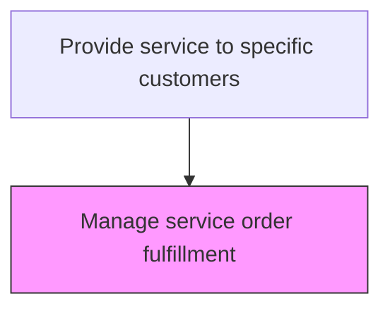
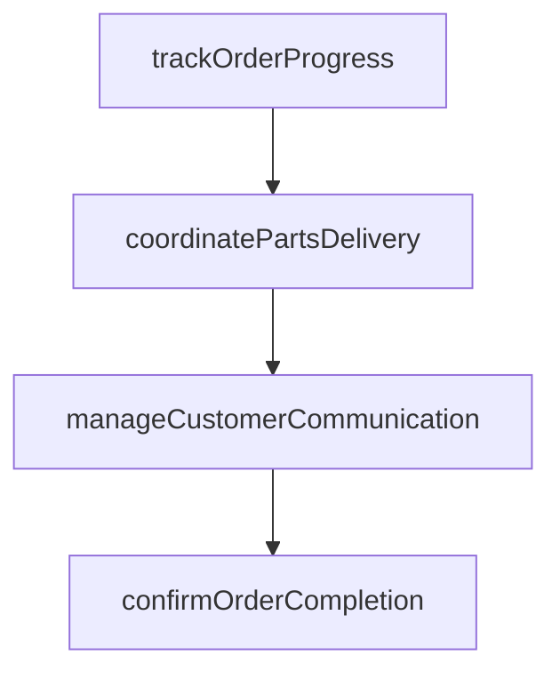

# Manage service order fulfillment

> Business-as-Code definition for service order fulfillment management. Models the end-to-end tracking, coordination, and completion of individual service orders.

## Overview

Handling and managing orders fulfilled, along with the orders are not or partially fulfilled to track the order fulfillment progress. Use electronic devices such as trackers and GPS in order track and ensure delivery of the orders.

## Process Hierarchy



## GraphDL

```yaml
manage:
  object: Service Order Fulfillment
  actor: ServiceFulfillmentManager
  result: ServiceFulfillmentResult
```

## Actions

| Action | Description |
|--------|-------------|
| trackOrderProgress | Monitor the status of service orders through each fulfillment stage |
| coordinatePartsDelivery | Ensure required parts are available at the service location on time |
| manageCustomerCommunication | Provide status updates and schedule confirmations to the customer |
| confirmOrderCompletion | Verify all service tasks are complete and obtain customer sign-off |

## Events

| Event | Description |
|-------|-------------|
| fulfillmentStatusUpdated | Service order fulfillment progress status updated |
| serviceOrderCompleted | Service order marked as fully fulfilled and completed |
| escalationTriggered | Service order escalated due to delay or complexity |
| customerNotified | Customer notified of service order completion or status change |

## Searches

| Search | Description |
|--------|-------------|
| getOrderFulfillmentStatus | Retrieve current fulfillment status for service orders |
| getOverdueOrders | List service orders past their SLA deadline |
| getEscalatedOrders | Query escalated service orders by reason and status |
| getFulfillmentMetrics | Retrieve fulfillment performance metrics by period or team |

## Process Flow



## RACI Matrix

| Activity | Responsible | Accountable | Consulted | Informed |
|----------|-------------|-------------|-----------|----------|
| trackFulfillmentStatus | Service Coordinator | Service Operations Manager | Field Service | Customer |
| manageEscalations | Service Operations Manager | VP Customer Service | Field Service | Executive Team |
| notifyCustomers | Customer Service Agent | Service Operations Manager | Field Service | Quality |

## Related Processes

| Process | Relationship |
|---------|-------------|
| 6.3.5.3.2 Execute product repair | Related - repair execution is tracked through fulfillment |
| 6.3.5.4.1 Identify completed service orders for feedback | Downstream - completed orders trigger feedback collection |
| 6.5.3 Measure customer satisfaction | Downstream - fulfillment quality affects satisfaction scores |

## Related Departments

| Department | Role |
|-----------|------|
| Service Operations | Monitors and manages service order fulfillment progress |
| Field Service | Executes and reports on service fulfillment activities |
| Customer Service | Communicates fulfillment status to customers |

## Related Occupations

| Occupation | Involvement |
|-----------|-------------|
| Service Operations Manager | Oversees service order fulfillment and SLA compliance |
| Service Coordinator | Tracks order progress and manages escalations |
| Field Service Supervisor | Ensures field team completes assigned orders |

## KPIs

| KPI | Description | Unit |
|-----|-------------|------|
| SLA Compliance Rate | Percentage of service orders completed within SLA timeframe | % |
| Order Completion Rate | Percentage of service orders successfully completed vs opened | % |
| Escalation Rate | Percentage of service orders requiring escalation | % |

## Usage

```typescript
import { manageServiceOrderFulfillment } from '@headlessly/manage-service-order-fulfillment'

const client = manageServiceOrderFulfillment()

// Update fulfillment status
await client.updateFulfillmentStatus({
  orderId: 'SO-2025-789',
  status: 'completed',
  completionNotes: 'Motor replaced, functional test passed'
})

// Check overdue orders
const overdue = await client.getOverdueOrders({
  region: 'west-coast',
  slaThreshold: 'breached'
})
```
