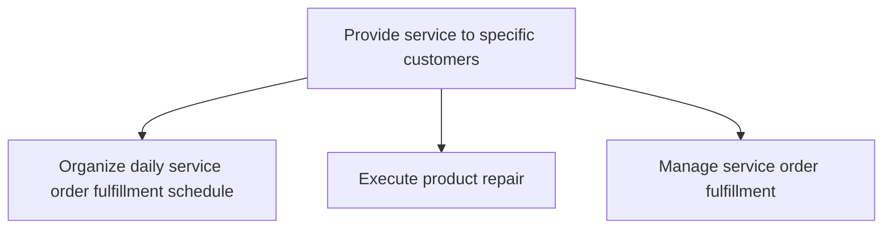
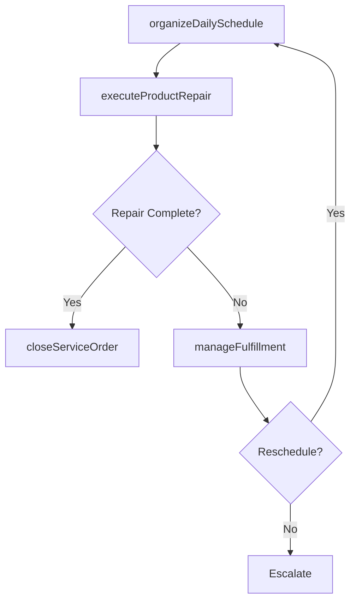

# Provide service to specific customers

> Business-as-Code definition for customer-specific service delivery. Models daily service scheduling, product repair execution, and service order fulfillment management.

## Overview

Dispatching resources for managing and fulfilling daily service requirements. Manage the progress of order fulfillment. Complete order blocks.

## Process Hierarchy



## GraphDL

```yaml
provide:
  object: Service To Specific Customers
  actor: FieldServiceTechnician
  result: CompletedServiceOrder
```

## Actions

| Action | Description |
|--------|-------------|
| organizeDailySchedule | Arrange and prioritize daily service orders for field technician dispatch |
| executeProductRepair | Perform on-site or depot repair of customer products per service order |
| manageFulfillment | Track service order progress and handle incomplete or blocked orders |
| closeServiceOrder | Complete service documentation and confirm customer acceptance |

## Events

| Event | Description |
|-------|-------------|
| dailyScheduleOrganized | Daily service fulfillment plan published to technicians |
| productRepairExecuted | Product repair completed and verified |
| fulfillmentManaged | Service order progress updated and exceptions handled |
| serviceOrderClosed | Service order completed with customer sign-off |

## Searches

| Search | Description |
|--------|-------------|
| getDailyServiceSchedule | Retrieve scheduled service orders for a given day and technician |
| getServiceOrderStatus | Query current status of active service orders |
| getIncompleteOrders | List service orders not completed within scheduled window |

## Process Flow



## RACI Matrix

| Activity | Responsible | Accountable | Consulted | Informed |
|----------|-------------|-------------|-----------|----------|
| organizeDailySchedule | Dispatch Coordinator | Service Manager | Field Technicians | Customer |
| executeProductRepair | Field Service Technician | Service Manager | Technical Support | Customer |
| manageFulfillment | Service Coordinator | Service Manager | Field Technicians | Customer |
| closeServiceOrder | Field Service Technician | Service Manager | Quality | Billing |

## Sub-Processes

| ID | Name | Description |
|----|------|-------------|
| 6.3.5.3.1 | Organize daily service order fulfillment schedule | Laying out a daily plan of specific service orders that need to be fulfilled. Document and systemati |
| 6.3.5.3.2 | Execute product repair | Dispatching and delivering the resources needed for the specific service requirements from the sourc |
| 6.3.5.3.3 | Manage service order fulfillment | Handling and managing orders fulfilled, along with the orders are not or partially fulfilled to trac |

## Related Processes

| Process | Relationship |
|---------|-------------|
| 6.3.5.2 Identify and schedule resources to meet service requirements | Upstream - scheduled resources enable service delivery |
| 6.3.5.4 Ensure quality of service | Downstream - completed services enter quality review |

## Related Departments

| Department | Role |
|-----------|------|
| Field Service | Executes on-site repairs and service delivery |
| Service Operations | Manages daily scheduling and dispatch coordination |
| Parts and Logistics | Provides spare parts and equipment for repairs |

## Related Occupations

| Occupation | Involvement |
|-----------|-------------|
| Field Service Technician | Performs on-site product repairs and installations |
| Dispatch Coordinator | Manages daily service order assignments and routing |

## KPIs

| KPI | Description | Unit |
|-----|-------------|------|
| First-Time Fix Rate | Percentage of service orders resolved on the first visit | % |
| Mean Time to Repair | Average duration from service start to repair completion | Hours |
| Daily Schedule Completion Rate | Percentage of scheduled service orders completed per day | % |

## Usage

```typescript
import { provideServiceToSpecificCustomers } from '@headlessly/provide-service-to-specific-customers'

const service = provideServiceToSpecificCustomers()

// Execute a product repair
const repair = await service.executeProductRepair({
  serviceOrderId: 'SO-2025-4567',
  technicianId: 'TECH-890',
  repairType: 'on-site',
  partsUsed: ['compressor-unit'],
  laborHours: 3.5
})

// Close the service order
await service.closeServiceOrder({
  serviceOrderId: 'SO-2025-4567',
  resolution: 'repaired',
  customerSignoff: true
})
```
