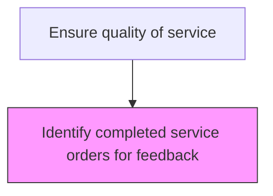
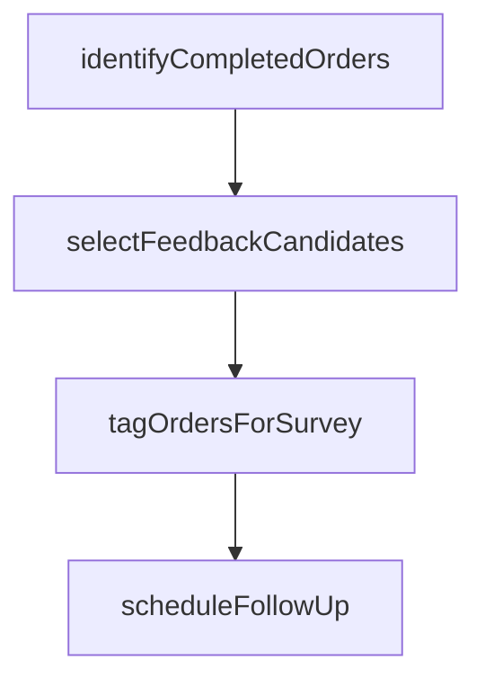

# Identify completed service orders for feedback

> Business-as-Code definition for completed service order feedback identification. Models the selection and flagging of completed service orders eligible for customer feedback collection.

## Overview

Determining the service orders that have been successfully delivered. Identify the service orders completed and delivered to the customer. Leverage communication systems to ensure coordination with the customers in order to avoid mishaps.

## Process Hierarchy



## GraphDL

```yaml
identify:
  object: Completed Service Orders For Feedback
  actor: ServiceQualityCoordinator
  result: ServiceQualityResult
```

## Actions

| Action | Description |
|--------|-------------|
| identifyCompletedOrders | Query recently completed service orders eligible for feedback solicitation |
| selectFeedbackCandidates | Apply sampling criteria to select orders for feedback collection |
| tagOrdersForSurvey | Mark selected orders for customer satisfaction survey distribution |
| scheduleFollowUp | Set the timing for feedback requests based on service completion date |

## Events

| Event | Description |
|-------|-------------|
| completedOrdersIdentified | Service orders eligible for feedback collection flagged |
| feedbackWindowOpened | Post-service feedback collection period activated |
| feedbackBatchPrepared | Batch of completed orders prepared for survey distribution |
| feedbackCriteriaApplied | Selection criteria applied to filter eligible feedback orders |

## Searches

| Search | Description |
|--------|-------------|
| getCompletedOrders | List recently completed service orders eligible for feedback |
| getFeedbackEligibility | Check whether a completed order qualifies for feedback solicitation |
| getFeedbackBatches | Retrieve prepared feedback batches by date or region |
| getExcludedOrders | List completed orders excluded from feedback and the exclusion reason |

## Process Flow



## RACI Matrix

| Activity | Responsible | Accountable | Consulted | Informed |
|----------|-------------|-------------|-----------|----------|
| identifyCompletedOrders | Quality Coordinator | Quality Manager | Service Operations | Customer Insights |
| applyFeedbackCriteria | Service Quality Analyst | Quality Manager | Customer Insights | Service Operations |
| prepareFeedbackBatch | Data Analyst | Quality Manager | IT | Customer Service |

## Related Processes

| Process | Relationship |
|---------|-------------|
| 6.3.5.3.3 Manage service order fulfillment | Upstream - completed orders trigger feedback identification |
| 6.3.5.4.3 Solicit customer feedback on services delivered | Downstream - identified orders are sent surveys |
| 6.5.3 Measure customer satisfaction | Downstream - feedback data feeds satisfaction measurement |

## Related Departments

| Department | Role |
|-----------|------|
| Quality Assurance | Identifies completed orders eligible for quality feedback |
| Service Operations | Provides order completion data for feedback selection |
| Customer Insights | Designs feedback selection criteria and sampling methods |

## Related Occupations

| Occupation | Involvement |
|-----------|-------------|
| Quality Coordinator | Identifies and flags completed orders for feedback |
| Service Quality Analyst | Defines eligibility criteria for feedback collection |
| Data Analyst | Prepares feedback batches and manages sampling |

## KPIs

| KPI | Description | Unit |
|-----|-------------|------|
| Feedback Eligibility Rate | Percentage of completed orders selected for feedback collection | % |
| Identification Timeliness | Average hours from order completion to feedback eligibility flagging | Hours |
| Batch Processing Time | Average time to prepare a feedback collection batch | Hours |

## Usage

```typescript
import { identifyCompletedServiceOrdersForFeedback } from '@headlessly/identify-completed-service-orders-for-feedback'

const client = identifyCompletedServiceOrdersForFeedback()

// Identify completed orders for feedback
const orders = await client.identifyCompletedOrders({
  dateRange: { from: '2025-04-01', to: '2025-04-07' },
  minDaysSinceCompletion: 2,
  excludeRepeatCustomers: false
})

// Prepare feedback batch
const batch = await client.prepareFeedbackBatch({
  orderIds: orders.map(o => o.id),
  surveyTemplate: 'post-service-standard'
})
```
