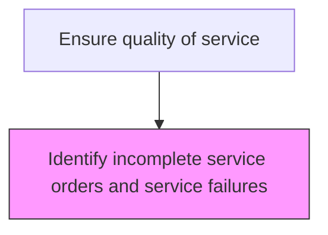
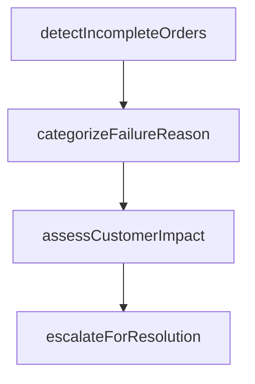

# Identify incomplete service orders and service failures

> Business-as-Code definition for incomplete service order and failure identification. Models the detection, categorization, and escalation of service orders that failed to complete successfully.

## Overview

Determining orders which have not been completed or delivered. Identify the service orders that are partially or entirely incomplete, as well as the orders that have not been delivered to the customer. Use techniques such as project trackers to recognize the progress of the service orders.

## Process Hierarchy



## GraphDL

```yaml
identify:
  object: Incomplete Service Orders And Service Failures
  actor: ServiceQualityAnalyst
  result: ServiceQualityResult
```

## Actions

| Action | Description |
|--------|-------------|
| detectIncompleteOrders | Identify service orders that missed completion deadlines or failed quality checks |
| categorizeFailureReason | Classify the reason for service incompletion or failure |
| assessCustomerImpact | Evaluate the impact on the customer and determine remediation needs |
| escalateForResolution | Route incomplete orders to appropriate teams for corrective action |

## Events

| Event | Description |
|-------|-------------|
| incompleteOrdersIdentified | Service orders not completed within SLA identified |
| serviceFailuresCategorized | Service failures classified by root cause type |
| failureEscalationTriggered | Critical service failure escalated for management review |
| remediationPlanCreated | Corrective plan developed for incomplete or failed service orders |

## Searches

| Search | Description |
|--------|-------------|
| getIncompleteOrders | List service orders not completed within their target timeframe |
| getServiceFailures | Query service failures by type, severity, or technician |
| getFailureTrends | Analyze service failure trends over time by category |
| getRemediationStatus | Track remediation progress for identified service failures |

## Process Flow



## RACI Matrix

| Activity | Responsible | Accountable | Consulted | Informed |
|----------|-------------|-------------|-----------|----------|
| identifyIncompleteOrders | Service Quality Analyst | Quality Manager | Service Operations | Field Service |
| categorizeServiceFailures | Service Quality Analyst | Quality Manager | Field Service | Engineering |
| createRemediationPlan | Service Operations Manager | VP Customer Service | Quality | Customer Service |

## Related Processes

| Process | Relationship |
|---------|-------------|
| 6.3.5.3.3 Manage service order fulfillment | Upstream - fulfillment tracking identifies incomplete orders |
| 6.3.5.4.4 Process customer feedback on services delivered | Related - failure data informs feedback analysis |
| 6.5.3 Measure customer satisfaction | Downstream - failure rates affect satisfaction metrics |

## Related Departments

| Department | Role |
|-----------|------|
| Quality Assurance | Identifies and categorizes service failures |
| Service Operations | Manages remediation of incomplete service orders |
| Field Service | Provides failure context and participates in remediation |

## Related Occupations

| Occupation | Involvement |
|-----------|-------------|
| Service Quality Analyst | Identifies and categorizes incomplete orders and failures |
| Service Operations Manager | Develops and oversees remediation plans |
| Field Service Supervisor | Provides root cause input for service failures |

## KPIs

| KPI | Description | Unit |
|-----|-------------|------|
| Incomplete Order Rate | Percentage of service orders not completed within SLA | % |
| Failure Categorization Time | Average time to categorize and document service failures | Hours |
| Remediation Completion Rate | Percentage of service failures with completed remediation plans | % |

## Usage

```typescript
import { identifyIncompleteServiceOrdersAndServiceFailures } from '@headlessly/identify-incomplete-service-orders-and-service-failures'

const client = identifyIncompleteServiceOrdersAndServiceFailures()

// Identify incomplete orders and failures
const failures = await client.identifyServiceFailures({
  period: '2025-Q1',
  includeRootCause: true
})

// Create remediation plan
await client.createRemediationPlan({
  failureIds: failures.map(f => f.id),
  targetCompletionDate: '2025-05-01',
  assignee: 'service-ops-lead'
})
```
