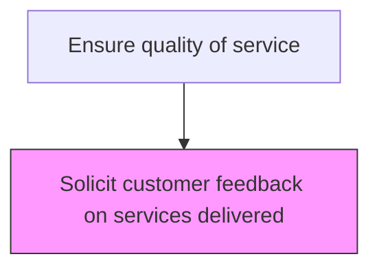
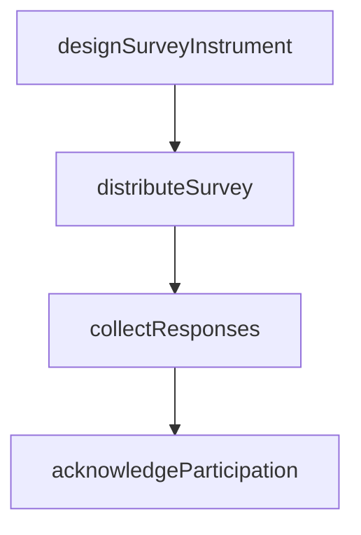

# Solicit customer feedback on services delivered

> Business-as-Code definition for post-service customer feedback solicitation. Models the collection of customer satisfaction data following after-sales service delivery.

## Overview

Obtaining and procuring customer reviews or feedback on the services delivered. Design a customer feedback form, or communicate with the customer through the phone or online.

## Process Hierarchy



## GraphDL

```yaml
solicit:
  object: Customer Feedback On Services Delivered
  actor: CustomerFeedbackSpecialist
  result: CustomerFeedbackResult
```

## Actions

| Action | Description |
|--------|-------------|
| designSurveyInstrument | Create or select the appropriate satisfaction survey for the service type |
| distributeSurvey | Send the feedback request to the customer through their preferred channel |
| collectResponses | Gather and record customer feedback submissions |
| acknowledgeParticipation | Thank customers who provided feedback and address any immediate concerns |

## Events

| Event | Description |
|-------|-------------|
| feedbackSurveyDistributed | Post-service satisfaction survey sent to customer |
| feedbackResponseReceived | Customer completed and submitted the feedback survey |
| feedbackReminderSent | Follow-up reminder sent for unreturned surveys |
| feedbackCollectionClosed | Feedback collection window closed for a service batch |

## Searches

| Search | Description |
|--------|-------------|
| getSurveyResponses | Retrieve customer feedback responses by service order or date |
| getSurveyResponseRate | Query feedback response rates by channel or customer segment |
| getPendingSurveys | List distributed surveys awaiting customer response |
| getFeedbackScores | Retrieve satisfaction scores by service type or technician |

## Process Flow



## RACI Matrix

| Activity | Responsible | Accountable | Consulted | Informed |
|----------|-------------|-------------|-----------|----------|
| distributeSurvey | Customer Insights Analyst | Customer Insights Manager | IT | Customer Service |
| trackResponses | Survey Administrator | Customer Insights Manager | Data Analytics | Quality |
| sendReminders | Customer Service Agent | Customer Insights Manager | Customer | Service Operations |

## Related Processes

| Process | Relationship |
|---------|-------------|
| 6.3.5.4.1 Identify completed service orders for feedback | Upstream - identified orders drive survey distribution |
| 6.3.5.4.4 Process customer feedback on services delivered | Downstream - received feedback is processed and analyzed |
| 6.5.3 Measure customer satisfaction | Downstream - feedback data feeds satisfaction measurement |

## Related Departments

| Department | Role |
|-----------|------|
| Customer Insights | Designs and distributes post-service satisfaction surveys |
| Customer Service | Manages customer communication during feedback collection |
| Quality Assurance | Uses feedback to assess service delivery quality |

## Related Occupations

| Occupation | Involvement |
|-----------|-------------|
| Customer Insights Analyst | Manages survey distribution and response tracking |
| Customer Service Agent | Handles customer questions about feedback surveys |
| Quality Manager | Reviews feedback trends for quality improvement |

## KPIs

| KPI | Description | Unit |
|-----|-------------|------|
| Survey Response Rate | Percentage of distributed surveys receiving customer responses | % |
| Average Satisfaction Score | Mean customer satisfaction rating from completed surveys | Score (1-5) |
| Survey Distribution Timeliness | Average days from service completion to survey delivery | Days |

## Usage

```typescript
import { solicitCustomerFeedbackOnServicesDelivered } from '@headlessly/solicit-customer-feedback-on-services-delivered'

const client = solicitCustomerFeedbackOnServicesDelivered()

// Distribute feedback survey
const survey = await client.distributeSurvey({
  orderId: 'SO-2025-789',
  channel: 'email',
  template: 'post-repair-satisfaction'
})

// Check response rate
const rate = await client.getSurveyResponseRate({
  batchId: 'BATCH-2025-04',
  minDaysOpen: 7
})
```
