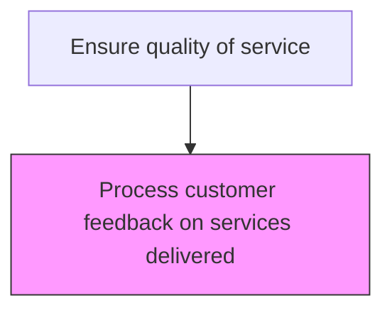
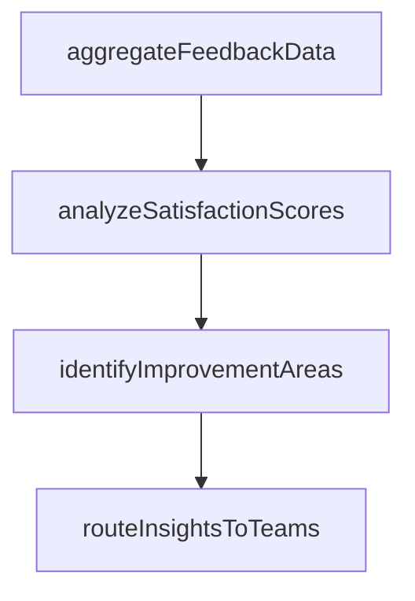

# Process customer feedback on services delivered

> Business-as-Code definition for service feedback processing and analysis. Models the aggregation, analysis, and action routing of customer feedback on after-sales services delivered.

## Overview

Assessing and incorporating customer reviews/feedback into the service plan to ensure high quality of service.

## Process Hierarchy



## GraphDL

```yaml
process:
  object: Customer Feedback On Services Delivered
  actor: FeedbackAnalyst
  result: FeedbackResult
```

## Actions

| Action | Description |
|--------|-------------|
| aggregateFeedbackData | Consolidate feedback responses across service types and periods |
| analyzeSatisfactionScores | Calculate satisfaction metrics and identify trends in service quality |
| identifyImprovementAreas | Detect recurring service issues and opportunities for enhancement |
| routeInsightsToTeams | Distribute feedback findings to service management and quality teams |

## Events

| Event | Description |
|-------|-------------|
| feedbackAnalyzed | Customer feedback responses analyzed and scored |
| improvementOpportunityIdentified | Service improvement opportunity derived from feedback patterns |
| feedbackReportPublished | Feedback analysis report distributed to stakeholders |
| actionItemCreated | Specific improvement action created from feedback insight |

## Searches

| Search | Description |
|--------|-------------|
| getFeedbackAnalysis | Retrieve analyzed feedback results by period, service type, or technician |
| getImprovementActions | List improvement actions created from feedback analysis |
| getFeedbackTrends | Query feedback score trends over time by dimension |
| getNegativeFeedback | Retrieve feedback responses below satisfaction threshold |

## Process Flow



## RACI Matrix

| Activity | Responsible | Accountable | Consulted | Informed |
|----------|-------------|-------------|-----------|----------|
| analyzeFeedback | Customer Insights Analyst | Customer Insights Manager | Quality | Service Operations |
| identifyImprovements | Quality Improvement Specialist | VP Customer Service | Service Operations | Product Team |
| createActionItems | Service Operations Manager | VP Customer Service | Quality | Executive Team |

## Related Processes

| Process | Relationship |
|---------|-------------|
| 6.3.5.4.3 Solicit customer feedback on services delivered | Upstream - collected feedback is processed and analyzed |
| 6.5.3 Measure customer satisfaction | Downstream - processed feedback feeds satisfaction scoring |
| 6.1.4 Define customer service policies and procedures | Feedback loop - insights inform policy updates |

## Related Departments

| Department | Role |
|-----------|------|
| Customer Insights | Analyzes feedback data and produces insights reports |
| Quality Assurance | Uses feedback to drive service quality improvements |
| Service Operations | Implements improvement actions from feedback findings |

## Related Occupations

| Occupation | Involvement |
|-----------|-------------|
| Customer Insights Analyst | Processes and analyzes customer feedback data |
| Quality Improvement Specialist | Converts feedback insights into improvement actions |
| Service Operations Manager | Implements operational changes from feedback findings |

## KPIs

| KPI | Description | Unit |
|-----|-------------|------|
| Feedback Processing Time | Average days from feedback receipt to completed analysis | Days |
| Action Item Closure Rate | Percentage of feedback-driven actions completed on time | % |
| Net Promoter Score | Customer likelihood to recommend based on service experience | Score (-100 to 100) |

## Usage

```typescript
import { processCustomerFeedbackOnServicesDelivered } from '@headlessly/process-customer-feedback-on-services-delivered'

const client = processCustomerFeedbackOnServicesDelivered()

// Analyze feedback responses
const analysis = await client.analyzeFeedback({
  period: '2025-Q1',
  dimensions: ['technician', 'serviceType', 'region']
})

// Create improvement action from insight
await client.createImprovementAction({
  insightId: analysis.insights[0].id,
  description: 'Reduce average repair time for motor replacements',
  assignee: 'field-service-mgr',
  targetDate: '2025-06-30'
})
```
