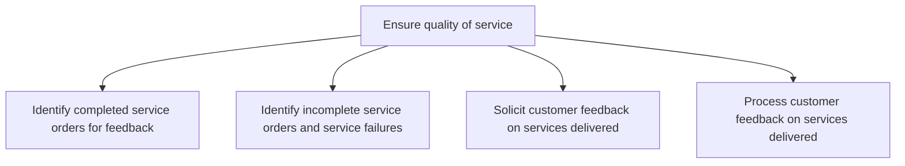
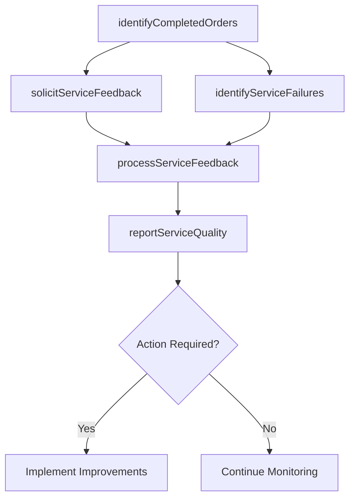

# Ensure quality of service

> Business-as-Code definition for service quality assurance. Models service completion tracking, failure identification, customer feedback collection, and feedback-driven quality improvement.

## Overview

Guaranteeing the quality of service provided to customers. Identify the successful and unsuccessful orders along with the service failures. Collect customer feedback. Process the feedback to ensure the quality of service in the future.

## Process Hierarchy



## GraphDL

```yaml
ensure:
  object: Quality Of Service
  actor: ServiceQualityAnalyst
  result: QualityAssessmentReport
```

## Actions

| Action | Description |
|--------|-------------|
| identifyCompletedOrders | Flag successfully completed service orders eligible for customer feedback |
| identifyServiceFailures | Detect incomplete orders, repeat visits, and service delivery failures |
| solicitServiceFeedback | Deploy post-service surveys to gather customer satisfaction ratings |
| processServiceFeedback | Analyze customer feedback and generate quality improvement actions |
| reportServiceQuality | Compile service quality metrics and trends into management reports |

## Events

| Event | Description |
|-------|-------------|
| completedOrdersIdentified | Successfully delivered service orders flagged for feedback |
| serviceFailuresIdentified | Incomplete orders and service failures documented |
| serviceFeedbackSolicited | Post-service satisfaction survey deployed to customer |
| serviceFeedbackProcessed | Customer feedback analyzed and improvement actions generated |
| serviceQualityReported | Service quality report compiled and distributed |

## Searches

| Search | Description |
|--------|-------------|
| getCompletedOrders | List completed service orders by period, technician, or product |
| getServiceFailures | Retrieve incomplete orders and repeat service visits |
| getServiceFeedbackScores | Query customer satisfaction ratings by technician, region, or period |
| getQualityTrends | Retrieve service quality metrics over time |

## Process Flow



## RACI Matrix

| Activity | Responsible | Accountable | Consulted | Informed |
|----------|-------------|-------------|-----------|----------|
| identifyCompletedOrders | Service Quality Analyst | Service Manager | Dispatch | Field Technicians |
| identifyServiceFailures | Service Quality Analyst | Service Manager | Field Technicians | Operations |
| solicitServiceFeedback | Service Quality Analyst | Service Manager | IT | Customer |
| processServiceFeedback | Service Quality Analyst | Service Manager | Operations | Executive Team |

## Sub-Processes

| ID | Name | Description |
|----|------|-------------|
| 6.3.5.4.1 | Identify completed service orders for feedback | Determining the service orders that have been successfully delivered. Identify the service orders co |
| 6.3.5.4.2 | Identify incomplete service orders and service failures | Determining orders which have not been completed or delivered. Identify the service orders that are  |
| 6.3.5.4.3 | Solicit customer feedback on services delivered | Obtaining and procuring customer reviews or feedback on the services delivered. Design a customer fe |
| 6.3.5.4.4 | Process customer feedback on services delivered | Assessing and incorporating customer reviews/feedback into the service plan to ensure high quality o |

## Related Processes

| Process | Relationship |
|---------|-------------|
| 6.3.5.3 Provide service to specific customers | Upstream - completed services enter quality review |
| 6.5.5 Measure customer satisfaction with products and services | Parallel - service quality data feeds overall satisfaction measurement |

## Related Departments

| Department | Role |
|-----------|------|
| Quality Assurance | Monitors service quality and drives improvement initiatives |
| Service Operations | Implements corrective actions for service failures |
| Customer Experience | Manages feedback programs and satisfaction tracking |

## Related Occupations

| Occupation | Involvement |
|-----------|-------------|
| Service Quality Analyst | Tracks quality metrics and analyzes customer feedback |
| Quality Manager | Oversees service quality standards and improvement programs |

## KPIs

| KPI | Description | Unit |
|-----|-------------|------|
| Service Satisfaction Score | Average customer rating of service delivery experience | Score (1-5) |
| Service Failure Rate | Percentage of service orders resulting in incomplete or failed delivery | % |
| Repeat Service Rate | Percentage of service orders requiring a follow-up visit | % |
| Feedback Response Rate | Percentage of customers completing post-service surveys | % |

## Usage

```typescript
import { ensureQualityOfService } from '@headlessly/ensure-quality-of-service'

const quality = ensureQualityOfService()

// Identify service failures
const failures = await quality.identifyServiceFailures({
  period: '2025-06',
  region: 'northeast',
  failureTypes: ['incomplete', 'repeat-visit', 'customer-complaint']
})

// Process service feedback
const insights = await quality.processServiceFeedback({
  period: '2025-06',
  minimumResponses: 50,
  generateActions: true
})
```
