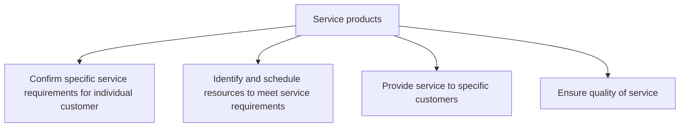
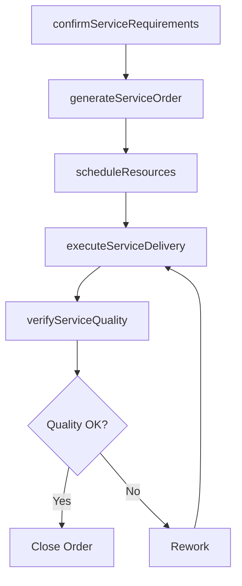

# Service products

> Business-as-Code definition for product service delivery. Models customer service requirement confirmation, resource scheduling, service execution, repair fulfillment, and service quality assurance.

## Overview

Validating specific service requirements for individual customers. Determine and schedule resource to fulfill these requirements. Provide service to specific individual customers. Ensure the quality of service delivery.

## Process Hierarchy



## GraphDL

```yaml
service:
  object: Products
  actor: FieldServiceManager
  result: ServiceCompletionRecord
```

## Actions

| Action | Description |
|--------|-------------|
| confirmServiceRequirements | Validate specific service needs for an individual customer |
| generateServiceOrder | Create a service order with scope, parts, and scheduling |
| scheduleResources | Assign technicians and materials to service orders |
| executeServiceDelivery | Perform on-site or depot repair and maintenance work |
| verifyServiceQuality | Inspect completed work and solicit customer feedback |

## Events

| Event | Description |
|-------|-------------|
| serviceRequirementsConfirmed | Customer service needs validated and documented |
| serviceOrderGenerated | Service order created with scope and schedule |
| resourcesScheduled | Technicians and parts assigned to service order |
| serviceDeliveryExecuted | Repair or maintenance work completed |
| serviceQualityVerified | Completed service inspected and customer feedback collected |

## Searches

| Search | Description |
|--------|-------------|
| getServiceOrders | List service orders by status, customer, or technician |
| getResourceSchedule | Query technician availability and assignment schedule |
| getServiceHistory | Retrieve service history for a product or customer |
| getQualityScores | Query service quality scores by technician or period |

## Process Flow



## RACI Matrix

| Activity | Responsible | Accountable | Consulted | Informed |
|----------|-------------|-------------|-----------|----------|
| confirmServiceRequirements | Service Coordinator | Field Service Manager | Customer | Sales |
| generateServiceOrder | Service Coordinator | Field Service Manager | Parts Department | Technician |
| scheduleResources | Dispatcher | Field Service Manager | Technicians | Customer |
| executeServiceDelivery | Field Service Technician | Field Service Manager | Engineering | Customer |
| verifyServiceQuality | Quality Inspector | Field Service Manager | Customer | VP Service |

## Sub-Processes

| ID | Name | Description |
|----|------|-------------|
| 6.3.5.1 | Confirm specific service requirements for individual customer | Acquiring or soliciting information about specific service requirements for individual customers thr |
| 6.3.5.2 | Identify and schedule resources to meet service requirements | Determining and scheduling the resources required to fulfill customer service requirements. Create a |
| 6.3.5.3 | Provide service to specific customers | Dispatching resources for managing and fulfilling daily service requirements. Manage the progress of |
| 6.3.5.4 | Ensure quality of service | Guaranteeing the quality of service provided to customers. Identify the successful and unsuccessful  |

## Related Processes

| Process | Relationship |
|---------|-------------|
| 6.3.2 Process warranty claims | Parallel - warranty repairs handled through service delivery |
| 6.2.2 Manage customer service problems, requests, and inquiries | Upstream - inquiries may generate service orders |
| 6.5 Evaluate customer service operations and customer satisfaction | Downstream - service quality feeds evaluation |

## Related Departments

| Department | Role |
|-----------|------|
| Field Service | Dispatches technicians and manages service delivery |
| Parts and Logistics | Provides replacement parts and manages inventory |
| Engineering | Provides technical expertise for complex repairs |
| Quality Assurance | Inspects completed work and monitors standards |

## Related Occupations

| Occupation | Involvement |
|-----------|-------------|
| Field Service Technician | Performs on-site repairs and maintenance |
| Service Dispatcher | Schedules resources and coordinates logistics |
| Quality Inspector | Verifies service completion and quality |

## KPIs

| KPI | Description | Unit |
|-----|-------------|------|
| First-Time Fix Rate | Percentage of service orders completed on first visit | % |
| Mean Time to Repair | Average hours from service start to completion | Hours |
| Service Order Backlog | Number of open service orders awaiting execution | Count |
| Customer Satisfaction with Service | Post-service customer satisfaction score | Score (1-5) |

## Usage

```typescript
import { serviceProducts } from '@headlessly/service-products'

const service = serviceProducts()

// Generate a service order
const order = await service.generateServiceOrder({
  customerId: 'cust_12345',
  productSerialNumber: 'SN-2024-67890',
  serviceType: 'preventive-maintenance',
  scheduledDate: '2025-04-10'
})

// Execute service delivery
const completion = await service.executeServiceDelivery({
  serviceOrderId: order.id,
  technicianId: 'tech_456',
  partsUsed: ['PART-001', 'PART-002'],
  laborHours: 3.5
})
```
