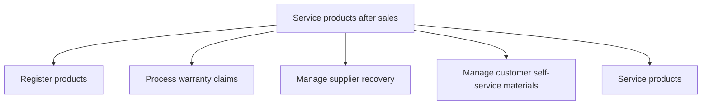
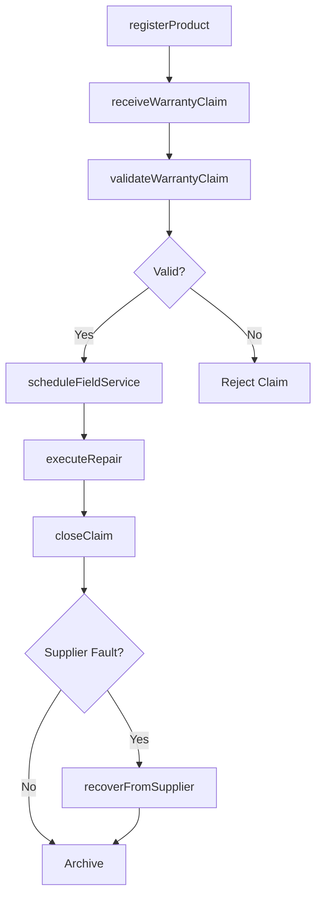

# Service products after sales

> Business-as-Code definition for post-sales product servicing. Models product registration, warranty claims processing, supplier recovery, self-service materials, and field service delivery.

## Overview

Assigning post-sales policies and paying claims on purchased products.  This is a process that is an administrative function focused on creating rules (claim codes). This group ensures that claims are valid and are processed quickly.  As well as to quickly determine responsibility for claim settlement.

## Process Hierarchy



## GraphDL

```yaml
service:
  object: Products After Sales
  actor: AfterSalesServiceManager
  result: ServiceCompletionRecord
```

## Actions

| Action | Description |
|--------|-------------|
| registerProduct | Record product registration with serial number and customer details |
| receiveWarrantyClaim | Accept and log a warranty claim from a customer |
| validateWarrantyClaim | Verify warranty eligibility and coverage terms |
| scheduleFieldService | Dispatch field technicians for on-site product inspection or repair |
| recoverFromSupplier | Initiate cost recovery claims against responsible suppliers |
| updateSelfServiceContent | Maintain FAQ, troubleshooting guides, and knowledge base articles |
| executeRepair | Perform product repair or replacement under warranty |
| closeClaim | Finalize and close a warranty or service claim |

## Events

| Event | Description |
|-------|-------------|
| productRegistered | Product registered with customer and serial number |
| warrantyClaimReceived | Warranty claim submitted and logged in the system |
| warrantyClaimValidated | Warranty claim verified against coverage terms |
| fieldServiceScheduled | Technician dispatched for on-site service |
| supplierRecoveryInitiated | Cost recovery claim filed with responsible supplier |
| selfServiceContentUpdated | Knowledge base or FAQ materials published |
| repairExecuted | Product repair or replacement completed |
| claimClosed | Service or warranty claim finalized and archived |

## Searches

| Search | Description |
|--------|-------------|
| getRegisteredProducts | Query registered products by customer, serial number, or product line |
| getWarrantyClaims | List warranty claims filtered by status, product, or date range |
| getFieldServiceOrders | Retrieve scheduled or completed field service orders |
| getSupplierRecoveries | Query supplier recovery claims by status or supplier |
| getKnowledgeBaseArticles | Search self-service content by topic or product |

## Process Flow



## RACI Matrix

| Activity | Responsible | Accountable | Consulted | Informed |
|----------|-------------|-------------|-----------|----------|
| registerProduct | Customer Service Agent | After-Sales Manager | IT | Product Management |
| validateWarrantyClaim | Warranty Specialist | After-Sales Manager | Engineering | Finance |
| scheduleFieldService | Field Service Coordinator | After-Sales Manager | Logistics | Customer |
| executeRepair | Field Service Technician | Field Service Coordinator | Engineering | After-Sales Manager |
| recoverFromSupplier | Procurement Specialist | After-Sales Manager | Legal, Finance | Supplier |

## Sub-Processes

| ID | Name | Description |
|----|------|-------------|
| 6.3.1 | Register products | Filing product registrations. |
| 6.3.2 | Process warranty claims | Identifying, investigating, and processes warranty claims. This process includes: receipt and valida |
| 6.3.3 | Manage supplier recovery | Filing and managing recovery claims against suppliers for warranty costs incurred due to supplier-liable defects, negotiating settlements and tracking recoveries. |
| 6.3.4 | Manage customer self-service materials | Maintaining and updating customer-facing self-service resources including FAQs, knowledge bases, troubleshooting guides, and how-to documentation. |
| 6.3.5 | Service products | Validating specific service requirements for individual customers. Determine and schedule resource t |

## Related Processes

| Process | Relationship |
|---------|-------------|
| 6.1 Develop customer care/customer service strategy | Upstream - warranty and service policies guide operations |
| 6.2 Plan and manage customer service operations | Parallel - shared customer interaction handling |
| 4.4 Deliver products and services | Upstream - delivery triggers after-sales service needs |
| 6.5 Evaluate customer service operations and customer satisfaction | Downstream - service outcomes feed satisfaction measurement |

## Related Departments

| Department | Role |
|-----------|------|
| After-Sales Service | Primary owner of warranty claims and field service |
| Engineering | Provides root cause analysis and repair expertise |
| Procurement | Manages supplier recovery and vendor claims |
| Logistics | Coordinates parts shipping and product returns |
| Finance | Processes warranty costs and supplier recovery accounting |

## Related Occupations

| Occupation | Involvement |
|-----------|-------------|
| Warranty Claims Specialist | Validates and processes warranty claims |
| Field Service Technician | Performs on-site product repairs and inspections |
| Technical Writer | Maintains self-service and knowledge base content |
| Procurement Analyst | Manages supplier recovery negotiations |

## KPIs

| KPI | Description | Unit |
|-----|-------------|------|
| Warranty Claim Processing Time | Average days from claim receipt to resolution | Days |
| First-Time Fix Rate | Percentage of field service visits resolving the issue on first visit | % |
| Supplier Recovery Rate | Percentage of eligible costs recovered from suppliers | % |
| Product Registration Rate | Percentage of sold products registered by customers | % |
| Self-Service Deflection Rate | Percentage of issues resolved via self-service content | % |

## Usage

```typescript
import { serviceProductsAfterSales } from '@headlessly/service-products-after-sales'

const afterSales = serviceProductsAfterSales()

// Register a product
const registration = await afterSales.registerProduct({
  serialNumber: 'SN-2025-98765',
  customerId: 'cust_12345',
  purchaseDate: '2025-03-15',
  productLine: 'industrial-pumps'
})

// Process a warranty claim
const claim = await afterSales.receiveWarrantyClaim({
  productId: registration.id,
  issueDescription: 'Motor overheating under normal load',
  claimType: 'manufacturer-defect'
})
```
