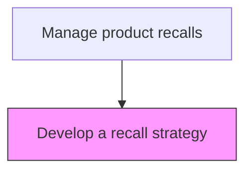
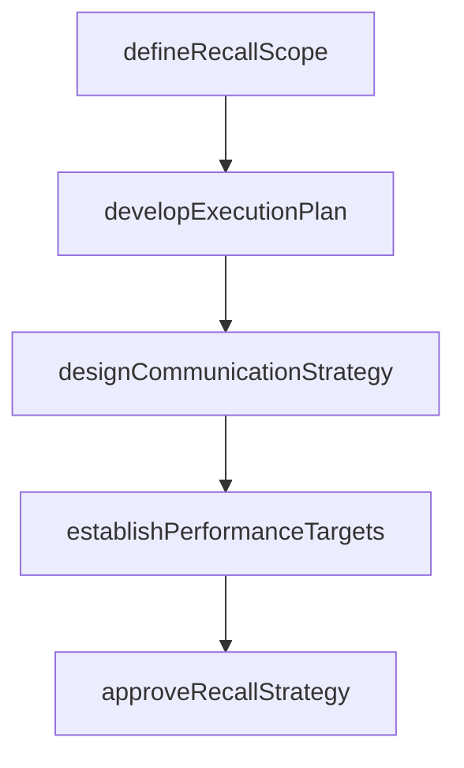

# Develop a recall strategy

> Business-as-Code definition for recall strategy development. Models the planning of recall procedures, scope determination, resource allocation, and communication strategies for product recalls.

## Overview

Developing the comprehensive strategy for executing a product recall. Define the scope of affected products, lots, and geographies. Create the operational execution plan including timelines, resource requirements, and logistics. Design the multi-channel communication strategy for customers, retailers, media, and regulatory bodies. Establish recall performance targets and obtain leadership and legal approval before initiation.

## Process Hierarchy



## GraphDL

```yaml
develop:
  object: Recall Strategy
  actor: RecallStrategyManager
  result: RecallStrategyResult
```

## Actions

| Action | Description |
|--------|-------------|
| defineRecallScope | Determine the products, lots, and geographies affected by the recall |
| developExecutionPlan | Create the operational plan including timeline, resources, and logistics |
| designCommunicationStrategy | Plan customer, retailer, and media notification approaches |
| establishPerformanceTargets | Set recall completion rate and timeline targets |
| approveRecallStrategy | Obtain leadership and legal approval for the recall plan |

## Events

| Event | Description |
|-------|-------------|
| recallScopeDefined | Affected products, lots, and geographies identified for recall |
| executionPlanDeveloped | Operational recall plan with timeline and resources created |
| communicationStrategyDesigned | Customer and stakeholder notification approach planned |
| performanceTargetsEstablished | Recall completion rate and timeline targets set |
| recallStrategyApproved | Recall plan approved by leadership and legal counsel |

## Searches

| Search | Description |
|--------|-------------|
| getAffectedProducts | List products, lots, and serial ranges included in recall scope |
| getRecallTemplates | Retrieve recall strategy templates by product category and risk level |
| getHistoricalRecalls | Query past recall strategies and outcomes for similar products |
| getRegulatoryRequirements | Retrieve regulatory reporting requirements by jurisdiction |

## Process Flow



## RACI Matrix

| Activity | Responsible | Accountable | Consulted | Informed |
|----------|-------------|-------------|-----------|----------|
| defineRecallScope | Recall Program Manager | VP Quality | Product Safety | Regulatory Affairs |
| developExecutionPlan | Recall Program Manager | VP Quality | Logistics, Legal | Executive Team |
| approveRecallStrategy | VP Quality | Chief Operating Officer | Legal, Regulatory Affairs | Board |

## Related Processes

| Process | Relationship |
|---------|-------------|
| 6.4.2 Initiate a recall | Downstream - approved strategy triggers recall initiation |
| 6.4.3 Assess likelihood and consequences of hazards | Parallel - hazard assessment informs strategy scope |
| 6.1.7 Develop recall strategy | Upstream - enterprise recall strategy guides product-specific plans |

## Related Departments

| Department | Role |
|-----------|------|
| Quality Assurance | Leads recall strategy development and scope definition |
| Legal | Reviews strategy for regulatory compliance and liability |
| Product Management | Provides product-specific data for scope determination |
| Communications | Designs stakeholder notification approaches |

## Related Occupations

| Occupation | Involvement |
|-----------|-------------|
| Recall Program Manager | Develops and coordinates the recall strategy |
| Regulatory Affairs Specialist | Ensures strategy meets regulatory requirements |
| Product Safety Engineer | Identifies affected products and hazard scope |

## KPIs

| KPI | Description | Unit |
|-----|-------------|------|
| Strategy Development Time | Average days from hazard identification to approved recall strategy | Days |
| Scope Accuracy | Percentage of affected units correctly identified in initial scope | % |
| Strategy Approval Rate | Percentage of recall strategies approved on first submission | % |

## Usage

```typescript
import { developRecallStrategy } from '@headlessly/develop-recall-strategy'

const client = developRecallStrategy()

// Define recall scope
const scope = await client.defineRecallScope({
  hazardId: 'HAZ-2025-001',
  productLines: ['X200', 'X300'],
  affectedLots: ['LOT-2025-A', 'LOT-2025-B'],
  geographies: ['US', 'CA', 'EU']
})

// Develop execution plan
const plan = await client.developExecutionPlan({
  scopeId: scope.id,
  targetCompletionRate: 95,
  timelineDays: 90
})
```
