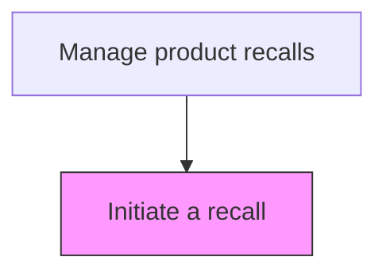
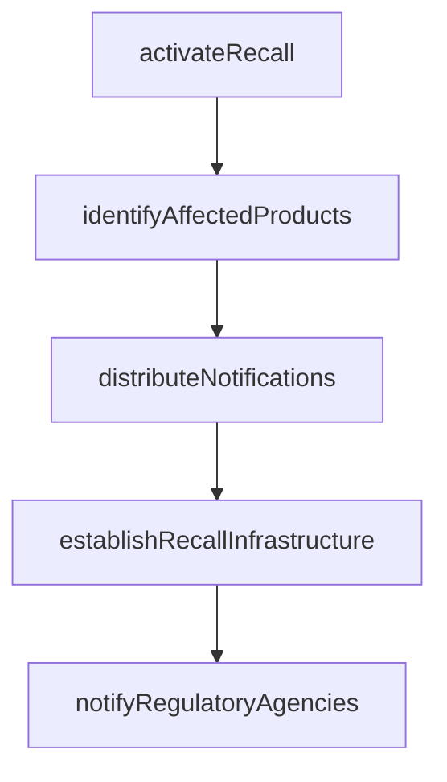

# Initiate a recall

> Business-as-Code definition for recall initiation. Models the activation of a product recall including lot identification, notification distribution, and operational launch.

## Overview

Formally launching a product recall and activating all recall operations. Identify affected products by serial number, lot, and distribution channel. Distribute recall notifications to customers, retailers, and regulatory contacts. Establish return logistics infrastructure, customer hotlines, and remedy fulfillment channels. File initial recall notifications with required regulatory bodies.

## Process Hierarchy



## GraphDL

```yaml
initiate:
  object: Recall
  actor: RecallExecutionManager
  result: RecallExecutionResult
```

## Actions

| Action | Description |
|--------|-------------|
| activateRecall | Formally launch the product recall and assign tracking identifiers |
| identifyAffectedProducts | Compile the specific serial numbers, lots, and distribution channels affected |
| distributeNotifications | Send recall notices to customers, retailers, and regulatory contacts |
| establishRecallInfrastructure | Set up return logistics, customer hotlines, and remedy fulfillment channels |
| notifyRegulatoryAgencies | File initial recall notifications with required regulatory bodies |

## Events

| Event | Description |
|-------|-------------|
| recallClassified | Recall type and urgency level classified per regulatory framework |
| regulatoryNotificationSent | Initial recall notification submitted to regulatory authorities |
| distributionChannelsNotified | Distributors and retailers notified to halt product distribution |
| recallActivated | Recall officially activated and customer notifications initiated |

## Searches

| Search | Description |
|--------|-------------|
| getRecallStatus | Query the current status of a recall by ID or product |
| getDistributionChannels | List distribution channels and retailers affected by the recall |
| getRecallNotifications | Retrieve all notifications sent for a specific recall |
| getActiveRecalls | List all active recalls by status, product, or date |

## Process Flow



## RACI Matrix

| Activity | Responsible | Accountable | Consulted | Informed |
|----------|-------------|-------------|-----------|----------|
| classifyRecall | Recall Coordinator | VP Quality | Regulatory Affairs | Legal |
| notifyRegulatoryAuthorities | Regulatory Affairs Manager | VP Quality | Legal | Executive Team |
| activateRecall | Recall Coordinator | VP Quality | Supply Chain, Customer Service | All Departments |

## Related Processes

| Process | Relationship |
|---------|-------------|
| 6.4.1 Develop a recall strategy | Upstream - approved strategy triggers recall initiation |
| 6.4.4 Manage recall related communications | Downstream - initiation triggers communication execution |
| 6.4.5 Submit regulatory reports | Downstream - initiation triggers regulatory reporting cycle |

## Related Departments

| Department | Role |
|-----------|------|
| Quality Assurance | Activates the recall and coordinates cross-functional execution |
| Regulatory Affairs | Files initial regulatory notifications |
| Supply Chain | Notifies distribution channels and halts product movement |

## Related Occupations

| Occupation | Involvement |
|-----------|-------------|
| Recall Coordinator | Manages the recall initiation process |
| Regulatory Affairs Manager | Files mandatory regulatory notifications |
| Supply Chain Manager | Coordinates distribution channel notifications |

## KPIs

| KPI | Description | Unit |
|-----|-------------|------|
| Time to Initiation | Days from hazard confirmation to recall activation | Days |
| Regulatory Filing Timeliness | Percentage of regulatory notifications filed within required deadlines | % |
| Channel Notification Rate | Percentage of distribution channels notified within 24 hours | % |

## Usage

```typescript
import { initiateRecall } from '@headlessly/initiate-recall'

const recall = initiateRecall()

// Activate the recall
const activation = await recall.activateRecall({
  strategyId: 'STRAT-2025-001',
  recallClass: 'Class-II',
  effectiveDate: '2025-04-01'
})

// Distribute notifications to affected parties
await recall.distributeNotifications({
  recallId: activation.id,
  channels: ['retail', 'wholesale', 'online'],
  action: 'stop-sale',
  includeCustomers: true
})
```
