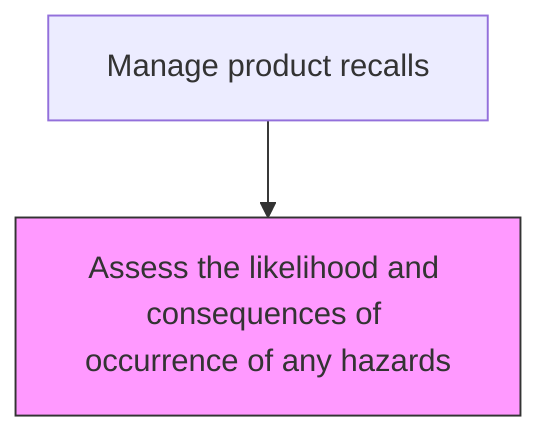
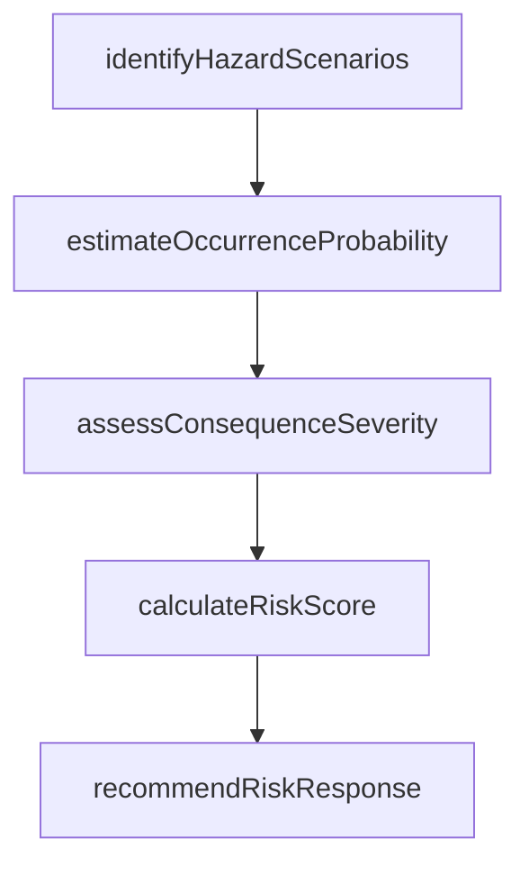

# Assess the likelihood and consequences of occurrence of any hazards

> Business-as-Code definition for hazard likelihood and consequence assessment. Models the systematic evaluation of product hazard probability and potential severity to inform recall decisions.

## Overview

Systematically evaluating the probability and potential severity of product hazards to inform recall decisions and risk classification. Enumerate potential harm scenarios, estimate occurrence probability using field data and engineering analysis, assess consequence severity, calculate composite risk scores, and recommend the appropriate level of response including voluntary recall, mandatory recall, or safety alert.

## Process Hierarchy



## GraphDL

```yaml
assess:
  object: Likelihood And Consequences Of Occurrence Of Any Hazards
  actor: ProductSafetyEngineer
  result: ProductSafetyResult
```

## Actions

| Action | Description |
|--------|-------------|
| identifyHazardScenarios | Enumerate the potential harm scenarios associated with the product defect |
| estimateOccurrenceProbability | Calculate the likelihood of each hazard scenario occurring |
| assessConsequenceSeverity | Evaluate the potential severity of harm for each scenario |
| calculateRiskScore | Combine probability and severity into a composite risk rating |
| recommendRiskResponse | Propose action level based on the risk assessment results |

## Events

| Event | Description |
|-------|-------------|
| hazardLikelihoodAssessed | Probability of harm occurrence evaluated |
| consequenceSeverityRated | Severity of potential consequences categorized |
| riskLevelDetermined | Overall risk level calculated from likelihood and consequence |
| riskAssessmentDocumented | Hazard risk assessment findings documented for regulatory review |

## Searches

| Search | Description |
|--------|-------------|
| getHazardAssessments | List hazard assessments by product, risk level, or status |
| getRiskMatrix | Retrieve the risk likelihood-consequence matrix for a product category |
| getIncidentCorrelations | Query historical incident data correlated to the assessed hazard |
| getExposureEstimates | Retrieve estimated consumer exposure data for affected products |

## Process Flow



## RACI Matrix

| Activity | Responsible | Accountable | Consulted | Informed |
|----------|-------------|-------------|-----------|----------|
| assessHazardLikelihood | Product Safety Engineer | VP Quality | Engineering | Regulatory Affairs |
| rateConsequenceSeverity | Risk Assessment Specialist | VP Quality | Medical Affairs | Legal |
| determineRiskLevel | Product Safety Engineer | VP Quality | Regulatory Affairs | Executive Team |

## Related Processes

| Process | Relationship |
|---------|-------------|
| 6.4.1 Develop a recall strategy | Related - hazard assessment informs recall scope and urgency |
| 6.4.2 Initiate a recall | Downstream - risk level determines recall class and timeline |
| 6.2.5.1 Identify incidents and adverse events | Upstream - incident data informs hazard assessment |

## Related Departments

| Department | Role |
|-----------|------|
| Product Safety | Leads hazard likelihood and consequence assessment |
| Quality Assurance | Provides product testing and failure analysis data |
| Regulatory Affairs | Ensures risk assessment meets regulatory methodology standards |

## Related Occupations

| Occupation | Involvement |
|-----------|-------------|
| Product Safety Engineer | Conducts hazard likelihood and consequence analysis |
| Risk Assessment Specialist | Applies quantitative risk assessment methodologies |
| Epidemiologist | Analyzes health consequence data for consumer products |

## KPIs

| KPI | Description | Unit |
|-----|-------------|------|
| Assessment Completion Time | Average days to complete a hazard risk assessment | Days |
| Risk Classification Accuracy | Percentage of risk assessments validated by subsequent data | % |
| Exposure Estimation Accuracy | Variance between estimated and actual consumer exposure | % |

## Usage

```typescript
import { assessLikelihoodAndConsequencesOfOccurrenceOfAnyHazards } from '@headlessly/assess-likelihood-and-consequences-of-occurrence-of-any-hazards'

const client = assessLikelihoodAndConsequencesOfOccurrenceOfAnyHazards()

// Assess hazard likelihood
const assessment = await client.assessHazardLikelihood({
  productId: 'PROD-X200',
  hazardType: 'thermal-failure',
  incidentCount: 15,
  unitsInField: 50000
})

// Determine overall risk level
const risk = await client.determineRiskLevel({
  assessmentId: assessment.id,
  consequenceSeverity: 'serious',
  populationExposure: 'widespread'
})
```
