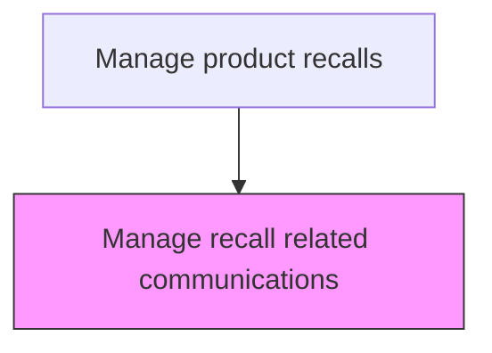
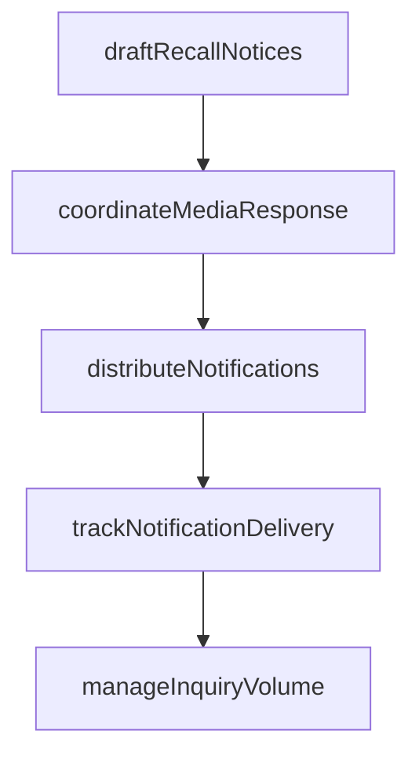

# Manage recall related communications

> Business-as-Code definition for recall communications management. Models the creation, distribution, and tracking of all stakeholder communications during a product recall.

## Overview

Managing all stakeholder communications throughout a product recall lifecycle. Draft recall notification content for customers, dealers, and regulators. Coordinate media responses including press releases and talking points. Distribute notifications through required channels, track delivery and read rates, and manage the increased customer inquiry volume resulting from recall announcements.

## Process Hierarchy



## GraphDL

```yaml
manage:
  object: Recall Related Communications
  actor: RecallCommunicationsManager
  result: RecallCommunicationsResult
```

## Actions

| Action | Description |
|--------|-------------|
| draftRecallNotices | Create recall notification content for customers, dealers, and regulators |
| coordinateMediaResponse | Prepare press releases and media talking points for public communications |
| distributeNotifications | Send recall notifications through all required channels |
| trackNotificationDelivery | Monitor delivery and read rates for distributed recall communications |
| manageInquiryVolume | Handle increased customer inquiries resulting from recall announcements |

## Events

| Event | Description |
|-------|-------------|
| communicationPlanActivated | Recall communication plan launched across all channels |
| customerNotificationsSent | Direct customer notifications distributed via registered channels |
| mediaStatementReleased | Press release or media statement published regarding the recall |
| dealerBulletinIssued | Dealer and retailer recall bulletins distributed |

## Searches

| Search | Description |
|--------|-------------|
| getRecallCommunications | List all communications sent for a specific recall |
| getNotificationStatus | Query customer notification delivery and read status |
| getMediaCoverage | Retrieve media mentions and coverage of the recall |
| getCustomerInquiries | List customer inquiries received in response to recall notifications |

## Process Flow



## RACI Matrix

| Activity | Responsible | Accountable | Consulted | Informed |
|----------|-------------|-------------|-----------|----------|
| sendCustomerNotifications | Crisis Communications Manager | VP Communications | Customer Service | Legal |
| manageMediaRelations | Crisis Communications Manager | VP Communications | Legal | Executive Team |
| handleCustomerInquiries | Customer Service Team Lead | VP Customer Service | Communications | Quality |

## Related Processes

| Process | Relationship |
|---------|-------------|
| 6.4.2 Initiate a recall | Upstream - recall initiation triggers communication execution |
| 6.4.5 Submit regulatory reports | Related - communication metrics feed regulatory reporting |
| 6.4.6 Monitor and audit recall effectiveness | Downstream - communication reach affects recall effectiveness |

## Related Departments

| Department | Role |
|-----------|------|
| Communications | Manages recall messaging and media relations |
| Customer Service | Handles customer inquiries about the recall |
| Marketing | Supports customer notification through owned channels |

## Related Occupations

| Occupation | Involvement |
|-----------|-------------|
| Crisis Communications Manager | Leads recall communication strategy and execution |
| Customer Service Team Lead | Coordinates customer inquiry response during recall |
| Digital Marketing Specialist | Manages recall notifications via digital channels |

## KPIs

| KPI | Description | Unit |
|-----|-------------|------|
| Notification Reach | Percentage of affected customers successfully contacted | % |
| Communication Response Rate | Percentage of notified customers taking the recommended action | % |
| Inquiry Response Time | Average time to respond to customer recall inquiries | Hours |

## Usage

```typescript
import { manageRecallRelatedCommunications } from '@headlessly/manage-recall-related-communications'

const client = manageRecallRelatedCommunications()

// Send customer notifications
const notification = await client.sendCustomerNotifications({
  recallId: 'RCL-2025-001',
  channels: ['email', 'sms', 'mail'],
  template: 'recall-notification-standard'
})

// Track notification delivery
const status = await client.getNotificationStatus({
  recallId: 'RCL-2025-001',
  deliveryStatus: 'pending'
})
```
