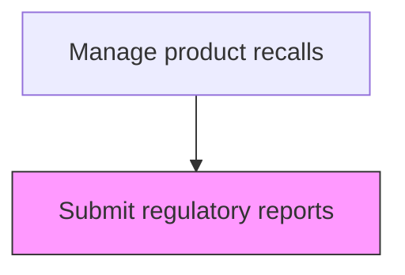
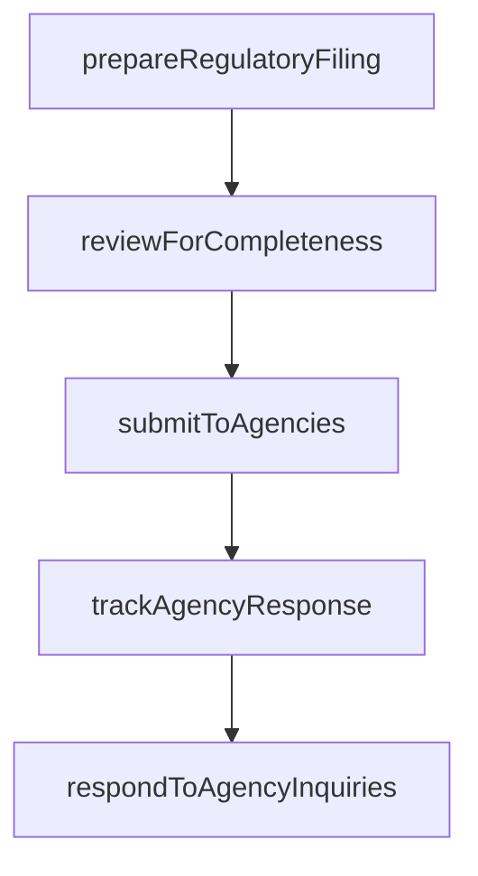

# Submit regulatory reports

> Business-as-Code definition for regulatory report submission. Models the preparation and filing of required regulatory reports during product recalls.

## Overview

Preparing and filing required regulatory reports during product recalls. Compile recall data into the prescribed regulatory format, review filings for completeness against agency requirements, submit reports to each applicable regulatory body within mandated deadlines, track agency acknowledgments and follow-up requests, and respond to regulatory inquiries with additional information as needed.

## Process Hierarchy



## GraphDL

```yaml
submit:
  object: Regulatory Reports
  actor: RegulatoryReportingManager
  result: RegulatoryReportingResult
```

## Actions

| Action | Description |
|--------|-------------|
| prepareRegulatoryFiling | Compile recall data into the required regulatory reporting format |
| reviewForCompleteness | Verify the filing meets all regulatory content requirements |
| submitToAgencies | File the report with each applicable regulatory agency |
| trackAgencyResponse | Monitor regulatory agency acknowledgments and follow-up requests |
| respondToAgencyInquiries | Address questions or requests for additional information from regulators |

## Events

| Event | Description |
|-------|-------------|
| regulatoryReportPrepared | Recall status report formatted per regulatory requirements |
| reportSubmitted | Recall report filed with the applicable regulatory agency |
| agencyAcknowledgmentReceived | Regulatory agency confirmed receipt of the recall report |
| reportAmendmentFiled | Updated or corrected recall report submitted to agency |

## Searches

| Search | Description |
|--------|-------------|
| getFilingDeadlines | List upcoming regulatory filing deadlines by recall and agency |
| getSubmittedReports | Retrieve previously submitted regulatory reports for a recall |
| getAgencyFeedback | Query feedback or questions received from regulatory agencies |
| getRegulatoryTemplates | Retrieve report templates by agency and recall classification |

## Process Flow



## RACI Matrix

| Activity | Responsible | Accountable | Consulted | Informed |
|----------|-------------|-------------|-----------|----------|
| prepareRegulatoryReport | Regulatory Affairs Manager | VP Quality | Quality Assurance | Legal |
| submitReport | Compliance Specialist | Regulatory Affairs Manager | Legal | Executive Team |
| trackAgencyFeedback | Regulatory Affairs Manager | VP Quality | Legal | Quality Assurance |

## Related Processes

| Process | Relationship |
|---------|-------------|
| 6.4.2 Initiate a recall | Upstream - recall initiation triggers initial regulatory report |
| 6.4.6 Monitor and audit recall effectiveness | Related - effectiveness data feeds periodic regulatory updates |
| 6.2.5.4 Report CAPA | Related - CAPA reporting may accompany recall regulatory filings |

## Related Departments

| Department | Role |
|-----------|------|
| Regulatory Affairs | Prepares and submits recall reports to agencies |
| Legal | Reviews regulatory submissions for compliance |
| Quality Assurance | Provides recall data and metrics for reporting |

## Related Occupations

| Occupation | Involvement |
|-----------|-------------|
| Regulatory Affairs Manager | Oversees recall regulatory report preparation and filing |
| Compliance Specialist | Ensures report adherence to agency format requirements |
| Legal Counsel | Reviews submissions for liability and regulatory risk |

## KPIs

| KPI | Description | Unit |
|-----|-------------|------|
| Filing Timeliness | Percentage of regulatory reports submitted before deadline | % |
| Report Accuracy Rate | Percentage of reports accepted without amendment requests | % |
| Agency Response Time | Average days from report submission to agency acknowledgment | Days |

## Usage

```typescript
import { submitRegulatoryReports } from '@headlessly/submit-regulatory-reports'

const client = submitRegulatoryReports()

// Prepare regulatory report
const report = await client.prepareRegulatoryReport({
  recallId: 'RCL-2025-001',
  agency: 'CPSC',
  reportType: 'progress-report',
  period: '2025-Q1'
})

// Submit to agency
await client.submitReport({
  reportId: report.id,
  filingMethod: 'electronic',
  deadline: '2025-04-30'
})
```
