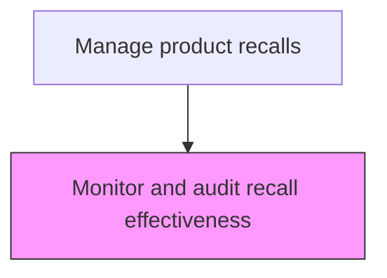
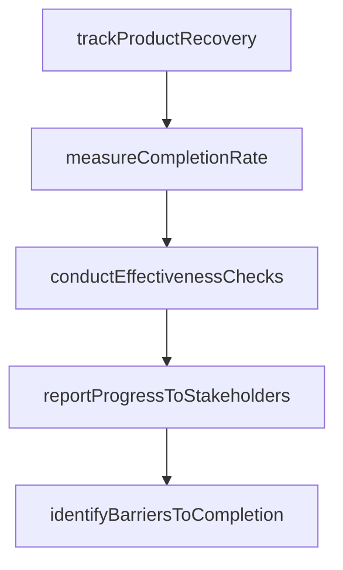

# Monitor and audit recall effectiveness

> Business-as-Code definition for recall effectiveness monitoring. Models the tracking, measurement, and reporting of recall progress against completion targets.

## Overview

Tracking, measuring, and reporting recall execution progress against established completion targets. Monitor the number of affected units returned, repaired, or replaced. Calculate recall completion rates, conduct periodic effectiveness assessments, distribute progress reports to leadership and regulators, and identify barriers preventing customers from responding to the recall.

## Process Hierarchy



## GraphDL

```yaml
monitor:
  object: And Audit Recall Effectiveness
  actor: RecallEffectivenessAnalyst
  result: RecallEffectivenessResult
```

## Actions

| Action | Description |
|--------|-------------|
| trackProductRecovery | Monitor the number of affected units returned, repaired, or replaced |
| measureCompletionRate | Calculate the percentage of affected products remediated |
| conductEffectivenessChecks | Perform periodic assessments of recall execution quality |
| reportProgressToStakeholders | Distribute recall progress reports to leadership and regulators |
| identifyBarriersToCompletion | Detect obstacles preventing customers from responding to the recall |

## Events

| Event | Description |
|-------|-------------|
| recallMetricsCollected | Recall completion and response metrics gathered |
| effectivenessAuditCompleted | Recall effectiveness audit performed against targets |
| gapIdentified | Shortfall in recall response or completion rate identified |
| correctiveActionRecommended | Actions recommended to improve recall effectiveness |

## Searches

| Search | Description |
|--------|-------------|
| getRecallCompletionRate | Query the recall completion rate by product, region, or channel |
| getAuditFindings | Retrieve audit findings and recommendations for a recall |
| getResponseTrends | Analyze consumer response trends over the recall period |
| getUnreachedCustomers | List affected customers who have not responded to the recall |

## Process Flow



## RACI Matrix

| Activity | Responsible | Accountable | Consulted | Informed |
|----------|-------------|-------------|-----------|----------|
| collectRecallMetrics | Data Analyst | Recall Effectiveness Auditor | Customer Service | Quality |
| conductEffectivenessAudit | Recall Effectiveness Auditor | VP Quality | Regulatory Affairs | Executive Team |
| recommendCorrectiveActions | Recall Effectiveness Auditor | VP Quality | Customer Outreach | Operations |

## Related Processes

| Process | Relationship |
|---------|-------------|
| 6.4.4 Manage recall related communications | Related - communication effectiveness impacts recall reach |
| 6.4.5 Submit regulatory reports | Downstream - effectiveness data feeds regulatory reporting |
| 6.4.7 Manage recall termination | Downstream - effectiveness determines readiness for termination |

## Related Departments

| Department | Role |
|-----------|------|
| Quality Assurance | Conducts recall effectiveness audits and monitors metrics |
| Regulatory Affairs | Reports effectiveness data to regulatory agencies |
| Customer Service | Supports re-notification efforts for unreached customers |

## Related Occupations

| Occupation | Involvement |
|-----------|-------------|
| Recall Effectiveness Auditor | Conducts audits and measures recall completion rates |
| Data Analyst | Compiles and analyzes recall response metrics |
| Customer Outreach Specialist | Contacts unreached customers to improve response rates |

## KPIs

| KPI | Description | Unit |
|-----|-------------|------|
| Recall Completion Rate | Percentage of affected units remediated through the recall | % |
| Consumer Response Rate | Percentage of notified consumers who responded to the recall | % |
| Audit Cycle Time | Average days between recall effectiveness audits | Days |

## Usage

```typescript
import { monitorAndAuditRecallEffectiveness } from '@headlessly/monitor-and-audit-recall-effectiveness'

const client = monitorAndAuditRecallEffectiveness()

// Monitor recall effectiveness
const metrics = await client.monitorEffectiveness({
  recallId: 'RCL-2025-001',
  asOfDate: '2025-06-30'
})

// Audit recall completion
const audit = await client.conductEffectivenessAudit({
  recallId: 'RCL-2025-001',
  auditType: 'quarterly',
  targetCompletionRate: 95
})
```
