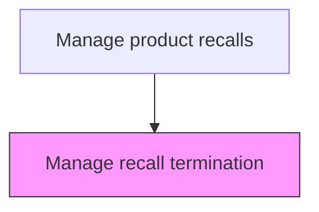
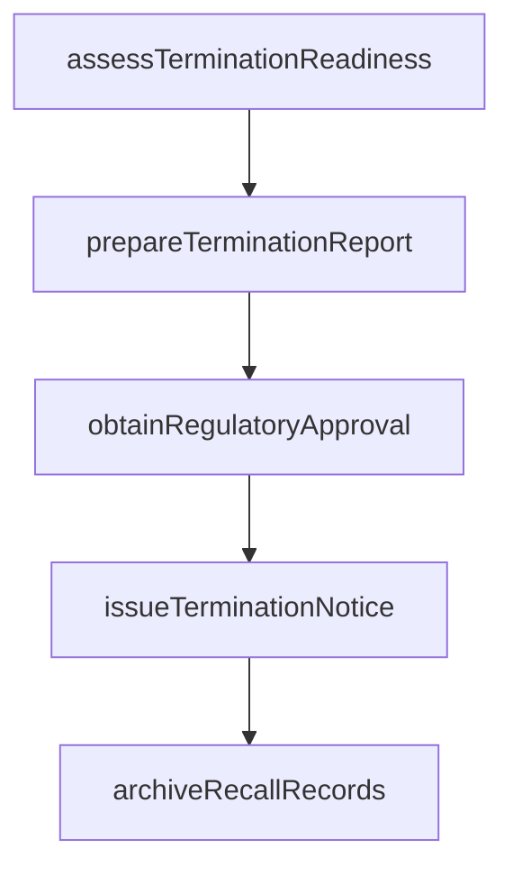

# Manage recall termination

> Business-as-Code definition for recall termination management. Models the formal closure of a product recall after achieving recovery targets or regulatory approval.

## Overview

Formally closing a product recall after achieving recovery targets or obtaining regulatory approval for termination. Assess whether recall completion criteria have been met, prepare the final termination report documenting metrics, outcomes, and lessons learned, secure regulatory agency concurrence, communicate recall closure to all stakeholders, and archive all recall documentation for retention compliance.

## Process Hierarchy



## GraphDL

```yaml
manage:
  object: Recall Termination
  actor: RecallTerminationManager
  result: RecallTerminationResult
```

## Actions

| Action | Description |
|--------|-------------|
| assessTerminationReadiness | Evaluate whether recall completion criteria have been met |
| prepareTerminationReport | Document final recall metrics, outcomes, and lessons learned |
| obtainRegulatoryApproval | Secure regulatory agency concurrence for recall termination |
| issueTerminationNotice | Communicate recall closure to all stakeholders and channels |
| archiveRecallRecords | Preserve all recall documentation for regulatory retention requirements |

## Events

| Event | Description |
|-------|-------------|
| terminationCriteriaEvaluated | Recall completion criteria assessed against targets |
| regulatoryClearanceObtained | Regulatory agency approved recall termination |
| recallTerminated | Recall officially closed and status updated to terminated |
| finalDocumentationArchived | Complete recall record archived for regulatory retention |

## Searches

| Search | Description |
|--------|-------------|
| getTerminationCriteria | Retrieve recall termination criteria and current status |
| getOpenRecalls | List recalls pending termination review |
| getRegulatoryApprovals | Query regulatory clearance status for recall termination |
| getRecallArchive | Retrieve archived documentation for terminated recalls |

## Process Flow



## RACI Matrix

| Activity | Responsible | Accountable | Consulted | Informed |
|----------|-------------|-------------|-----------|----------|
| evaluateTerminationCriteria | Recall Program Manager | VP Quality | Regulatory Affairs | Legal |
| obtainRegulatoryApproval | Regulatory Affairs Manager | VP Quality | Legal | Executive Team |
| archiveRecallDocumentation | Records Manager | VP Quality | Legal | Regulatory Affairs |

## Related Processes

| Process | Relationship |
|---------|-------------|
| 6.4.6 Monitor and audit recall effectiveness | Upstream - effectiveness metrics determine termination readiness |
| 6.4.8 Review recall strategy | Downstream - terminated recall triggers strategy review |
| 6.4.5 Submit regulatory reports | Related - final regulatory report accompanies termination |

## Related Departments

| Department | Role |
|-----------|------|
| Quality Assurance | Evaluates termination criteria and recommends closure |
| Regulatory Affairs | Obtains regulatory clearance for recall termination |
| Legal | Reviews termination for residual liability considerations |

## Related Occupations

| Occupation | Involvement |
|-----------|-------------|
| Recall Program Manager | Manages the recall termination process |
| Regulatory Affairs Manager | Coordinates regulatory termination approvals |
| Records Manager | Archives recall documentation per retention requirements |

## KPIs

| KPI | Description | Unit |
|-----|-------------|------|
| Recall Duration | Total elapsed time from recall initiation to termination | Days |
| Final Completion Rate | Recall completion rate at time of termination | % |
| Termination Processing Time | Days from termination request to regulatory clearance | Days |

## Usage

```typescript
import { manageRecallTermination } from '@headlessly/manage-recall-termination'

const client = manageRecallTermination()

// Evaluate termination criteria
const evaluation = await client.evaluateTerminationCriteria({
  recallId: 'RCL-2025-001',
  completionRateThreshold: 95,
  incidentThreshold: 0
})

// Process recall termination
await client.terminateRecall({
  recallId: 'RCL-2025-001',
  clearanceId: 'CLR-CPSC-2025-99',
  archiveDocuments: true
})
```
