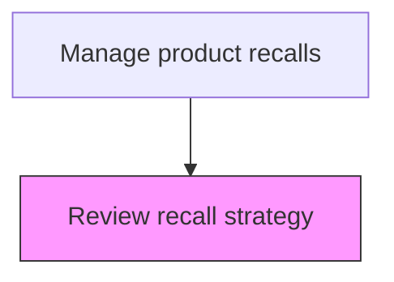
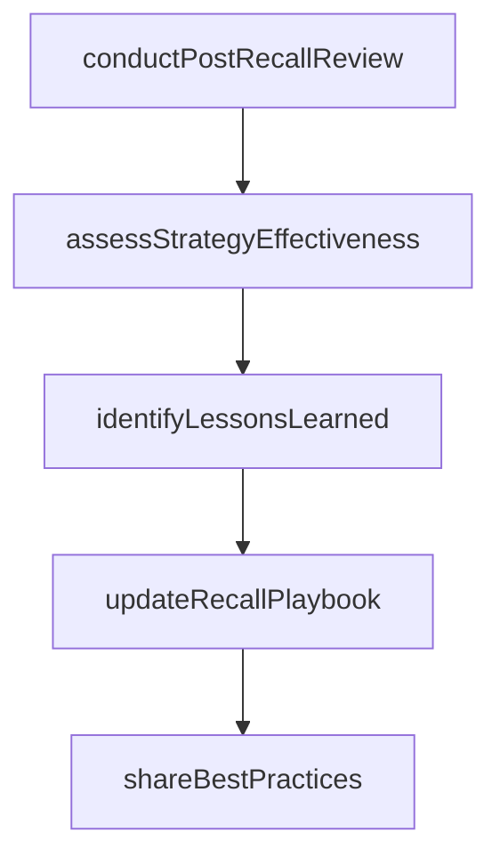

# Review recall strategy

> Business-as-Code definition for recall strategy review and improvement. Models the post-recall evaluation of strategy effectiveness and incorporation of lessons learned into future preparedness.

## Overview

Conducting post-recall evaluation to assess strategy effectiveness and incorporate lessons learned into future recall preparedness. Facilitate a comprehensive review of recall execution and outcomes, evaluate how well the strategy achieved its objectives, document improvement opportunities and best practices, update the organization's recall playbook, and share findings across quality, safety, and operations teams.

## Process Hierarchy



## GraphDL

```yaml
review:
  object: Recall Strategy
  actor: RecallReviewManager
  result: RecallReviewResult
```

## Actions

| Action | Description |
|--------|-------------|
| conductPostRecallReview | Facilitate a comprehensive review of recall execution and outcomes |
| assessStrategyEffectiveness | Evaluate how well the recall strategy achieved its objectives |
| identifyLessonsLearned | Document improvement opportunities and best practices from the recall |
| updateRecallPlaybook | Incorporate findings into the organization recall procedures and playbook |
| shareBestPractices | Distribute lessons learned across quality, safety, and operations teams |

## Events

| Event | Description |
|-------|-------------|
| recallReviewInitiated | Post-recall strategy review commenced |
| lessonsLearnedCaptured | Key learnings and improvement opportunities documented |
| strategyRecommendationsIssued | Updated strategy recommendations published for future recalls |
| proceduresUpdated | Recall procedures revised based on review findings |

## Searches

| Search | Description |
|--------|-------------|
| getReviewFindings | Retrieve review findings and recommendations for a completed recall |
| getLessonsLearned | Query lessons learned from past recall reviews |
| getStrategyComparisons | Compare recall strategy effectiveness across multiple recalls |
| getUpdatedProcedures | List recall procedure updates resulting from strategy reviews |

## Process Flow



## RACI Matrix

| Activity | Responsible | Accountable | Consulted | Informed |
|----------|-------------|-------------|-----------|----------|
| initiateRecallReview | Recall Program Manager | VP Quality | All Recall Team Members | Executive Team |
| captureLessonsLearned | Quality Improvement Specialist | VP Quality | Operations, Logistics | Product Safety |
| updateRecallProcedures | Recall Program Manager | VP Quality | Regulatory Affairs, Legal | All Departments |

## Related Processes

| Process | Relationship |
|---------|-------------|
| 6.4.7 Manage recall termination | Upstream - terminated recalls trigger strategy review |
| 6.4.1 Develop a recall strategy | Feedback loop - review findings improve future strategies |
| 6.1.7 Develop recall strategy | Feedback loop - review insights update enterprise recall strategy |

## Related Departments

| Department | Role |
|-----------|------|
| Quality Assurance | Conducts post-recall reviews and captures lessons learned |
| Operations | Assesses operational aspects of recall execution |
| Regulatory Affairs | Reviews regulatory compliance aspects of recall execution |

## Related Occupations

| Occupation | Involvement |
|-----------|-------------|
| Recall Program Manager | Leads post-recall strategy review |
| Quality Improvement Specialist | Documents lessons learned and improvement recommendations |
| Operations Analyst | Evaluates operational efficiency of recall execution |

## KPIs

| KPI | Description | Unit |
|-----|-------------|------|
| Review Completion Time | Average days from recall termination to completed review | Days |
| Recommendation Implementation Rate | Percentage of review recommendations implemented | % |
| Procedure Update Cycle | Time from review completion to updated procedure publication | Days |

## Usage

```typescript
import { reviewRecallStrategy } from '@headlessly/review-recall-strategy'

const client = reviewRecallStrategy()

// Initiate recall review
const review = await client.initiateRecallReview({
  recallId: 'RCL-2025-001',
  reviewScope: ['strategy', 'execution', 'communications', 'regulatory']
})

// Capture lessons learned
await client.captureLessonsLearned({
  reviewId: review.id,
  findings: [
    { area: 'communications', lesson: 'Social media notification improved response rate by 15%' },
    { area: 'logistics', lesson: 'Pre-staged replacement inventory reduced resolution time' }
  ]
})
```
