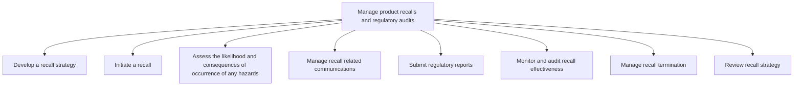
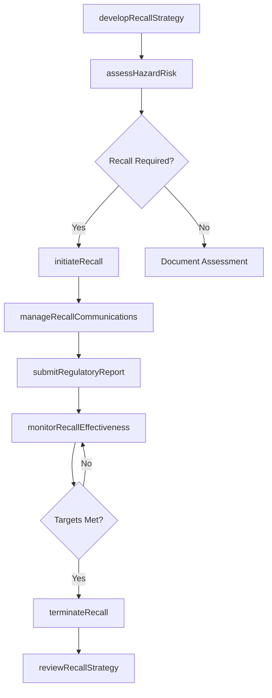

# Manage product recalls and regulatory audits

> Business-as-Code definition for product recall and regulatory audit management. Models the full recall lifecycle from strategy development through initiation, hazard assessment, communications, regulatory reporting, effectiveness monitoring, and termination.

## Overview

Managing effective product recalls. To effectively manage product recalls, develop and initiate a clearly defined recall strategy while assessing the likelihood and consequences of occurrence of any hazards.  As part of the process, develop and manage recall related communications and submit the required regulatory reporting.  Monitoring effectiveness and reviewing and terminating the strategy are necessary components as well.  In order to define a cross functional/end-to-end manage recalls process, the following processes would be used in conjunction with Manage product recalls and regulatory audits: Manage customer complaints [10389]; Manage returns and reverse logistics [10342]; Report incidents, adverse events, and corrective action/preventive action [12840]; Manage public relations program [11014], Manage legal and ethical issues [11013], and Maintain production records and manage lot traceability [10370].)

## Process Hierarchy



## GraphDL

```yaml
manage:
  object: Product Recalls And Regulatory Audits
  actor: RecallManager
  result: RecallCompletionReport
```

## Actions

| Action | Description |
|--------|-------------|
| developRecallStrategy | Define recall procedures, scope, and escalation protocols |
| initiateRecall | Activate a product recall with affected lot identification |
| assessHazardRisk | Evaluate likelihood and severity of product hazards |
| manageRecallCommunications | Coordinate notifications to customers, regulators, and media |
| submitRegulatoryReport | File required reports with regulatory agencies |
| monitorRecallEffectiveness | Track recall completion rates and product recovery metrics |
| terminateRecall | Formally close a recall after meeting recovery targets |
| reviewRecallStrategy | Evaluate recall execution and update procedures for improvement |

## Events

| Event | Description |
|-------|-------------|
| recallStrategyDeveloped | Recall strategy and playbook approved |
| recallInitiated | Product recall activated and notifications sent |
| hazardRiskAssessed | Hazard likelihood and consequence evaluation completed |
| recallCommunicationsManaged | Customer and regulatory notifications distributed |
| regulatoryReportSubmitted | Required regulatory filings completed |
| recallEffectivenessMonitored | Recall metrics reviewed and compliance tracked |
| recallTerminated | Recall formally closed after target achievement |
| recallStrategyReviewed | Post-recall review completed with lessons learned |

## Searches

| Search | Description |
|--------|-------------|
| getActiveRecalls | List active product recalls filtered by product, severity, or date |
| getRecallMetrics | Retrieve recall completion and recovery rate metrics |
| getRegulatoryFilings | Query regulatory reports by jurisdiction or recall ID |
| getAffectedProducts | List affected product lots and serial numbers for a recall |

## Process Flow



## RACI Matrix

| Activity | Responsible | Accountable | Consulted | Informed |
|----------|-------------|-------------|-----------|----------|
| developRecallStrategy | Recall Manager | VP Quality | Legal, Regulatory Affairs | Executive Team |
| initiateRecall | Recall Manager | VP Quality | Supply Chain, Manufacturing | CEO, Board |
| assessHazardRisk | Quality Engineer | VP Quality | Product Engineering, Safety | Regulatory Affairs |
| manageRecallCommunications | Corporate Communications | VP Quality | Legal, Marketing | Customer Service |
| submitRegulatoryReport | Regulatory Affairs Manager | VP Quality | Legal | Executive Team |

## Sub-Processes

| ID | Name | Description |
|----|------|-------------|
| 6.4.1 | Develop a recall strategy | Establishing the overall recall framework including risk thresholds, communication plans, logistics procedures, and regulatory compliance requirements. |
| 6.4.2 | Initiate a recall | Activating the recall process by classifying the recall type, notifying regulatory authorities, and launching corrective action procedures. |
| 6.4.3 | Assess the likelihood and consequences of occurrence of any hazards | Evaluating the probability and severity of harm from the defective product to determine recall urgency and scope. |
| 6.4.4 | Manage recall related communications | Coordinating all stakeholder communications including customer notifications, media statements, dealer bulletins, and internal alerts during the recall. |
| 6.4.5 | Submit regulatory reports | Preparing and filing mandatory recall reports with government agencies and regulatory bodies in compliance with reporting deadlines and format requirements. |
| 6.4.6 | Monitor and audit recall effectiveness | Tracking recall completion rates, consumer response levels, and remediation outcomes to ensure the recall achieves its safety objectives. |
| 6.4.7 | Manage recall termination | Evaluating recall completion criteria, obtaining regulatory clearance, and formally closing the recall with final status documentation. |
| 6.4.8 | Review recall strategy | Conducting post-recall reviews to capture lessons learned, assess strategy effectiveness, and update recall procedures for future events. |

## Related Processes

| Process | Relationship |
|---------|-------------|
| 6.2.3 Manage customer complaints | Upstream - complaints may trigger recall investigation |
| 6.2.5 Report incidents, adverse events and CAPA | Parallel - incident reports inform recall decisions |
| 6.1.7 Develop recall strategy | Upstream - strategic framework for recall execution |
| 6.5.7 Evaluate recall performance | Downstream - post-recall performance assessment |

## Related Departments

| Department | Role |
|-----------|------|
| Quality Assurance | Leads recall investigation and hazard assessment |
| Regulatory Affairs | Manages filings and compliance with regulatory bodies |
| Legal | Assesses liability exposure and advises on communications |
| Corporate Communications | Manages customer and media notifications |
| Supply Chain | Coordinates product retrieval and lot traceability |

## Related Occupations

| Occupation | Involvement |
|-----------|-------------|
| Product Recall Manager | Leads end-to-end recall execution |
| Regulatory Affairs Specialist | Prepares and submits regulatory filings |
| Quality Engineer | Conducts hazard assessments and root cause analysis |
| Corporate Communications Manager | Drafts public notifications and press releases |

## KPIs

| KPI | Description | Unit |
|-----|-------------|------|
| Recall Completion Rate | Percentage of affected units recovered or remediated | % |
| Time to Initiate Recall | Days from hazard identification to recall activation | Days |
| Regulatory Filing Timeliness | Percentage of regulatory reports filed within required deadlines | % |
| Customer Notification Rate | Percentage of affected customers successfully notified | % |
| Recall Cost Per Unit | Total recall cost divided by number of affected units | USD |

## Usage

```typescript
import { manageProductRecallsAndRegulatoryAudits } from '@headlessly/manage-product-recalls-and-regulatory-audits'

const recalls = manageProductRecallsAndRegulatoryAudits()

// Initiate a product recall
const recall = await recalls.initiateRecall({
  productLine: 'residential-heaters',
  affectedLots: ['LOT-2025-001', 'LOT-2025-002'],
  hazardType: 'fire-risk',
  severity: 'class-I'
})

// Monitor recall effectiveness
const metrics = await recalls.monitorRecallEffectiveness({
  recallId: recall.id,
  targetCompletionRate: 0.95
})
```
