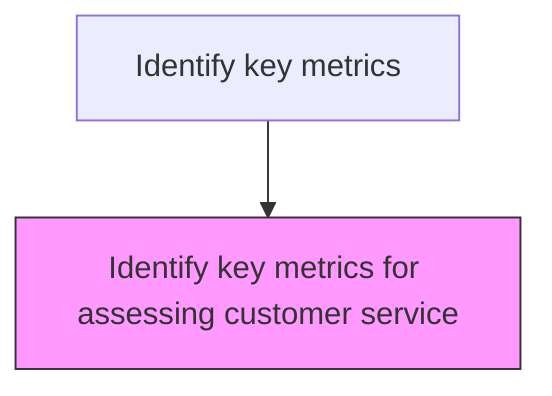
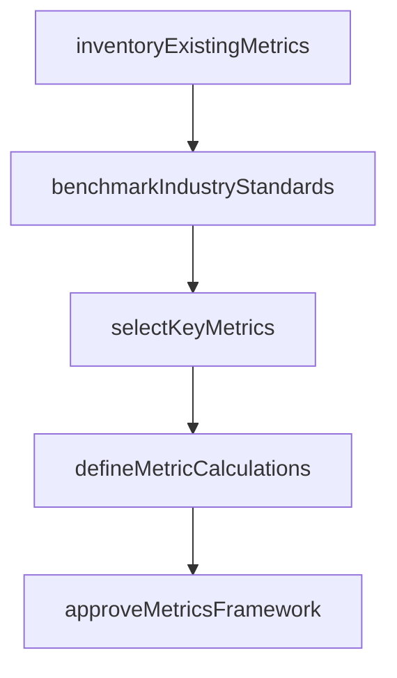

# Identify key metrics for assessing customer service

> Business-as-Code definition for customer service metrics identification. Models the selection, definition, and establishment of key performance indicators for measuring customer service effectiveness.

## Overview

Selecting, defining, and establishing the key performance indicators used to measure customer service effectiveness. Catalog existing metrics and their measurement methods, benchmark against industry standards and best practices, choose the most impactful metrics for the customer service scorecard, define precise calculation methods and data sources, set performance targets, and obtain leadership approval for the metrics framework.

## Process Hierarchy



## GraphDL

```yaml
identify:
  object: Key Metrics For Assessing Customer Service
  actor: ServiceMetricsManager
  result: ServiceMetricsResult
```

## Actions

| Action | Description |
|--------|-------------|
| inventoryExistingMetrics | Catalog current customer service KPIs and their measurement methods |
| benchmarkIndustryStandards | Compare existing metrics against industry best practices and standards |
| selectKeyMetrics | Choose the most impactful metrics for the customer service scorecard |
| defineMetricCalculations | Establish precise calculation methods, data sources, and targets for each metric |
| approveMetricsFramework | Obtain leadership approval for the selected metrics and targets |

## Events

| Event | Description |
|-------|-------------|
| metricCandidatesIdentified | Potential customer service metrics identified from industry and business analysis |
| metricDefinitionsApproved | Selected metric definitions approved by leadership |
| measurementMethodologyEstablished | Data collection and calculation methods defined for each metric |
| metricBaselineSet | Initial baseline values established for approved metrics |

## Searches

| Search | Description |
|--------|-------------|
| getMetricDefinitions | Retrieve defined customer service metrics and their specifications |
| getIndustryBenchmarks | Query industry benchmark values for customer service metrics |
| getMetricBaselines | Retrieve baseline values for established metrics |
| getMetricDataSources | List data sources feeding each customer service metric |

## Process Flow



## RACI Matrix

| Activity | Responsible | Accountable | Consulted | Informed |
|----------|-------------|-------------|-----------|----------|
| identifyMetricCandidates | Customer Analytics Manager | VP Customer Service | Service Operations | Executive Team |
| defineMetric | Business Intelligence Analyst | Customer Analytics Manager | Data Engineering | Service Operations |
| setMetricBaseline | Business Intelligence Analyst | VP Customer Service | Finance | Executive Team |

## Related Processes

| Process | Relationship |
|---------|-------------|
| 6.5.2 Track performance against customer service scorecard | Downstream - defined metrics populate the scorecard |
| 6.1.1 Define customer service requirements | Upstream - service requirements inform metric selection |
| 6.5.3 Measure customer satisfaction | Related - satisfaction metrics are a subset of service metrics |

## Related Departments

| Department | Role |
|-----------|------|
| Customer Insights | Identifies and defines customer service performance metrics |
| Service Operations | Provides operational data sources for metric calculation |
| Executive Leadership | Approves metric selection and target values |

## Related Occupations

| Occupation | Involvement |
|-----------|-------------|
| Customer Analytics Manager | Leads metric identification and definition |
| Business Intelligence Analyst | Establishes measurement methodology and data sources |
| VP Customer Service | Approves metric definitions and baseline targets |

## KPIs

| KPI | Description | Unit |
|-----|-------------|------|
| Metric Coverage | Percentage of key service processes with defined metrics | % |
| Benchmark Availability | Percentage of metrics with external industry benchmarks | % |
| Metric Review Cycle | Frequency of metric relevance and accuracy reviews | Per Year |

## Usage

```typescript
import { identifyKeyMetricsForAssessingCustomerService } from '@headlessly/identify-key-metrics-for-assessing-customer-service'

const client = identifyKeyMetricsForAssessingCustomerService()

// Identify metric candidates
const candidates = await client.identifyMetricCandidates({
  processAreas: ['complaints', 'service-delivery', 'satisfaction'],
  includeIndustryBenchmarks: true
})

// Define approved metric
const metric = await client.defineMetric({
  name: 'First Contact Resolution Rate',
  formula: 'resolved_first_contact / total_contacts * 100',
  unit: '%',
  target: 85,
  dataSource: 'crm-system'
})
```
