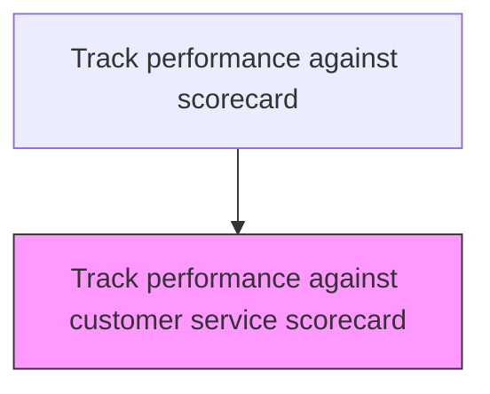
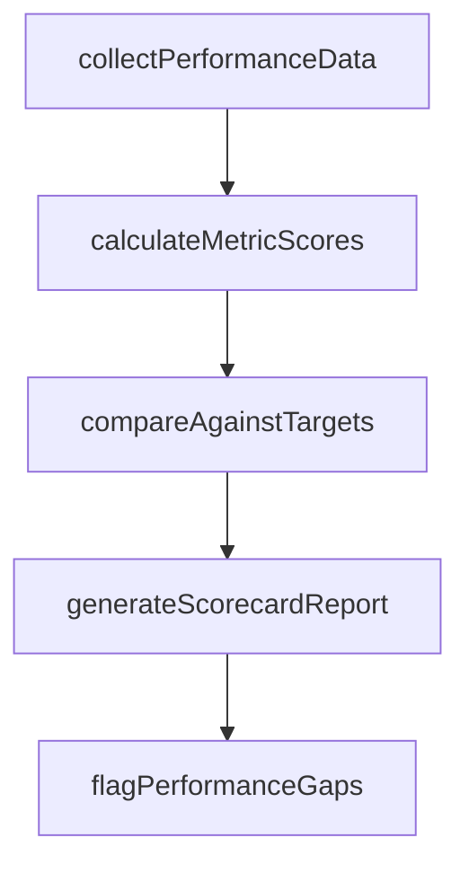

# Track performance against customer service scorecard

> Business-as-Code definition for customer service scorecard performance tracking. Models the collection, calculation, and reporting of customer service performance against established scorecard metrics.

## Overview

Collecting, calculating, and reporting customer service performance against the established scorecard metrics. Gather raw performance data from service systems, compute scorecard metric values using defined calculations, compare actual performance against targets and thresholds, generate the periodic scorecard report, and flag metrics falling below target for corrective action review.

## Process Hierarchy



## GraphDL

```yaml
track:
  object: Performance Against Customer Service Scorecard
  actor: PerformanceTrackingAnalyst
  result: PerformanceTrackingResult
```

## Actions

| Action | Description |
|--------|-------------|
| collectPerformanceData | Gather raw data from service systems for each scorecard metric |
| calculateMetricScores | Compute scorecard values using defined calculation methods |
| compareAgainstTargets | Measure actual performance against established targets and thresholds |
| generateScorecardReport | Produce the customer service performance scorecard for the reporting period |
| flagPerformanceGaps | Identify metrics falling below target and trigger corrective action reviews |

## Events

| Event | Description |
|-------|-------------|
| scorecardDataCollected | Current period scorecard data gathered from all sources |
| performanceCalculated | Scorecard metrics calculated for the reporting period |
| varianceFlagged | Significant deviations from targets identified and flagged |
| scorecardReportPublished | Scorecard report distributed to leadership and stakeholders |

## Searches

| Search | Description |
|--------|-------------|
| getScorecardResults | Retrieve scorecard metric results by period or dimension |
| getTargetVariances | List metrics with performance outside target thresholds |
| getScorecardTrends | Query scorecard metric trends over multiple periods |
| getScorecardComparisons | Compare scorecard performance across teams or regions |

## Process Flow



## RACI Matrix

| Activity | Responsible | Accountable | Consulted | Informed |
|----------|-------------|-------------|-----------|----------|
| collectScorecardData | Business Intelligence Analyst | Customer Service Director | IT, Data Engineering | Service Operations |
| calculatePerformance | Business Intelligence Analyst | Customer Service Director | Service Operations | Finance |
| publishScorecardReport | Customer Service Director | VP Customer Service | Executive Team | All Departments |

## Related Processes

| Process | Relationship |
|---------|-------------|
| 6.5.1 Identify key metrics for assessing customer service | Upstream - defined metrics are tracked on the scorecard |
| 6.5.3 Measure customer satisfaction | Related - satisfaction data feeds scorecard metrics |
| 6.1.5 Establish target service levels | Upstream - service level targets define scorecard thresholds |

## Related Departments

| Department | Role |
|-----------|------|
| Customer Insights | Collects data and publishes scorecard reports |
| Service Operations | Provides operational metric data and acts on variance findings |
| Executive Leadership | Reviews scorecard performance and directs improvement efforts |

## Related Occupations

| Occupation | Involvement |
|-----------|-------------|
| Business Intelligence Analyst | Calculates metrics and produces scorecard reports |
| Customer Service Director | Reviews scorecard results and addresses variances |
| Data Engineer | Maintains data pipelines feeding scorecard calculations |

## KPIs

| KPI | Description | Unit |
|-----|-------------|------|
| Metrics Meeting Target | Percentage of scorecard metrics performing at or above target | % |
| Reporting Timeliness | Percentage of scorecard reports published within scheduled deadline | % |
| Data Completeness | Percentage of scorecard metrics with available data for the period | % |

## Usage

```typescript
import { trackPerformanceAgainstCustomerServiceScorecard } from '@headlessly/track-performance-against-customer-service-scorecard'

const client = trackPerformanceAgainstCustomerServiceScorecard()

// Collect scorecard data
const scorecard = await client.collectScorecardData({
  period: '2025-Q1',
  metrics: ['first-contact-resolution', 'average-handle-time', 'csat-score']
})

// Flag variances
const variances = await client.flagVariances({
  scorecardId: scorecard.id,
  thresholdPercent: 10
})
```
