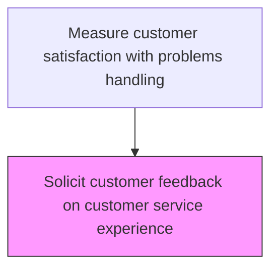
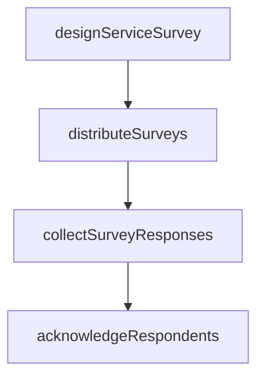

# Solicit customer feedback on customer service experience

> Business-as-Code definition for customer service experience feedback solicitation. Models the design, distribution, and collection of customer satisfaction surveys focused on service interaction quality.

## Overview

Creating an avenue for which the customer can provide feedback on their experience with how their inquiry, problem, or request was handled.

## Process Hierarchy



## GraphDL

```yaml
solicit:
  object: Customer Feedback On Customer Service Experience
  actor: CustomerExperienceAnalyst
  result: CustomerExperienceResult
```

## Actions

| Action | Description |
|--------|-------------|
| designServiceSurvey | Create satisfaction survey instruments targeting customer service experience |
| distributeSurveys | Send surveys to customers following service interactions through preferred channels |
| collectSurveyResponses | Gather and validate submitted customer feedback responses |
| acknowledgeRespondents | Send thank-you communications and address any immediate concerns raised |

## Events

| Event | Description |
|-------|-------------|
| satisfactionSurveyDistributed | Post-interaction satisfaction survey sent to customer |
| surveyResponseCollected | Customer completed satisfaction survey response |
| feedbackChannelMonitored | Passive feedback channels scanned for satisfaction signals |
| feedbackDataConsolidated | All feedback data compiled for analysis |

## Searches

| Search | Description |
|--------|-------------|
| getSatisfactionSurveys | List satisfaction surveys by interaction type, channel, or date |
| getSurveyResponses | Retrieve completed survey responses and satisfaction scores |
| getFeedbackChannelActivity | Query passive feedback sources for recent activity |
| getResponseRates | Retrieve survey response rates by channel and customer segment |

## Process Flow



## RACI Matrix

| Activity | Responsible | Accountable | Consulted | Informed |
|----------|-------------|-------------|-----------|----------|
| distributeSatisfactionSurvey | Customer Experience Analyst | Customer Insights Manager | IT | Customer Service |
| collectSurveyResponses | Survey Administrator | Customer Insights Manager | Data Analytics | Quality |
| consolidateFeedbackData | Customer Experience Analyst | Customer Insights Manager | Data Engineering | Service Operations |

## Related Processes

| Process | Relationship |
|---------|-------------|
| 6.5.3.2 Analyze customer service data and identify improvement opportunities | Downstream - collected feedback is analyzed for improvements |
| 6.2.2 Manage customer service requests/inquiries | Upstream - service interactions trigger feedback solicitation |
| 6.5.1 Identify key metrics | Related - satisfaction metrics are defined as part of key metrics |

## Related Departments

| Department | Role |
|-----------|------|
| Customer Insights | Designs and distributes customer satisfaction surveys |
| Customer Service | Facilitates feedback collection during interactions |
| IT | Provides survey distribution and data collection platforms |

## Related Occupations

| Occupation | Involvement |
|-----------|-------------|
| Customer Experience Analyst | Designs feedback instruments and manages distribution |
| Survey Administrator | Manages survey logistics and response collection |
| Customer Service Manager | Ensures feedback collection process operates smoothly |

## KPIs

| KPI | Description | Unit |
|-----|-------------|------|
| Survey Response Rate | Percentage of surveys receiving completed responses | % |
| Overall Satisfaction Score | Average customer satisfaction rating across all channels | Score (1-5) |
| Feedback Coverage | Percentage of customer interactions covered by feedback collection | % |

## Usage

```typescript
import { solicitCustomerFeedbackOnCustomerServiceExperience } from '@headlessly/solicit-customer-feedback-on-customer-service-experience'

const client = solicitCustomerFeedbackOnCustomerServiceExperience()

// Distribute satisfaction survey
const survey = await client.distributeSatisfactionSurvey({
  interactionId: 'INT-2025-1234',
  channel: 'email',
  template: 'post-service-satisfaction'
})

// Monitor feedback channels
const feedback = await client.monitorFeedbackChannels({
  channels: ['social-media', 'review-sites', 'in-app'],
  period: '2025-Q1'
})
```
