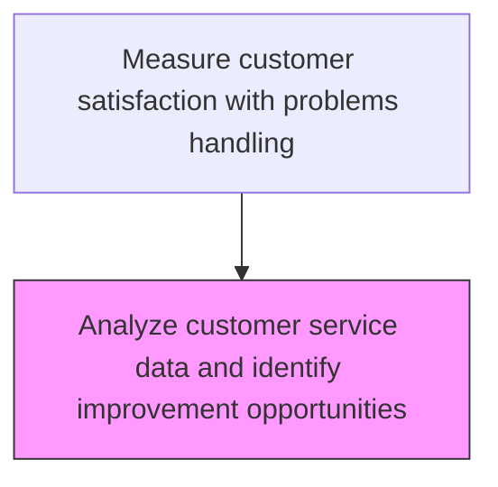
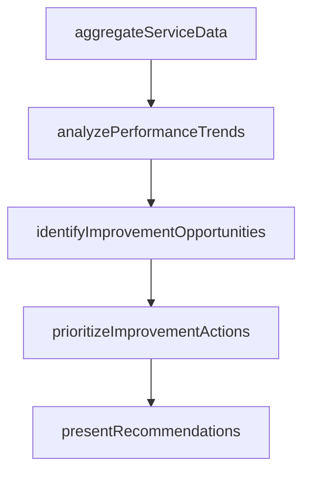

# Analyze customer service data and identify improvement opportunities

> Business-as-Code definition for customer service data analysis and improvement identification. Models the analysis of service interaction data to detect patterns and identify improvement opportunities.

## Overview

Reviewing customer service feedback to identify areas in which improvements can be made. Engage with management to discuss issues.

## Process Hierarchy



## GraphDL

```yaml
analyze:
  object: Customer Service Data And Identify Improvement Opportunities
  actor: ServiceImprovementAnalyst
  result: ServiceImprovementResult
```

## Actions

| Action | Description |
|--------|-------------|
| aggregateServiceData | Consolidate customer service interaction data across channels and periods |
| analyzePerformanceTrends | Identify patterns in service quality, resolution times, and satisfaction scores |
| identifyImprovementOpportunities | Detect specific areas where service processes can be enhanced |
| prioritizeImprovementActions | Rank improvement opportunities by impact and feasibility |
| presentRecommendations | Deliver findings and recommendations to service leadership |

## Events

| Event | Description |
|-------|-------------|
| serviceDataAnalyzed | Customer service interaction data analyzed for patterns |
| improvementOpportunitiesIdentified | Service improvement opportunities derived from data analysis |
| insightsReportPublished | Analysis findings and improvement recommendations published |
| improvementPrioritized | Identified improvements ranked by impact and feasibility |

## Searches

| Search | Description |
|--------|-------------|
| getAnalysisResults | Retrieve customer service data analysis results by period or topic |
| getImprovementOpportunities | List identified improvement opportunities by priority and status |
| getServiceTrends | Query service quality trends over time by metric or dimension |
| getRootCauseBreakdown | Retrieve root cause distribution for service quality issues |

## Process Flow



## RACI Matrix

| Activity | Responsible | Accountable | Consulted | Informed |
|----------|-------------|-------------|-----------|----------|
| analyzeServiceData | Customer Analytics Analyst | Customer Insights Manager | Quality | Service Operations |
| identifyImprovements | Process Improvement Specialist | VP Customer Service | Service Operations | Executive Team |
| publishInsightsReport | Customer Insights Manager | VP Customer Service | Service Operations | Executive Team |

## Related Processes

| Process | Relationship |
|---------|-------------|
| 6.5.3.1 Solicit customer feedback on customer service experience | Upstream - feedback data feeds analysis |
| 6.5.3.3 Provide customer feedback to product management | Downstream - analysis findings shared with product team |
| 6.1.4 Define customer service policies and procedures | Feedback loop - insights inform policy updates |

## Related Departments

| Department | Role |
|-----------|------|
| Customer Insights | Analyzes service data and identifies improvement opportunities |
| Service Operations | Implements operational improvements from analysis findings |
| Quality Assurance | Validates improvement effectiveness |

## Related Occupations

| Occupation | Involvement |
|-----------|-------------|
| Customer Analytics Analyst | Performs service data analysis and identifies patterns |
| Process Improvement Specialist | Converts insights into actionable improvement plans |
| Service Operations Manager | Implements and monitors operational improvements |

## KPIs

| KPI | Description | Unit |
|-----|-------------|------|
| Improvement Actions Implemented | Number of data-driven improvements implemented per quarter | Count |
| Analysis Cycle Time | Average days to complete service data analysis cycle | Days |
| Improvement Impact Score | Measured impact of implemented improvements on satisfaction | Score (1-10) |

## Usage

```typescript
import { analyzeCustomerServiceDataAndIdentifyImprovementOpportunities } from '@headlessly/analyze-customer-service-data-and-identify-improvement-opportunities'

const client = analyzeCustomerServiceDataAndIdentifyImprovementOpportunities()

// Analyze customer service data
const analysis = await client.analyzeServiceData({
  period: '2025-Q1',
  dimensions: ['channel', 'issueType', 'resolution'],
  includeRootCause: true
})

// Identify improvement opportunities
const opportunities = await client.identifyImprovements({
  analysisId: analysis.id,
  minImpactScore: 7,
  maxEffort: 'medium'
})
```
