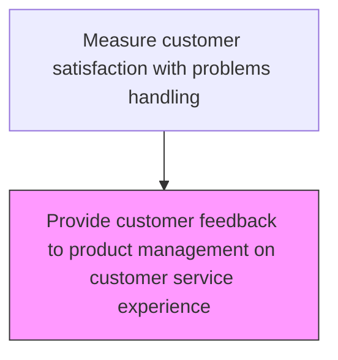
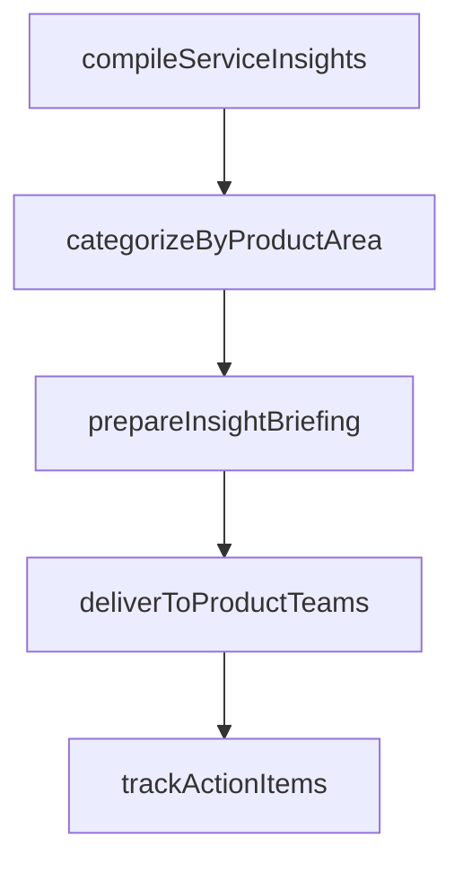

# Provide customer feedback to product management on customer service experience

> Business-as-Code definition for customer feedback relay to product management. Models the structured communication of customer service experience insights to product teams for product improvement decisions.

## Overview

Handing over data to management to analyze common issues in regards to customer service.

## Process Hierarchy



## GraphDL

```yaml
provide:
  object: Customer Feedback To Product Management On Customer Service Experience
  actor: VoiceOfCustomerCoordinator
  result: VoiceOfCustomerResult
```

## Actions

| Action | Description |
|--------|-------------|
| compileServiceInsights | Aggregate recurring product-related issues from customer service interactions |
| categorizeByProductArea | Organize feedback themes by product line, feature, or component |
| prepareInsightBriefing | Create structured briefing materials for product management review |
| deliverToProductTeams | Present compiled insights in product management review sessions |
| trackActionItems | Monitor product team responses and actions taken on shared insights |

## Events

| Event | Description |
|-------|-------------|
| feedbackSummarized | Customer feedback on service experience summarized for product team |
| productImpactAssessed | Product-related impact of service experience feedback evaluated |
| feedbackDelivered | Summarized feedback formally shared with product management |
| actionItemsTracked | Product team action items from feedback tracked to completion |

## Searches

| Search | Description |
|--------|-------------|
| getProductFeedbackSummaries | Retrieve feedback summaries prepared for product management |
| getProductRelatedIssues | Query service feedback items related to product features or defects |
| getActionItemStatus | Track product team action items generated from feedback |
| getFeedbackTrends | Analyze product-related feedback trends over time |

## Process Flow



## RACI Matrix

| Activity | Responsible | Accountable | Consulted | Informed |
|----------|-------------|-------------|-----------|----------|
| summarizeFeedback | Customer Insights Manager | VP Customer Service | Quality | Service Operations |
| deliverToProductManagement | Customer Insights Manager | VP Customer Service | Product Management | Engineering |
| trackActionItems | Voice of Customer Analyst | Customer Insights Manager | Product Management | Quality |

## Related Processes

| Process | Relationship |
|---------|-------------|
| 6.5.3.2 Analyze customer service data and identify improvements | Upstream - analysis results identify product-related issues |
| 2.3 Manage product lifecycle | Downstream - feedback informs product improvement decisions |
| 6.5.5 Measure customer satisfaction with products and services | Related - product satisfaction measurement uses similar data |

## Related Departments

| Department | Role |
|-----------|------|
| Customer Insights | Summarizes and delivers customer feedback to product management |
| Product Management | Receives feedback and creates product improvement plans |
| Quality Assurance | Provides product quality data to contextualize feedback |

## Related Occupations

| Occupation | Involvement |
|-----------|-------------|
| Customer Insights Manager | Prepares feedback reports for product management |
| Product Manager | Receives feedback and prioritizes product improvements |
| Voice of Customer Analyst | Translates customer feedback into actionable product insights |

## KPIs

| KPI | Description | Unit |
|-----|-------------|------|
| Feedback Delivery Timeliness | Average days from feedback collection to product management delivery | Days |
| Action Item Completion Rate | Percentage of product feedback action items completed | % |
| Product Improvement Impact | Measured reduction in product-related service contacts | % |

## Usage

```typescript
import { provideCustomerFeedbackToProductManagementOnCustomerServiceExperience } from '@headlessly/provide-customer-feedback-to-product-management-on-customer-service-experience'

const client = provideCustomerFeedbackToProductManagementOnCustomerServiceExperience()

// Summarize feedback for product management
const summary = await client.summarizeFeedbackForProduct({
  period: '2025-Q1',
  productLines: ['X200', 'X300'],
  topIssuesCount: 10
})

// Deliver to product management
await client.deliverToProductManagement({
  summaryId: summary.id,
  recipients: ['product-director', 'engineering-lead'],
  meetingDate: '2025-04-20'
})
```
