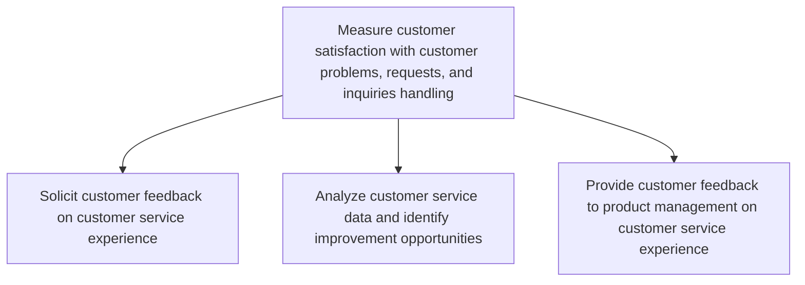
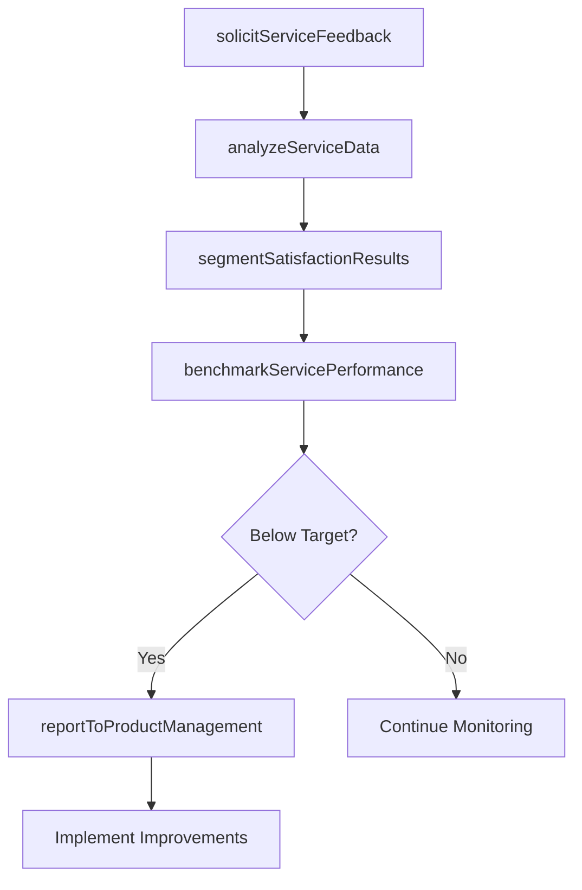

# Measure customer satisfaction with customer problems, requests, and inquiries handling

> Business-as-Code definition for customer satisfaction measurement in problem and inquiry handling. Models feedback solicitation, service data analysis, and improvement insight delivery to product management.

## Overview

Calculating satisfaction levels of customers by effectively evaluating the process of handling requests/inquiries of customers. Effectively calculate the performance of customer-requests/inquiries handling and resolution. Obtain information regarding requests/inquiries handling and resolution through customer feedback. Use it to explore new ideas and opportunities for enhanced customer requests/inquiries handling and resolution process.

## Process Hierarchy



## GraphDL

```yaml
measure:
  object: Customer Satisfaction With Customer Problems, Requests, And Inquiries Handling
  actor: CustomerExperienceAnalyst
  result: SatisfactionReport
```

## Actions

| Action | Description |
|--------|-------------|
| solicitServiceFeedback | Deploy post-interaction surveys to capture customer satisfaction with inquiry handling |
| analyzeServiceData | Examine CSAT, NPS, and resolution data to identify service improvement opportunities |
| segmentSatisfactionResults | Break down satisfaction scores by channel, issue type, and customer segment |
| reportToProductManagement | Deliver customer experience insights and feedback to product teams |
| benchmarkServicePerformance | Compare satisfaction metrics against industry standards and historical baselines |

## Events

| Event | Description |
|-------|-------------|
| serviceFeedbackSolicited | Post-interaction customer satisfaction survey deployed |
| serviceDataAnalyzed | Customer service satisfaction data analysis completed |
| satisfactionResultsSegmented | Satisfaction scores broken down by dimension and segment |
| productManagementReported | Customer feedback insights delivered to product team |
| servicePerformanceBenchmarked | Satisfaction metrics compared against benchmarks |

## Searches

| Search | Description |
|--------|-------------|
| getSatisfactionScores | Retrieve CSAT and NPS scores by period, channel, or agent |
| getFeedbackResponses | List individual customer feedback responses by topic or rating |
| getImprovementOpportunities | Query identified service improvement opportunities by priority |
| getSatisfactionTrends | Retrieve satisfaction metric trends over time |

## Process Flow



## RACI Matrix

| Activity | Responsible | Accountable | Consulted | Informed |
|----------|-------------|-------------|-----------|----------|
| solicitServiceFeedback | CX Analyst | VP Customer Service | IT | Service Agents |
| analyzeServiceData | CX Analyst | VP Customer Service | Quality Team | Operations |
| segmentSatisfactionResults | CX Analyst | VP Customer Service | Marketing | Product |
| reportToProductManagement | CX Manager | VP Customer Service | Product Management | Executive Team |

## Sub-Processes

| ID | Name | Description |
|----|------|-------------|
| 6.5.3.1 | Solicit customer feedback on customer service experience | Creating an avenue for which the customer can provide feedback on their experience with how their in |
| 6.5.3.2 | Analyze customer service data and identify improvement opportunities | Reviewing customer service feedback to identify areas in which improvements can be made. Engage with |
| 6.5.3.3 | Provide customer feedback to product management on customer service experience | Handing over data to management to analyze common issues in regards to customer service. |

## Related Processes

| Process | Relationship |
|---------|-------------|
| 6.2.2 Manage customer service problems, requests, and inquiries | Upstream - inquiry handling data feeds satisfaction measurement |
| 6.5.4 Measure customer satisfaction with complaint handling and resolution | Parallel - complementary satisfaction measurement |
| 6.5.1 Identify key metrics for assessing customer service | Upstream - defines metrics used for measurement |

## Related Departments

| Department | Role |
|-----------|------|
| Customer Experience | Designs surveys and analyzes satisfaction data |
| Customer Service Operations | Provides operational data and implements improvements |
| Product Management | Receives customer feedback insights for product decisions |
| Quality Assurance | Monitors service quality standards and compliance |

## Related Occupations

| Occupation | Involvement |
|-----------|-------------|
| Customer Experience Analyst | Conducts satisfaction analysis and identifies trends |
| Voice of Customer Manager | Oversees feedback collection and insight delivery |
| Quality Assurance Specialist | Evaluates service interaction quality |

## KPIs

| KPI | Description | Unit |
|-----|-------------|------|
| Customer Satisfaction Score | Average CSAT rating for inquiry handling interactions | Score (1-5) |
| Net Promoter Score | Customer likelihood to recommend based on service experience | Score (-100 to 100) |
| Survey Response Rate | Percentage of customers completing post-interaction surveys | % |
| Improvement Implementation Rate | Percentage of identified improvements acted upon within target | % |

## Usage

```typescript
import { measureCustomerSatisfactionWithCustomerProblemsRequestsAndInquiriesHandling } from '@headlessly/measure-customer-satisfaction-with-customer-problems-requests-and-inquiries-handling'

const satisfaction = measureCustomerSatisfactionWithCustomerProblemsRequestsAndInquiriesHandling()

// Analyze service data
const analysis = await satisfaction.analyzeServiceData({
  period: '2025-Q2',
  channels: ['phone', 'chat', 'email'],
  metrics: ['csat', 'nps', 'resolution-time']
})

// Report findings to product management
await satisfaction.reportToProductManagement({
  analysisId: analysis.id,
  topIssues: analysis.improvementOpportunities.slice(0, 5),
  recommendations: true
})
```
