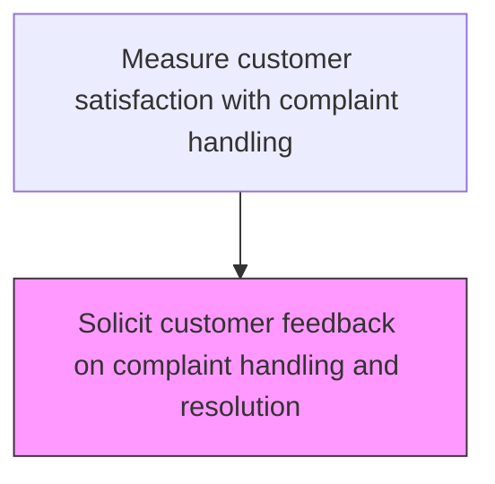
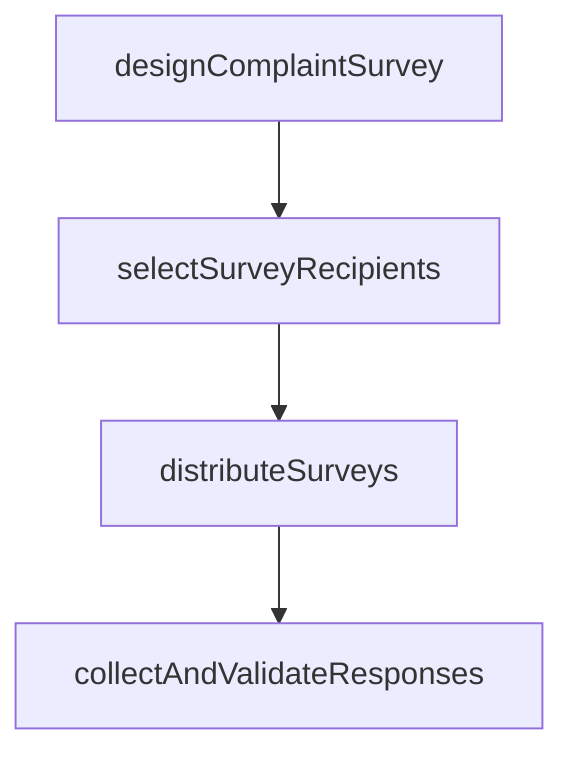

# Solicit customer feedback on complaint handling and resolution

> Business-as-Code definition for complaint handling satisfaction feedback. Models the solicitation and collection of customer feedback specifically about the complaint handling and resolution experience.

## Overview

Requesting customer feedback on the process of handling and resolving customer complaints. Obtain information about the effectiveness and performance of the customer complaint handling process from the customers through various means (e.g., online and by phone).

## Process Hierarchy



## GraphDL

```yaml
solicit:
  object: Customer Feedback On Complaint Handling And Resolution
  actor: ComplaintSatisfactionAnalyst
  result: ComplaintSatisfactionResult
```

## Actions

| Action | Description |
|--------|-------------|
| designComplaintSurvey | Create survey instruments focused on complaint handling experience |
| selectSurveyRecipients | Identify customers with recently resolved complaints for feedback collection |
| distributeSurveys | Send complaint satisfaction surveys through appropriate channels |
| collectAndValidateResponses | Gather responses and verify data quality for analysis |

## Events

| Event | Description |
|-------|-------------|
| complaintSurveyDistributed | Post-resolution satisfaction survey sent to complainants |
| complaintFeedbackReceived | Complainant completed satisfaction survey about complaint handling |
| feedbackRemindersIssued | Follow-up reminders sent for unreturned complaint surveys |
| complaintFeedbackCompiled | All complaint handling feedback compiled for analysis |

## Searches

| Search | Description |
|--------|-------------|
| getComplaintSurveys | List complaint satisfaction surveys by status, date, or complaint type |
| getComplaintFeedbackScores | Retrieve satisfaction scores for complaint handling by dimension |
| getSurveyResponseRates | Query response rates for complaint satisfaction surveys |
| getDetractorComments | Retrieve verbatim comments from dissatisfied complainants |

## Process Flow



## RACI Matrix

| Activity | Responsible | Accountable | Consulted | Informed |
|----------|-------------|-------------|-----------|----------|
| distributeComplaintSurvey | Customer Experience Analyst | Customer Insights Manager | Customer Service | Quality |
| collectComplaintFeedback | Survey Administrator | Customer Insights Manager | Data Analytics | Service Operations |
| compileComplaintFeedback | Customer Experience Analyst | Customer Insights Manager | Quality | Executive Team |

## Related Processes

| Process | Relationship |
|---------|-------------|
| 6.5.4.2 Analyze customer complaint data and identify improvements | Downstream - feedback data feeds complaint analysis |
| 6.2.3 Manage customer complaints | Upstream - complaint resolution triggers satisfaction solicitation |
| 6.5.3.1 Solicit customer feedback on service experience | Related - shares survey methodology and infrastructure |

## Related Departments

| Department | Role |
|-----------|------|
| Customer Insights | Designs and manages complaint satisfaction surveys |
| Customer Service | Supports feedback collection during complaint resolution |
| Quality Assurance | Uses feedback to assess complaint handling quality |

## Related Occupations

| Occupation | Involvement |
|-----------|-------------|
| Customer Experience Analyst | Manages complaint satisfaction survey program |
| Complaint Coordinator | Facilitates feedback collection during complaint process |
| Survey Administrator | Distributes surveys and tracks response rates |

## KPIs

| KPI | Description | Unit |
|-----|-------------|------|
| Complaint Survey Response Rate | Percentage of complaint surveys receiving responses | % |
| Complaint Handling Satisfaction | Average satisfaction score for complaint resolution process | Score (1-5) |
| Detractor Rate | Percentage of respondents rating complaint handling below threshold | % |

## Usage

```typescript
import { solicitCustomerFeedbackOnComplaintHandlingAndResolution } from '@headlessly/solicit-customer-feedback-on-complaint-handling-and-resolution'

const client = solicitCustomerFeedbackOnComplaintHandlingAndResolution()

// Distribute complaint satisfaction survey
const survey = await client.distributeComplaintSurvey({
  complaintId: 'CMP-2025-1234',
  channel: 'email',
  delayDays: 3
})

// Get complaint feedback scores
const scores = await client.getComplaintFeedbackScores({
  period: '2025-Q1',
  groupBy: 'complaintType'
})
```
