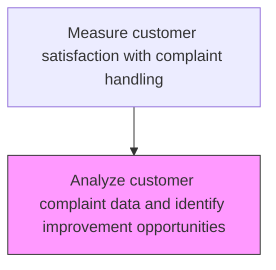
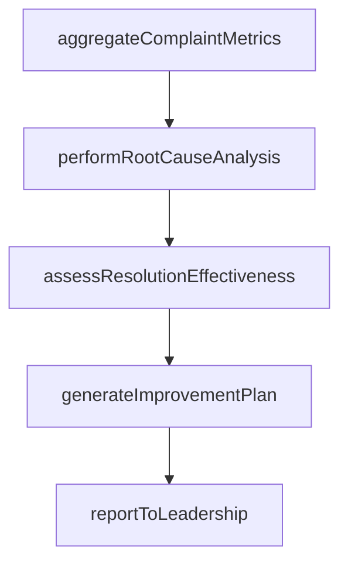

# Analyze customer complaint data and identify improvement opportunities

> Business-as-Code definition for complaint data analysis and improvement identification. Models the analysis of customer complaint patterns to identify systemic issues and improvement opportunities.

## Overview

Examining the information obtained through handling and resolving complaints for development/improvement opportunities. Categorize the customer complaints data on the basis of speed, accuracy, courtesy, price, product choice, availability, hours, location, etc. Determine complaint patterns in order to diagnose areas needing enhancement.

## Process Hierarchy



## GraphDL

```yaml
analyze:
  object: Customer Complaint Data And Identify Improvement Opportunities
  actor: ComplaintDataAnalyst
  result: ComplaintDataResult
```

## Actions

| Action | Description |
|--------|-------------|
| aggregateComplaintMetrics | Consolidate complaint volumes, categories, and resolution data |
| performRootCauseAnalysis | Identify the most common root causes driving customer complaints |
| assessResolutionEffectiveness | Evaluate the success rates and customer satisfaction of complaint resolutions |
| generateImprovementPlan | Create an action plan addressing the highest-impact complaint drivers |
| reportToLeadership | Present complaint analysis findings and improvement plan to service leadership |

## Events

| Event | Description |
|-------|-------------|
| complaintDataAnalyzed | Customer complaint data patterns and trends identified |
| rootCausesIdentified | Common root causes of complaints determined through analysis |
| improvementRecommendationsIssued | Data-driven improvement recommendations published |
| complaintTrendReported | Complaint trends and analysis report distributed to stakeholders |

## Searches

| Search | Description |
|--------|-------------|
| getComplaintAnalysis | Retrieve complaint data analysis results by period or category |
| getComplaintRootCauses | Query top root causes of customer complaints |
| getComplaintTrends | Analyze complaint volume and severity trends over time |
| getImprovementRecommendations | List improvement recommendations from complaint analysis |

## Process Flow



## RACI Matrix

| Activity | Responsible | Accountable | Consulted | Informed |
|----------|-------------|-------------|-----------|----------|
| analyzeComplaintData | Complaint Data Analyst | Customer Insights Manager | Quality | Service Operations |
| identifyRootCauses | Quality Improvement Specialist | VP Customer Service | Engineering | Product Management |
| recommendImprovements | Process Improvement Specialist | VP Customer Service | Service Operations | Executive Team |

## Related Processes

| Process | Relationship |
|---------|-------------|
| 6.5.4.1 Solicit customer feedback on complaint handling | Upstream - complaint feedback data feeds analysis |
| 6.5.4.3 Identify common customer complaints | Related - analysis supports common complaint identification |
| 6.2.3 Manage customer complaints | Feedback loop - analysis findings improve complaint processes |

## Related Departments

| Department | Role |
|-----------|------|
| Customer Insights | Analyzes complaint data and publishes improvement insights |
| Quality Assurance | Investigates root causes and validates improvements |
| Service Operations | Implements process changes from complaint analysis findings |

## Related Occupations

| Occupation | Involvement |
|-----------|-------------|
| Complaint Data Analyst | Performs complaint data analysis and trend identification |
| Quality Improvement Specialist | Develops improvement plans from root cause findings |
| Service Operations Manager | Implements process changes to reduce complaints |

## KPIs

| KPI | Description | Unit |
|-----|-------------|------|
| Complaint Reduction Rate | Period-over-period reduction in complaint volume | % |
| Root Cause Resolution Rate | Percentage of identified root causes with implemented fixes | % |
| Analysis Cycle Time | Average days to complete complaint data analysis cycle | Days |

## Usage

```typescript
import { analyzeCustomerComplaintDataAndIdentifyImprovementOpportunities } from '@headlessly/analyze-customer-complaint-data-and-identify-improvement-opportunities'

const client = analyzeCustomerComplaintDataAndIdentifyImprovementOpportunities()

// Analyze complaint data
const analysis = await client.analyzeComplaintData({
  period: '2025-Q1',
  dimensions: ['productLine', 'complaintType', 'resolution'],
  includeRootCause: true
})

// Get top root causes
const rootCauses = await client.getComplaintRootCauses({
  analysisId: analysis.id,
  topN: 10
})
```
