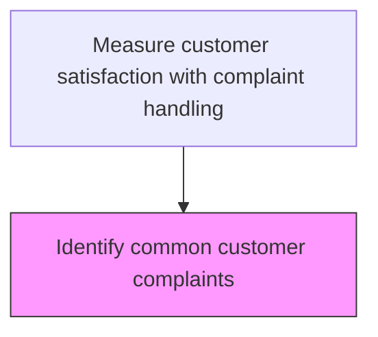
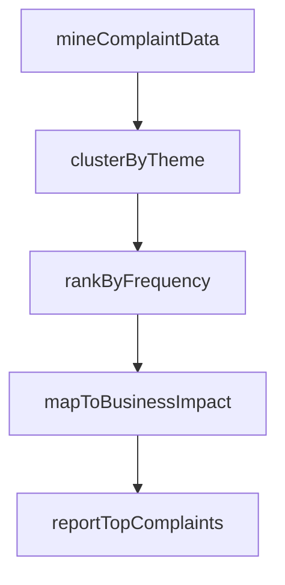

# Identify common customer complaints

> Business-as-Code definition for common complaint identification. Models the detection and categorization of the most frequent customer complaints to prioritize preventive action.

## Overview

Determining complaint patterns in order to identify common issues. Document common problems for correction.

## Process Hierarchy



## GraphDL

```yaml
identify:
  object: Common Customer Complaints
  actor: ComplaintPatternAnalyst
  result: ComplaintPatternResult
```

## Actions

| Action | Description |
|--------|-------------|
| mineComplaintData | Extract complaint records from the case management system for analysis |
| clusterByTheme | Group complaints by common themes, products, and root causes |
| rankByFrequency | Order complaint clusters by volume and trend direction |
| mapToBusinessImpact | Assess the revenue, cost, and reputation impact of each complaint category |
| reportTopComplaints | Publish the prioritized list of common complaints with recommendations |

## Events

| Event | Description |
|-------|-------------|
| commonComplaintsIdentified | Recurring complaint patterns recognized and categorized |
| complaintFrequencyRanked | Common complaints ranked by frequency and severity impact |
| preventionActionsProposed | Preventive actions proposed for top recurring complaints |
| commonComplaintReportPublished | Common complaints report distributed to stakeholders |

## Searches

| Search | Description |
|--------|-------------|
| getCommonComplaints | List the most frequent customer complaints by category and period |
| getComplaintFrequency | Query complaint occurrence frequency by type and product |
| getPreventionActions | Retrieve preventive actions proposed for common complaints |
| getComplaintClusters | Identify complaint clusters by similarity of root cause or symptom |

## Process Flow



## RACI Matrix

| Activity | Responsible | Accountable | Consulted | Informed |
|----------|-------------|-------------|-----------|----------|
| identifyCommonComplaints | Complaint Trends Analyst | Customer Insights Manager | Quality | Service Operations |
| rankByFrequency | Complaint Trends Analyst | Customer Insights Manager | Data Analytics | Product Management |
| proposePreventionActions | Process Improvement Specialist | VP Customer Service | Product Management | Engineering |

## Related Processes

| Process | Relationship |
|---------|-------------|
| 6.5.4.2 Analyze customer complaint data and identify improvements | Upstream - complaint analysis feeds common complaint identification |
| 6.2.3 Manage customer complaints | Feedback loop - common complaints guide complaint handling priorities |
| 6.5.5 Measure customer satisfaction with products and services | Related - product-related complaints inform product satisfaction |

## Related Departments

| Department | Role |
|-----------|------|
| Customer Insights | Identifies and reports common complaint patterns |
| Product Management | Addresses product-related recurring complaints |
| Service Operations | Implements process changes to prevent common complaints |

## Related Occupations

| Occupation | Involvement |
|-----------|-------------|
| Complaint Trends Analyst | Identifies and categorizes recurring complaint patterns |
| Product Quality Manager | Addresses product defects driving common complaints |
| Process Improvement Specialist | Develops prevention strategies for recurring complaints |

## KPIs

| KPI | Description | Unit |
|-----|-------------|------|
| Top Complaint Repeat Rate | Recurrence rate of the top 10 most common complaints | % |
| Prevention Action Implementation | Percentage of proposed prevention actions implemented | % |
| Common Complaint Reduction | Quarter-over-quarter reduction in top recurring complaint volume | % |

## Usage

```typescript
import { identifyCommonCustomerComplaints } from '@headlessly/identify-common-customer-complaints'

const client = identifyCommonCustomerComplaints()

// Identify common complaints
const common = await client.identifyCommonComplaints({
  period: '2025-Q1',
  minOccurrences: 10,
  groupBy: 'complaintType'
})

// Propose prevention actions
await client.proposePreventionActions({
  complaintPatternId: common[0].id,
  actions: [
    { type: 'process-change', description: 'Add pre-shipment quality check' },
    { type: 'training', description: 'Update handling procedures for fragile items' }
  ]
})
```
