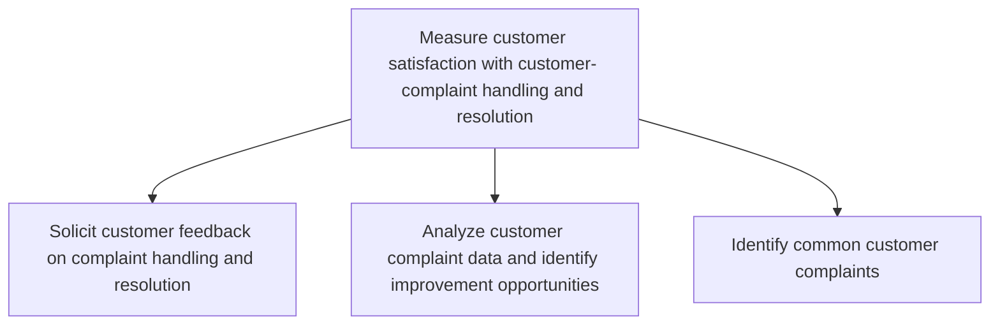
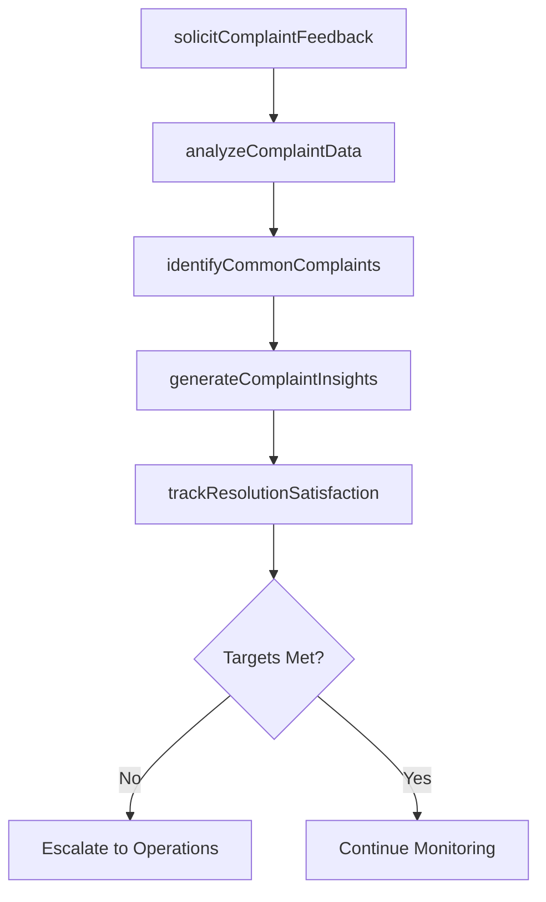

# Measure customer satisfaction with customer- complaint handling and resolution

> Business-as-Code definition for complaint handling satisfaction measurement. Models complaint feedback collection, complaint data analysis, pattern identification, and improvement opportunity discovery.

## Overview

Measuring the satisfaction level of customers as pertains to how their complaints are handled and resolved. This process element requires the organization to estimate the customers level of fulfillment with the process reconciling their complaints and towards the objective of ensuring customer retention. The feedback received can be used to develop concepts for new opportunities to boost the level of customer satisfaction.

## Process Hierarchy



## GraphDL

```yaml
measure:
  object: Customer Satisfaction With Customer- Complaint Handling And Resolution
  actor: ComplaintAnalyst
  result: ComplaintSatisfactionReport
```

## Actions

| Action | Description |
|--------|-------------|
| solicitComplaintFeedback | Deploy post-resolution surveys to capture satisfaction with complaint handling |
| analyzeComplaintData | Examine complaint resolution data to identify systemic issues and opportunities |
| identifyCommonComplaints | Detect recurring complaint patterns and categorize by root cause |
| generateComplaintInsights | Produce actionable recommendations from complaint analysis |
| trackResolutionSatisfaction | Monitor satisfaction trends for complaint resolution over time |

## Events

| Event | Description |
|-------|-------------|
| complaintFeedbackSolicited | Post-resolution satisfaction survey deployed to customer |
| complaintDataAnalyzed | Complaint data analysis completed with findings |
| commonComplaintsIdentified | Recurring complaint patterns documented and categorized |
| complaintInsightsGenerated | Actionable improvement recommendations produced |
| resolutionSatisfactionTracked | Complaint resolution satisfaction trend data updated |

## Searches

| Search | Description |
|--------|-------------|
| getComplaintSatisfactionScores | Retrieve satisfaction ratings for complaint resolution by period or category |
| getCommonComplaintPatterns | List recurring complaint types ranked by frequency or impact |
| getComplaintResolutionMetrics | Query average resolution time, escalation rate, and reopen rate |
| getComplaintFeedbackResponses | Retrieve individual customer feedback on complaint handling |

## Process Flow



## RACI Matrix

| Activity | Responsible | Accountable | Consulted | Informed |
|----------|-------------|-------------|-----------|----------|
| solicitComplaintFeedback | CX Analyst | VP Customer Service | IT | Complaint Handlers |
| analyzeComplaintData | Complaint Analyst | Customer Service Manager | Quality Team | Operations |
| identifyCommonComplaints | Complaint Analyst | VP Customer Service | Product, Operations | Executive Team |
| generateComplaintInsights | CX Manager | VP Customer Service | Department Heads | All Service Staff |

## Sub-Processes

| ID | Name | Description |
|----|------|-------------|
| 6.5.4.1 | Solicit customer feedback on complaint handling and resolution | Requesting customer feedback on the process of handling and resolving customer complaints. Obtain in |
| 6.5.4.2 | Analyze customer complaint data and identify improvement opportunities | Examining the information obtained through handling and resolving complaints for development/improve |
| 6.5.4.3 | Identify common customer complaints | Determining complaint patterns in order to identify common issues. Document common problems for corr |

## Related Processes

| Process | Relationship |
|---------|-------------|
| 6.2.3 Manage customer complaints | Upstream - complaint handling data feeds satisfaction measurement |
| 6.5.3 Measure customer satisfaction with customer problems handling | Parallel - complementary satisfaction measurement |
| 6.5.5 Measure customer satisfaction with products and services | Parallel - product-level satisfaction measurement |

## Related Departments

| Department | Role |
|-----------|------|
| Customer Experience | Manages complaint feedback programs and analysis |
| Customer Service Operations | Implements resolution process improvements |
| Quality Assurance | Monitors complaint handling standards and compliance |
| Product Management | Receives product-related complaint insights |

## Related Occupations

| Occupation | Involvement |
|-----------|-------------|
| Complaint Analyst | Analyzes complaint data and identifies patterns |
| Customer Experience Manager | Oversees satisfaction measurement programs |
| Quality Assurance Specialist | Monitors complaint resolution quality |

## KPIs

| KPI | Description | Unit |
|-----|-------------|------|
| Complaint Resolution Satisfaction | Average customer satisfaction rating after complaint resolution | Score (1-5) |
| Complaint Reopen Rate | Percentage of resolved complaints reopened by customers | % |
| Root Cause Identification Rate | Percentage of complaints with documented root cause | % |
| Time to Resolution | Average days from complaint submission to resolution | Days |

## Usage

```typescript
import { measureCustomerSatisfactionWithCustomerComplaintHandlingAndResolution } from '@headlessly/measure-customer-satisfaction-with-customer-complaint-handling-and-resolution'

const complaints = measureCustomerSatisfactionWithCustomerComplaintHandlingAndResolution()

// Identify common complaints
const patterns = await complaints.identifyCommonComplaints({
  period: '2025-Q2',
  minFrequency: 10,
  categories: ['billing', 'product-quality', 'delivery']
})

// Generate improvement insights
const insights = await complaints.generateComplaintInsights({
  patterns: patterns.topPatterns,
  includeRecommendations: true
})
```
