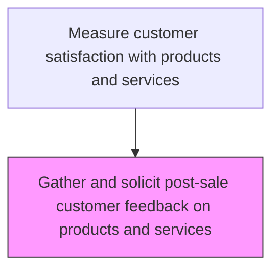
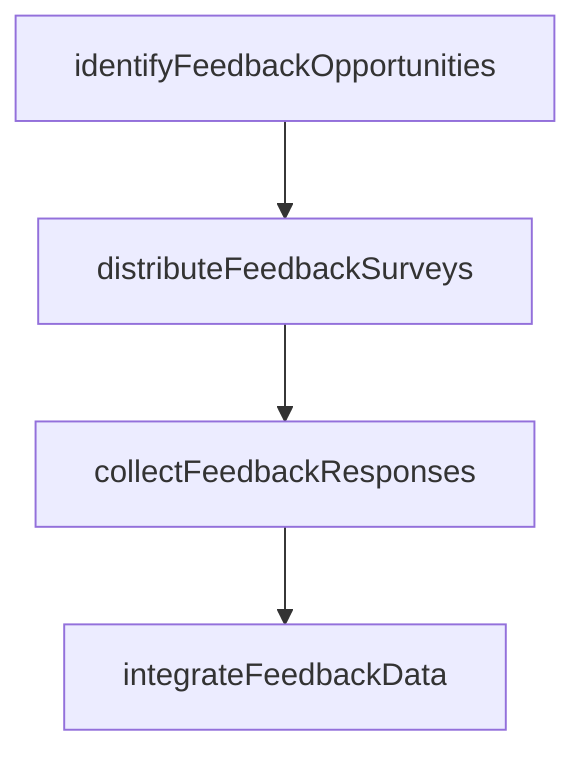

# Gather and solicit post-sale customer feedback on products and services

> Business-as-Code definition for post-sale product feedback collection. Models the gathering and solicitation of customer feedback on product and service satisfaction after purchase.

## Overview

Obtaining customer feedback/review on the quality and utility derived from the products/services after the sale is complete. Use techniques such as surveys, feedback boxes, and user activity and usability tests.

## Process Hierarchy



## GraphDL

```yaml
gather:
  object: And Solicit Post-sale Customer Feedback On Products And Services
  actor: PostSaleFeedbackManager
  result: PostSaleFeedbackResult
```

## Actions

| Action | Description |
|--------|-------------|
| identifyFeedbackOpportunities | Determine optimal touchpoints for soliciting post-sale product feedback |
| distributeFeedbackSurveys | Send product satisfaction surveys to customers at defined post-purchase intervals |
| collectFeedbackResponses | Gather customer responses across survey channels |
| integrateFeedbackData | Consolidate feedback data into the voice-of-customer analytics platform |

## Events

| Event | Description |
|-------|-------------|
| feedbackOpportunitiesIdentified | Optimal post-sale feedback touchpoints determined |
| productSurveysDistributed | Product satisfaction surveys sent to customers at scheduled intervals |
| feedbackResponsesCollected | Customer feedback responses received and validated |
| feedbackDataIntegrated | Feedback data consolidated into the analytics platform |

## Searches

| Search | Description |
|--------|-------------|
| getPostSaleSurveys | List post-sale feedback surveys by product, channel, or date |
| getProductFeedbackScores | Retrieve product satisfaction scores by product line or feature |
| getFeedbackResponseRates | Query response rates for post-sale surveys by channel |
| getProductSentiment | Analyze customer sentiment trends for products and services |

## Process Flow



## RACI Matrix

| Activity | Responsible | Accountable | Consulted | Informed |
|----------|-------------|-------------|-----------|----------|
| identifyFeedbackOpportunities | Customer Insights Analyst | Customer Insights Manager | Product Management | Marketing |
| distributeSurveys | Customer Insights Analyst | Customer Insights Manager | IT | Customer Service |
| integrateFeedbackData | Data Engineer | Customer Insights Manager | Data Analytics | Product Management |

## Related Processes

| Process | Relationship |
|---------|-------------|
| 6.5.5.4 Analyze product and service satisfaction data | Downstream - collected feedback feeds satisfaction analysis |
| 6.5.5.2 Solicit post-sale feedback on ad effectiveness | Related - shares feedback collection infrastructure |
| 6.3.5.4 Ensure quality of service | Related - service quality affects product satisfaction |

## Related Departments

| Department | Role |
|-----------|------|
| Customer Insights | Designs and manages post-sale feedback collection programs |
| Product Management | Defines feedback questions aligned with product goals |
| Marketing | Coordinates feedback collection with customer communication calendar |

## Related Occupations

| Occupation | Involvement |
|-----------|-------------|
| Customer Insights Analyst | Manages post-sale feedback survey programs |
| Product Marketing Manager | Aligns feedback collection with product lifecycle |
| Data Engineer | Integrates feedback data into analytics platform |

## KPIs

| KPI | Description | Unit |
|-----|-------------|------|
| Post-Sale Survey Response Rate | Percentage of post-sale surveys receiving customer responses | % |
| Product Satisfaction Score | Average product satisfaction rating from collected feedback | Score (1-5) |
| Feedback Collection Timeliness | Average days from purchase to first feedback solicitation | Days |

## Usage

```typescript
import { gatherAndSolicitPostSaleCustomerFeedbackOnProductsAndServices } from '@headlessly/gather-and-solicit-post-sale-customer-feedback-on-products-and-services'

const client = gatherAndSolicitPostSaleCustomerFeedbackOnProductsAndServices()

// Distribute post-sale surveys
const survey = await client.distributePostSaleSurvey({
  productLine: 'X200',
  purchaseDateRange: { from: '2025-03-01', to: '2025-03-31' },
  channel: 'email',
  template: 'product-satisfaction-30day'
})

// Collect and integrate feedback
const responses = await client.collectFeedbackResponses({
  surveyId: survey.id,
  minResponseAge: 7
})
```
