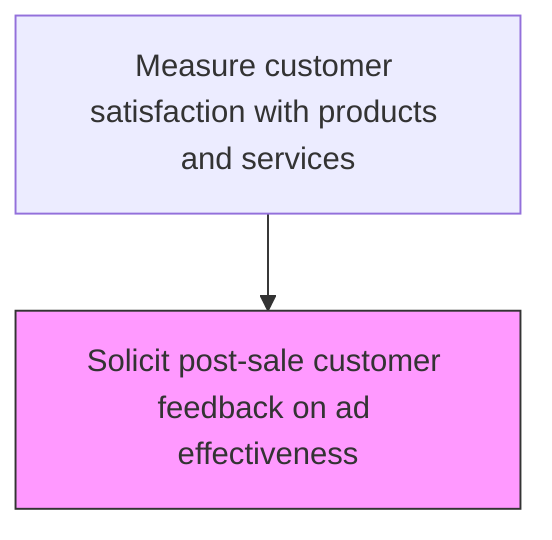
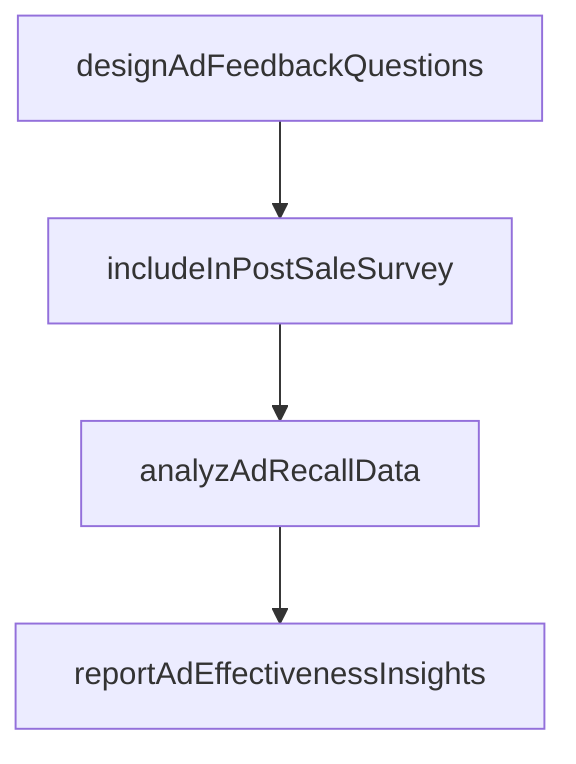

# Solicit post-sale customer feedback on ad effectiveness

> Business-as-Code definition for advertising effectiveness feedback. Models the collection and analysis of customer feedback on advertising impact in post-sale satisfaction surveys.

## Overview

Assessing the influence of advertisements on purchasing behavior. Use techniques such as surveys and product recognition tests, questionnaires or feedback flyers, and toll-free numbers in order to encourage customer interaction after the sale.

## Process Hierarchy



## GraphDL

```yaml
solicit:
  object: Post-sale Customer Feedback On Ad Effectiveness
  actor: AdEffectivenessAnalyst
  result: AdEffectivenessResult
```

## Actions

| Action | Description |
|--------|-------------|
| designAdFeedbackQuestions | Create survey questions measuring advertising recall and purchase influence |
| includeInPostSaleSurvey | Integrate advertising effectiveness questions into post-sale feedback instruments |
| analyzAdRecallData | Evaluate customer responses regarding advertising awareness and influence |
| reportAdEffectivenessInsights | Deliver advertising effectiveness findings to marketing teams |

## Events

| Event | Description |
|-------|-------------|
| adEffectivenessSurveyDistributed | Post-purchase advertising effectiveness survey sent to customers |
| adFeedbackReceived | Customer feedback on advertising effectiveness collected |
| adPerceptionAnalyzed | Customer perception of advertising impact analyzed |
| adFeedbackReported | Advertising effectiveness feedback report shared with marketing |

## Searches

| Search | Description |
|--------|-------------|
| getAdEffectivenessSurveys | List advertising effectiveness surveys by campaign or product |
| getAdPerceptionScores | Retrieve customer perception scores by advertising channel |
| getAdInfluenceData | Query how advertising influenced purchase decisions |
| getCampaignFeedback | Retrieve customer feedback specific to a marketing campaign |

## Process Flow



## RACI Matrix

| Activity | Responsible | Accountable | Consulted | Informed |
|----------|-------------|-------------|-----------|----------|
| distributeAdSurvey | Marketing Research Analyst | Customer Insights Manager | Marketing | IT |
| collectAdFeedback | Marketing Research Analyst | Customer Insights Manager | Data Analytics | Campaign Manager |
| analyzeAdPerception | Customer Insights Analyst | Customer Insights Manager | Marketing | Product Management |

## Related Processes

| Process | Relationship |
|---------|-------------|
| 6.5.5.1 Gather post-sale customer feedback on products | Related - shares feedback collection methodology |
| 6.5.5.5 Provide feedback and insights to appropriate teams | Downstream - ad effectiveness data shared with marketing |
| 3.4 Develop and manage advertising campaigns | Feedback loop - informs campaign effectiveness evaluation |

## Related Departments

| Department | Role |
|-----------|------|
| Customer Insights | Manages advertising effectiveness feedback collection |
| Marketing | Receives feedback and adjusts advertising strategies |
| Product Management | Provides product context for advertising feedback analysis |

## Related Occupations

| Occupation | Involvement |
|-----------|-------------|
| Marketing Research Analyst | Designs and manages ad effectiveness surveys |
| Campaign Manager | Uses feedback to improve campaign targeting |
| Customer Insights Analyst | Analyzes ad perception data across channels |

## KPIs

| KPI | Description | Unit |
|-----|-------------|------|
| Ad Survey Response Rate | Percentage of ad effectiveness surveys receiving responses | % |
| Ad Influence Score | Average rating of advertising influence on purchase decision | Score (1-5) |
| Ad Channel Effectiveness | Customer-perceived effectiveness rating by advertising channel | Score (1-10) |

## Usage

```typescript
import { solicitPostSaleCustomerFeedbackOnAdEffectiveness } from '@headlessly/solicit-post-sale-customer-feedback-on-ad-effectiveness'

const client = solicitPostSaleCustomerFeedbackOnAdEffectiveness()

// Distribute ad effectiveness survey
const survey = await client.distributeAdSurvey({
  campaignId: 'CAMP-2025-Q1-Brand',
  targetAudience: 'recent-purchasers',
  channel: 'email'
})

// Analyze ad perception
const perception = await client.analyzeAdPerception({
  campaignId: 'CAMP-2025-Q1-Brand',
  dimensions: ['channel', 'adFormat', 'message']
})
```
