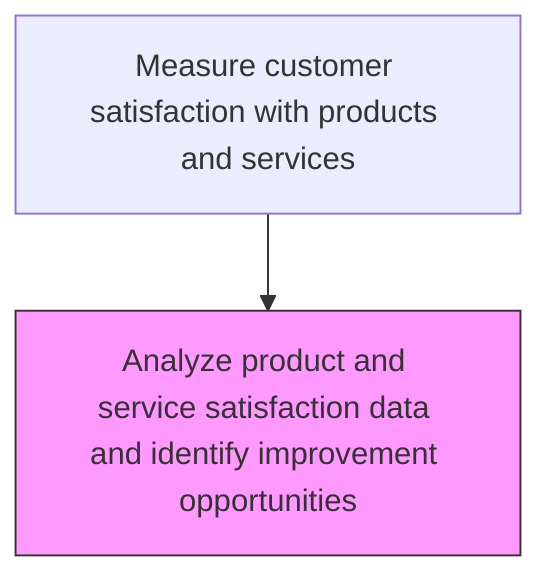
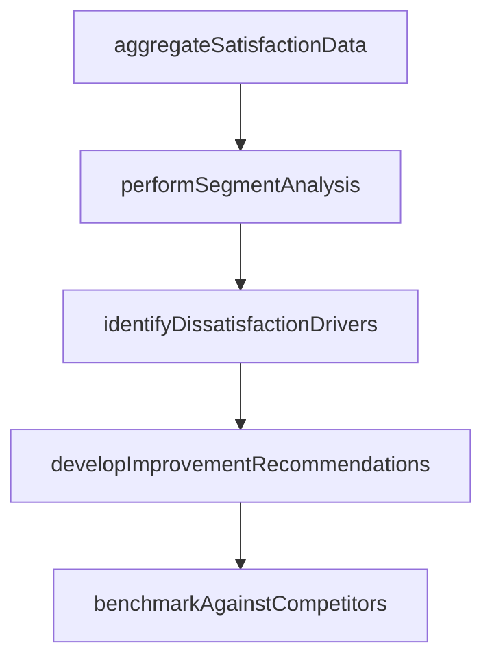

# Analyze product and service satisfaction data and identify improvement opportunities

> Business-as-Code definition for product and service satisfaction analysis. Models the statistical analysis of satisfaction data to identify improvement opportunities for products and services.

## Overview

Assessing the information collected on customer satisfaction levels with products/services in order to determine areas for improvement. Examine the data and information extracted from the customer feedback and reviews to measure the satisfaction levels of the customers. Identify opportunities that could enhance the customer satisfaction levels and the overall customer service strategy.

## Process Hierarchy



## GraphDL

```yaml
analyze:
  object: Product And Service Satisfaction Data And Identify Improvement Opportunities
  actor: SatisfactionAnalyst
  result: SatisfactionResult
```

## Actions

| Action | Description |
|--------|-------------|
| aggregateSatisfactionData | Consolidate product and service satisfaction scores across customer segments |
| performSegmentAnalysis | Analyze satisfaction patterns by customer demographics, product line, and purchase channel |
| identifyDissatisfactionDrivers | Detect the primary factors driving low satisfaction scores |
| developImprovementRecommendations | Create actionable recommendations to address identified satisfaction gaps |
| benchmarkAgainstCompetitors | Compare satisfaction scores against industry and competitor benchmarks |

## Events

| Event | Description |
|-------|-------------|
| satisfactionDataAnalyzed | Product and service satisfaction data patterns identified |
| improvementOpportunitiesFound | Product and service improvement opportunities derived from data |
| satisfactionInsightsPublished | Satisfaction analysis insights report distributed |
| improvementsPrioritized | Product and service improvements ranked by impact |

## Searches

| Search | Description |
|--------|-------------|
| getSatisfactionAnalysis | Retrieve product satisfaction analysis results by period or product |
| getProductImprovements | List improvement opportunities identified from satisfaction data |
| getSatisfactionDrivers | Query key drivers of product and service satisfaction or dissatisfaction |
| getSatisfactionBenchmarks | Compare satisfaction scores against industry benchmarks |

## Process Flow



## RACI Matrix

| Activity | Responsible | Accountable | Consulted | Informed |
|----------|-------------|-------------|-----------|----------|
| analyzeSatisfactionData | Customer Analytics Analyst | Customer Insights Manager | Quality | Product Management |
| identifySatisfactionDrivers | Customer Analytics Analyst | Customer Insights Manager | Product Management | Engineering |
| publishSatisfactionInsights | Customer Insights Manager | VP Customer Service | Product Management | Executive Team |

## Related Processes

| Process | Relationship |
|---------|-------------|
| 6.5.5.1 Gather post-sale customer feedback on products | Upstream - collected feedback feeds satisfaction analysis |
| 6.5.5.5 Provide feedback and insights to appropriate teams | Downstream - analysis insights shared with product and marketing teams |
| 2.3 Manage product lifecycle | Feedback loop - satisfaction data informs product decisions |

## Related Departments

| Department | Role |
|-----------|------|
| Customer Insights | Analyzes product and service satisfaction data |
| Product Management | Uses satisfaction insights for product improvement planning |
| Quality Assurance | Investigates quality-related satisfaction drivers |

## Related Occupations

| Occupation | Involvement |
|-----------|-------------|
| Customer Analytics Analyst | Analyzes satisfaction data and identifies improvement opportunities |
| Product Improvement Manager | Converts satisfaction insights into product improvement plans |
| Quality Analyst | Investigates product quality factors affecting satisfaction |

## KPIs

| KPI | Description | Unit |
|-----|-------------|------|
| Satisfaction Score Trend | Direction and magnitude of product satisfaction score change | Score delta |
| Improvement Implementation Rate | Percentage of identified improvements acted upon | % |
| Driver Analysis Completeness | Percentage of satisfaction drivers quantified and ranked | % |

## Usage

```typescript
import { analyzeProductAndServiceSatisfactionDataAndIdentifyImprovementOpportunities } from '@headlessly/analyze-product-and-service-satisfaction-data-and-identify-improvement-opportunities'

const client = analyzeProductAndServiceSatisfactionDataAndIdentifyImprovementOpportunities()

// Analyze satisfaction data
const analysis = await client.analyzeSatisfactionData({
  period: '2025-Q1',
  productLines: ['X200', 'X300'],
  dimensions: ['feature', 'quality', 'value']
})

// Identify key satisfaction drivers
const drivers = await client.identifySatisfactionDrivers({
  analysisId: analysis.id,
  driverType: 'dissatisfaction',
  topN: 10
})
```
