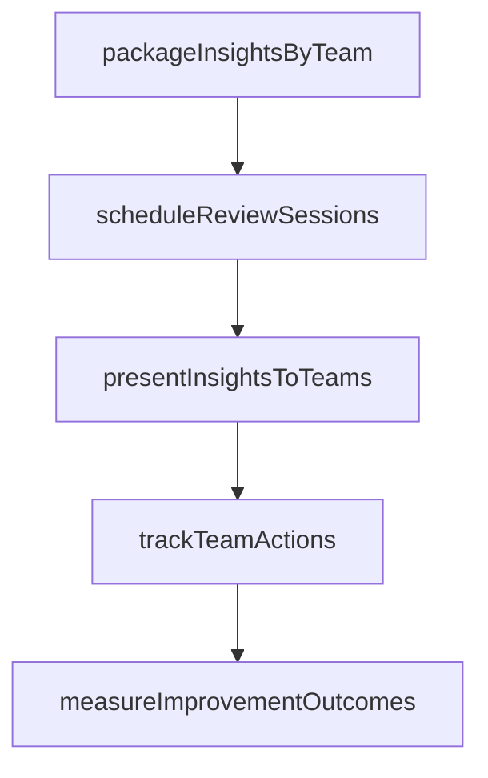

# Provide feedback and insights to appropriate teams (product design/development, marketing, manufacturing)

> Business-as-Code definition for cross-functional feedback distribution. Models the communication of customer satisfaction insights to product, design, development, marketing, and manufacturing teams.

## Overview

Providing feedback from customers on products/services to the product management team. Analyze information collected through Gather and solicit post-sale customer feedback on products/services [11238]. Share with the product management team for consideration while improving existing offerings or developing new products/services.

## Process Hierarchy

```mermaid
graph TD
    A[Measure customer satisfaction with products and services] --> B[Provide feedback and insights to appropriate teams (product design/development, marketing, manufacturing)]
    style B fill:#f9f,stroke:#333
```

## GraphDL

```yaml
provide:
  object: Feedback And Insights To Appropriate Teams (product Design/development, Marketing, Manufacturing)
  actor: InsightDistributionCoordinator
  result: InsightDistributionResult
```

## Actions

| Action | Description |
|--------|-------------|
| packageInsightsByTeam | Organize satisfaction findings into team-specific briefing packages |
| scheduleReviewSessions | Arrange cross-functional review meetings for feedback presentation |
| presentInsightsToTeams | Deliver satisfaction data and recommendations to each functional team |
| trackTeamActions | Monitor improvement actions taken by each team in response to insights |
| measureImprovementOutcomes | Assess whether team actions resulted in measurable satisfaction improvement |

## Events

| Event | Description |
|-------|-------------|
| insightPackagePrepared | Feedback insights compiled and formatted for target teams |
| feedbackDeliveredToProduct | Customer feedback insights shared with product design/development team |
| feedbackDeliveredToMarketing | Customer feedback insights shared with marketing team |
| actionItemsAssigned | Specific action items assigned to teams based on feedback insights |

## Searches

| Search | Description |
|--------|-------------|
| getInsightPackages | Retrieve feedback insight packages by team, period, or product |
| getTeamActionItems | List action items assigned to each team from feedback insights |
| getInsightDeliveryStatus | Query delivery and acknowledgment status of insight packages |
| getCrossTeamInsights | Retrieve insights relevant to multiple teams |

## Process Flow



## RACI Matrix

| Activity | Responsible | Accountable | Consulted | Informed |
|----------|-------------|-------------|-----------|----------|
| prepareInsightPackage | Customer Insights Manager | VP Customer Service | Product Management | Marketing |
| deliverInsights | Customer Insights Manager | VP Customer Service | Product, Marketing, Manufacturing | Executive Team |
| trackTeamActions | Voice of Customer Analyst | Customer Insights Manager | All Receiving Teams | Executive Team |

## Related Processes

| Process | Relationship |
|---------|-------------|
| 6.5.5.4 Analyze product and service satisfaction data | Upstream - analysis results feed insight distribution |
| 2.3 Manage product lifecycle | Downstream - product team receives insights for improvement |
| 3.1 Develop marketing strategy | Downstream - marketing team receives insights for strategy adjustment |

## Related Departments

| Department | Role |
|-----------|------|
| Customer Insights | Packages and delivers feedback insights to appropriate teams |
| Product Management | Receives and acts on product improvement insights |
| Marketing | Receives and acts on customer perception and messaging insights |
| Manufacturing | Receives and acts on quality and manufacturing-related insights |

## Related Occupations

| Occupation | Involvement |
|-----------|-------------|
| Customer Insights Manager | Coordinates insight packaging and delivery |
| Product Manager | Translates customer insights into product requirements |
| Marketing Strategist | Adjusts marketing approach based on customer insights |

## KPIs

| KPI | Description | Unit |
|-----|-------------|------|
| Insight Delivery Timeliness | Average days from analysis completion to team delivery | Days |
| Action Item Conversion Rate | Percentage of insights converted into team action items | % |
| Cross-Team Alignment | Percentage of insights acknowledged by all relevant teams | % |

## Usage

```typescript
import { provideFeedbackAndInsightsToAppropriateTeamsProductDesignDevelopmentMarketingManufacturing } from '@headlessly/provide-feedback-and-insights-to-appropriate-teams-product-design-development-marketing-manufacturing'

const client = provideFeedbackAndInsightsToAppropriateTeamsProductDesignDevelopmentMarketingManufacturing()

// Prepare insight package for product team
const pkg = await client.prepareInsightPackage({
  analysisId: 'ANL-2025-Q1',
  targetTeam: 'product-development',
  topInsights: 10
})

// Deliver insights and assign actions
await client.deliverInsights({
  packageId: pkg.id,
  recipients: ['product-director', 'ux-lead', 'engineering-lead'],
  requestActionItems: true
})
```
