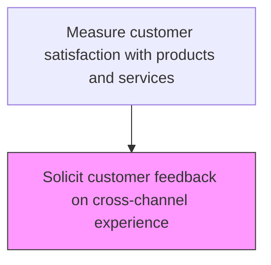
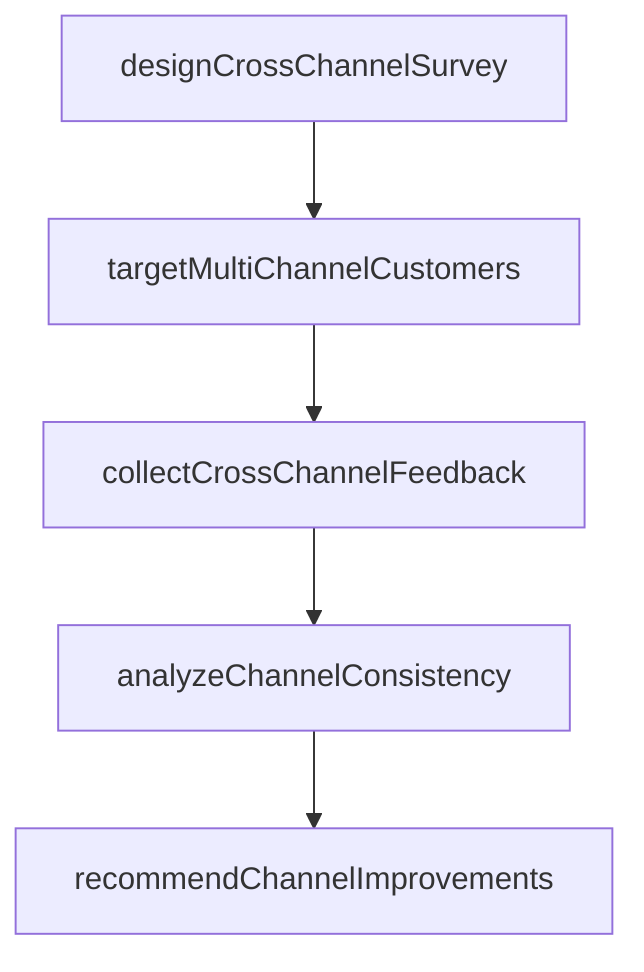

# Solicit customer feedback on cross-channel experience

> Business-as-Code definition for cross-channel experience feedback collection. Models the solicitation and analysis of customer feedback on the consistency and quality of service across multiple interaction channels.

## Overview

Engaging with the customer to understand their cross-channel experience. Find out what channels were effective and what areas need improvement.

## Process Hierarchy



## GraphDL

```yaml
solicit:
  object: Customer Feedback On Cross-channel Experience
  actor: OmnichannelExperienceAnalyst
  result: OmnichannelExperienceResult
```

## Actions

| Action | Description |
|--------|-------------|
| designCrossChannelSurvey | Create feedback instruments measuring experience consistency across channels |
| targetMultiChannelCustomers | Identify customers who have interacted through multiple service channels |
| collectCrossChannelFeedback | Gather customer assessments of their multi-channel experience |
| analyzeChannelConsistency | Evaluate satisfaction variation across channels and identify gaps |
| recommendChannelImprovements | Propose actions to improve cross-channel experience consistency |

## Events

| Event | Description |
|-------|-------------|
| crossChannelSurveyDistributed | Cross-channel experience survey sent to customers |
| crossChannelFeedbackReceived | Customer feedback on cross-channel experience collected |
| channelTransitionPointsIdentified | Pain points in channel transitions identified from feedback |
| crossChannelInsightsReported | Cross-channel experience feedback analysis shared with channel owners |

## Searches

| Search | Description |
|--------|-------------|
| getCrossChannelSurveys | List cross-channel experience surveys by status or date |
| getChannelTransitionScores | Retrieve customer ratings for channel-to-channel transitions |
| getChannelConsistencyScores | Query consistency of experience across different service channels |
| getMultiChannelJourneys | Retrieve customer journey data spanning multiple channels |

## Process Flow



## RACI Matrix

| Activity | Responsible | Accountable | Consulted | Informed |
|----------|-------------|-------------|-----------|----------|
| distributeCrossChannelSurvey | Customer Journey Analyst | Customer Insights Manager | Digital Operations | Customer Service |
| analyzeCrossChannelFeedback | Customer Journey Analyst | Customer Insights Manager | Channel Managers | IT |
| identifyTransitionPainPoints | Channel Experience Manager | VP Customer Service | Digital Operations | Service Operations |

## Related Processes

| Process | Relationship |
|---------|-------------|
| 6.5.5.1 Gather post-sale customer feedback on products | Related - shares feedback collection methodology |
| 6.5.5.4 Analyze product and service satisfaction data | Downstream - cross-channel data feeds overall satisfaction analysis |
| 6.1.3 Define and manage customer service channel strategy | Feedback loop - cross-channel insights inform channel strategy |

## Related Departments

| Department | Role |
|-----------|------|
| Customer Insights | Designs and manages cross-channel feedback collection |
| Digital Operations | Provides digital channel performance data |
| Customer Service | Provides contact center channel interaction data |

## Related Occupations

| Occupation | Involvement |
|-----------|-------------|
| Customer Journey Analyst | Maps and evaluates cross-channel customer journeys |
| Channel Experience Manager | Oversees experience quality across all service channels |
| Digital Analytics Specialist | Analyzes digital channel contribution to customer journeys |

## KPIs

| KPI | Description | Unit |
|-----|-------------|------|
| Cross-Channel Satisfaction | Average satisfaction score for multi-channel customer journeys | Score (1-5) |
| Channel Consistency Score | Rating of experience consistency across channels | Score (1-10) |
| Channel Transition Drop-off | Percentage of customers abandoning during channel transitions | % |

## Usage

```typescript
import { solicitCustomerFeedbackOnCrossChannelExperience } from '@headlessly/solicit-customer-feedback-on-cross-channel-experience'

const client = solicitCustomerFeedbackOnCrossChannelExperience()

// Distribute cross-channel survey
const survey = await client.distributeCrossChannelSurvey({
  customerSegment: 'multi-channel-users',
  channels: ['web', 'mobile', 'phone', 'in-store'],
  template: 'channel-experience-survey'
})

// Identify transition pain points
const painPoints = await client.identifyTransitionPainPoints({
  period: '2025-Q1',
  minOccurrences: 20
})
```
