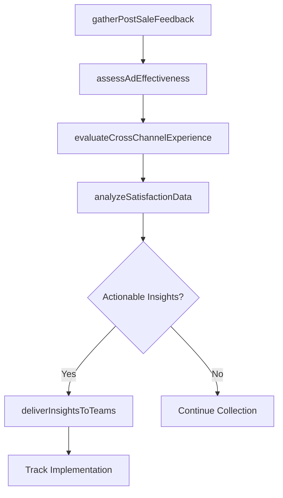

# Measure customer satisfaction with products and services

> Business-as-Code definition for product and service satisfaction measurement. Models post-sale feedback collection, ad effectiveness assessment, cross-channel experience evaluation, and insight delivery to product, marketing, and manufacturing teams.

## Overview

Calculating satisfaction levels of customers with products/services. Obtain customer feedback on products/services, as well as the effectiveness of the advertising campaigns. Examine this information to reach meaningful conclusions, which could then be used to enhance the customer service operations.

## Process Hierarchy

```mermaid
graph TD
    A[Measure customer satisfaction with products and services]
    A --> B[Gather and solicit post-sale customer feedback on products and services]
    A --> C[Solicit post-sale customer feedback on ad effectiveness]
    A --> D[Solicit customer feedback on cross-channel experience]
    A --> E[Analyze product and service satisfaction data and identify improvement opportunities]
    A --> F[Provide feedback and insights to appropriate teams (product design/development, marketing, manufacturing)]
```

## GraphDL

```yaml
measure:
  object: Customer Satisfaction With Products And Services
  actor: ProductSatisfactionAnalyst
  result: ProductSatisfactionReport
```

## Actions

| Action | Description |
|--------|-------------|
| gatherPostSaleFeedback | Collect customer reviews and ratings on products and services after purchase |
| assessAdEffectiveness | Evaluate customer perception of advertising and its influence on purchase decisions |
| evaluateCrossChannelExperience | Measure customer satisfaction across different interaction channels |
| analyzeSatisfactionData | Examine product and service satisfaction metrics to identify improvement areas |
| deliverInsightsToTeams | Distribute customer feedback and recommendations to product, marketing, and manufacturing |

## Events

| Event | Description |
|-------|-------------|
| postSaleFeedbackGathered | Customer product and service reviews collected |
| adEffectivenessAssessed | Advertising impact on customer satisfaction evaluated |
| crossChannelExperienceEvaluated | Multi-channel customer experience assessment completed |
| satisfactionDataAnalyzed | Product and service satisfaction analysis finalized |
| insightsDeliveredToTeams | Customer feedback distributed to responsible teams |

## Searches

| Search | Description |
|--------|-------------|
| getProductSatisfactionScores | Retrieve satisfaction ratings by product, category, or period |
| getAdEffectivenessData | Query advertising impact metrics by campaign or channel |
| getCrossChannelMetrics | List customer satisfaction data across interaction channels |
| getProductFeedbackResponses | Retrieve individual customer product reviews and comments |

## Process Flow



## RACI Matrix

| Activity | Responsible | Accountable | Consulted | Informed |
|----------|-------------|-------------|-----------|----------|
| gatherPostSaleFeedback | CX Analyst | VP Customer Service | Product Management | Marketing |
| assessAdEffectiveness | Marketing Analyst | VP Marketing | Customer Service | Sales |
| analyzeSatisfactionData | Product Satisfaction Analyst | VP Customer Service | Product, Marketing | Executive Team |
| deliverInsightsToTeams | CX Manager | VP Customer Service | Product, Manufacturing | All Stakeholders |

## Sub-Processes

| ID | Name | Description |
|----|------|-------------|
| 6.5.5.1 | Gather and solicit post-sale customer feedback on products and services | Obtaining customer feedback/review on the quality and utility derived from the products/services aft |
| 6.5.5.2 | Solicit post-sale customer feedback on ad effectiveness | Assessing the influence of advertisements on purchasing behavior. Use techniques such as surveys and |
| 6.5.5.3 | Solicit customer feedback on cross-channel experience | Engaging with the customer to understand their cross-channel experience. Find out what channels were |
| 6.5.5.4 | Analyze product and service satisfaction data and identify improvement opportunities | Assessing the information collected on customer satisfaction levels with products/services in order  |
| 6.5.5.5 | Provide feedback and insights to appropriate teams (product design/development, marketing, manufacturing) | Providing feedback from customers on products/services to the product management team. Analyze infor |

## Related Processes

| Process | Relationship |
|---------|-------------|
| 6.5.3 Measure customer satisfaction with customer problems handling | Parallel - service interaction satisfaction measurement |
| 6.5.4 Measure customer satisfaction with complaint handling | Parallel - complaint resolution satisfaction measurement |
| 6.5.2 Track performance against customer service scorecard | Upstream - scorecard metrics inform satisfaction measurement |

## Related Departments

| Department | Role |
|-----------|------|
| Customer Experience | Manages product satisfaction surveys and analysis |
| Product Management | Receives feedback for product improvement decisions |
| Marketing | Uses ad effectiveness feedback to optimize campaigns |
| Manufacturing | Receives quality-related feedback for production improvements |

## Related Occupations

| Occupation | Involvement |
|-----------|-------------|
| Product Satisfaction Analyst | Analyzes product and service satisfaction data |
| Marketing Research Analyst | Evaluates advertising effectiveness through customer feedback |
| Voice of Customer Manager | Orchestrates cross-team feedback delivery |

## KPIs

| KPI | Description | Unit |
|-----|-------------|------|
| Product Satisfaction Score | Average customer rating of product quality and value | Score (1-5) |
| Service Satisfaction Score | Average customer rating of post-sale service experience | Score (1-5) |
| Ad Effectiveness Rating | Customer-reported influence of advertising on purchase decision | Score (1-5) |
| Feedback-to-Action Rate | Percentage of customer insights resulting in product or service changes | % |

## Usage

```typescript
import { measureCustomerSatisfactionWithProductsAndServices } from '@headlessly/measure-customer-satisfaction-with-products-and-services'

const productSat = measureCustomerSatisfactionWithProductsAndServices()

// Gather post-sale feedback
const feedback = await productSat.gatherPostSaleFeedback({
  productCategory: 'enterprise-software',
  period: '2025-Q2',
  channels: ['in-app-survey', 'email', 'nps']
})

// Deliver insights to product teams
await productSat.deliverInsightsToTeams({
  analysisId: feedback.id,
  teams: ['product-design', 'engineering', 'marketing'],
  format: 'executive-summary'
})
```
