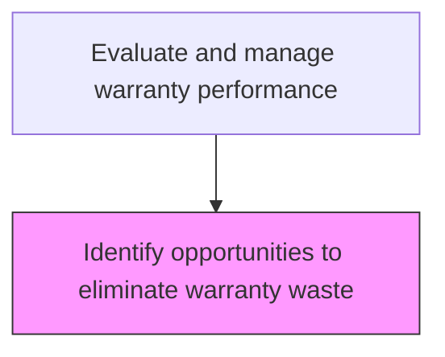
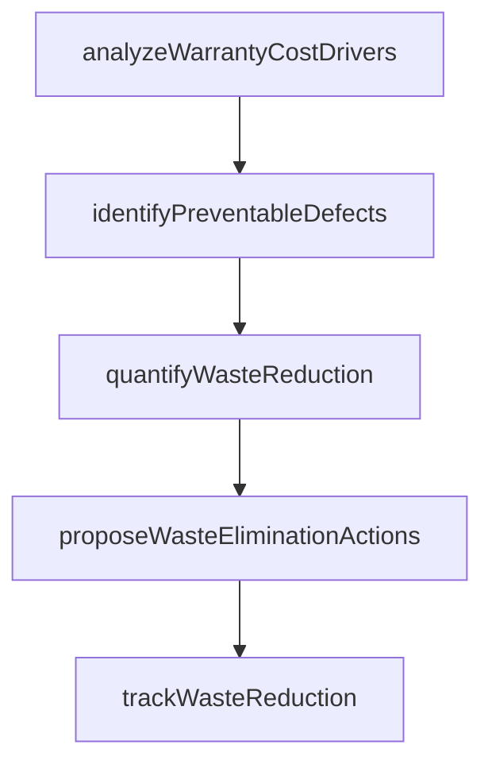

# Identify opportunities to eliminate warranty waste

> Business-as-Code definition for warranty waste elimination. Models the identification and reduction of unnecessary warranty costs through process improvement and defect prevention.

## Overview

Finding ways to phase out unused or seldom used warranties.

## Process Hierarchy



## GraphDL

```yaml
identify:
  object: Opportunities To Eliminate Warranty Waste
  actor: WarrantyWasteAnalyst
  result: WarrantyWasteResult
```

## Actions

| Action | Description |
|--------|-------------|
| analyzeWarrantyCostDrivers | Break down warranty expenditures to identify the largest cost categories |
| identifyPreventableDefects | Detect defect types that could be eliminated through design or process changes |
| quantifyWasteReduction | Calculate potential savings from eliminating identified warranty waste |
| proposeWasteEliminationActions | Recommend specific actions to reduce preventable warranty costs |
| trackWasteReduction | Monitor the impact of implemented waste elimination initiatives |

## Events

| Event | Description |
|-------|-------------|
| warrantyCostDriversAnalyzed | Warranty expenditures broken down to identify top cost categories |
| preventableDefectsIdentified | Defect types that could be eliminated through improvements detected |
| wasteReductionQuantified | Potential savings from eliminating warranty waste calculated |
| wasteEliminationActionsProposed | Specific actions to reduce preventable warranty costs recommended |
| wasteReductionTracked | Impact of implemented waste elimination initiatives monitored |

## Searches

| Search | Description |
|--------|-------------|
| getWarrantyCostBreakdown | Retrieve warranty cost breakdown by category, product, or period |
| getPreventableDefects | List defect types identified as preventable through design or process changes |
| getWasteReductionProgress | Query progress on warranty waste reduction initiatives |
| getCostSavingsProjections | Retrieve projected savings from waste elimination actions |

## Process Flow



## RACI Matrix

| Activity | Responsible | Accountable | Consulted | Informed |
|----------|-------------|-------------|-----------|----------|
| analyzeWarrantyCostDrivers | Warranty Cost Analyst | Warranty Manager | Finance | Quality |
| identifyPreventableDefects | Quality Improvement Engineer | VP Quality | Engineering | Product Management |
| trackWasteReduction | Warranty Cost Analyst | Warranty Manager | Finance | Executive Team |

## Related Processes

| Process | Relationship |
|---------|-------------|
| 6.5.6.2 Monitor and report on warranty management metrics | Related - waste data feeds warranty management reporting |
| 6.3.2 Process warranty claims | Upstream - claims data provides waste identification input |
| 2.4 Manage product quality | Downstream - waste findings inform product quality improvements |

## Related Departments

| Department | Role |
|-----------|------|
| Quality Assurance | Leads warranty waste analysis and elimination planning |
| Finance | Provides warranty cost data and validates savings calculations |
| Engineering | Implements design changes to prevent warranty-causing defects |

## Related Occupations

| Occupation | Involvement |
|-----------|-------------|
| Warranty Cost Analyst | Analyzes warranty costs to identify waste elimination opportunities |
| Quality Improvement Engineer | Develops defect prevention strategies |
| Financial Analyst | Validates cost projections and tracks savings |

## KPIs

| KPI | Description | Unit |
|-----|-------------|------|
| Warranty Cost Reduction | Period-over-period reduction in warranty costs | % |
| Preventable Defect Rate | Percentage of warranty claims attributed to preventable defects | % |
| Waste Elimination ROI | Return on investment for warranty waste elimination initiatives | Ratio |

## Usage

```typescript
import { identifyOpportunitiesToEliminateWarrantyWaste } from '@headlessly/identify-opportunities-to-eliminate-warranty-waste'

const client = identifyOpportunitiesToEliminateWarrantyWaste()

// Analyze warranty cost drivers
const costs = await client.analyzeWarrantyCostDrivers({
  period: '2025-Q1',
  productLines: ['X200', 'X300'],
  groupBy: 'defectType'
})

// Quantify waste reduction opportunity
const savings = await client.quantifyWasteReduction({
  defectTypes: costs.topDrivers.map(d => d.type),
  interventionType: 'design-improvement'
})
```
