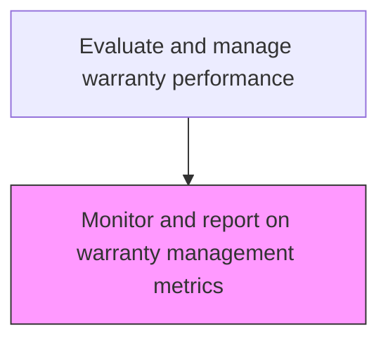
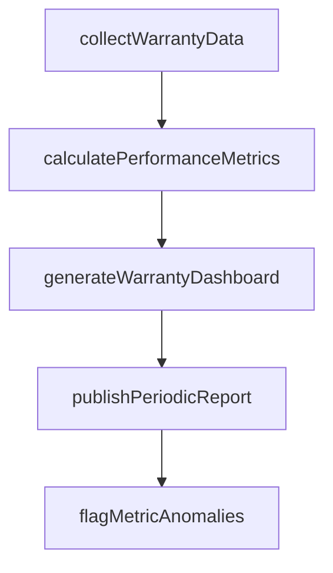

# Monitor and report on warranty management metrics

> Business-as-Code definition for warranty management metrics monitoring and reporting. Models the collection, calculation, and publication of warranty performance metrics for management review.

## Overview

Comparing warranties by using applicable metrics to see how they are handled and resolved. Develop and submit reports that summarize significant conclusions.

## Process Hierarchy



## GraphDL

```yaml
monitor:
  object: And Report On Warranty Management Metrics
  actor: WarrantyMetricsAnalyst
  result: WarrantyMetricsResult
```

## Actions

| Action | Description |
|--------|-------------|
| collectWarrantyData | Gather warranty claim, cost, and resolution data from all sources |
| calculatePerformanceMetrics | Compute warranty KPIs including claim rates, costs, and cycle times |
| generateWarrantyDashboard | Produce visual management dashboard of warranty performance metrics |
| publishPeriodicReport | Distribute warranty performance report to management stakeholders |
| flagMetricAnomalies | Alert leadership to unexpected changes in warranty performance indicators |

## Events

| Event | Description |
|-------|-------------|
| warrantyDataCollected | Warranty claim, cost, and resolution data gathered from all sources |
| performanceMetricsCalculated | Warranty KPIs including claim rates, costs, and cycle times computed |
| warrantyDashboardGenerated | Visual management dashboard of warranty performance produced |
| periodicReportPublished | Warranty performance report distributed to management stakeholders |
| metricAnomaliesFlagged | Unexpected changes in warranty performance indicators alerted |

## Searches

| Search | Description |
|--------|-------------|
| getWarrantyDashboard | Retrieve the latest warranty performance dashboard |
| getWarrantyKPIs | Query warranty KPI values by period, product, or region |
| getWarrantyReports | List published warranty performance reports by date |
| getMetricAnomalies | Retrieve flagged warranty metric anomalies for investigation |

## Process Flow



## RACI Matrix

| Activity | Responsible | Accountable | Consulted | Informed |
|----------|-------------|-------------|-----------|----------|
| collectWarrantyData | Warranty Analytics Manager | VP After-Sales | Finance, Quality | IT |
| calculatePerformanceMetrics | Business Intelligence Analyst | Warranty Analytics Manager | Finance | Quality |
| generateWarrantyDashboard | Business Intelligence Analyst | Warranty Analytics Manager | IT | Executive Team |

## Related Processes

| Process | Relationship |
|---------|-------------|
| 6.5.6.1 Measure customer satisfaction with warranty handling | Related - satisfaction data feeds warranty performance reporting |
| 6.5.6.3 Identify opportunities to eliminate warranty waste | Downstream - metrics highlight waste reduction opportunities |
| 6.3.2 Process warranty claims | Upstream - claims processing generates warranty performance data |

## Related Departments

| Department | Role |
|-----------|------|
| Customer Insights | Produces warranty performance reports and dashboards |
| Finance | Provides warranty cost metrics and financial data |
| Quality Assurance | Provides warranty quality metrics and trend data |

## Related Occupations

| Occupation | Involvement |
|-----------|-------------|
| Warranty Analytics Manager | Oversees warranty metric collection and reporting |
| Business Intelligence Analyst | Builds dashboards and calculates warranty KPIs |
| Financial Analyst | Provides warranty cost analysis for performance reporting |

## KPIs

| KPI | Description | Unit |
|-----|-------------|------|
| Dashboard Refresh Frequency | How often warranty performance dashboard is updated | Per Day |
| Report Publication Timeliness | Percentage of warranty reports published on schedule | % |
| Anomaly Detection Rate | Percentage of warranty metric anomalies detected within 24 hours | % |

## Usage

```typescript
import { monitorAndReportOnWarrantyManagementMetrics } from '@headlessly/monitor-and-report-on-warranty-management-metrics'

const client = monitorAndReportOnWarrantyManagementMetrics()

// Collect warranty performance data
const data = await client.collectWarrantyData({
  period: '2025-Q1',
  metrics: ['claim-rate', 'average-cost', 'cycle-time', 'satisfaction']
})

// Generate dashboard
const dashboard = await client.generateWarrantyDashboard({
  dataId: data.id,
  compareTo: '2024-Q1'
})
```
