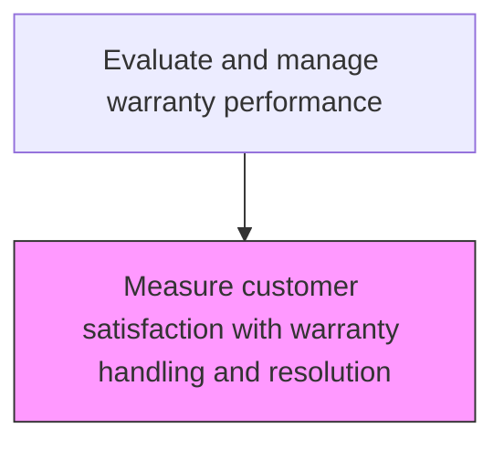
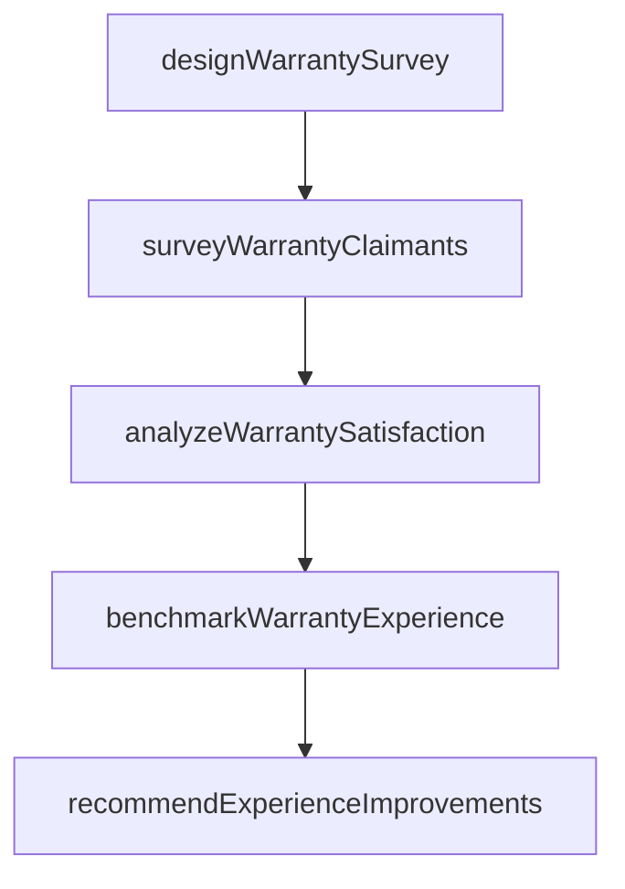

# Measure customer satisfaction with warranty handling and resolution

> Business-as-Code definition for warranty handling satisfaction measurement. Models the assessment of customer satisfaction with the warranty claim handling and resolution experience.

## Overview

Assessing customer satisfaction with the warranty claim handling and resolution experience through structured feedback collection and analysis. Design and deploy surveys targeting customers with recently resolved warranty claims, collect satisfaction ratings across key touchpoints such as claim submission ease, communication quality, repair or replacement timeliness, and final resolution outcome. Analyze satisfaction scores segmented by claim type, product line, resolution method, and service channel. Benchmark warranty experience ratings against industry standards and competitor performance, and recommend targeted improvements to the warranty handling process.

## Process Hierarchy



## GraphDL

```yaml
measure:
  object: Customer Satisfaction With Warranty Handling And Resolution
  actor: WarrantySatisfactionAnalyst
  result: WarrantySatisfactionResult
```

## Actions

| Action | Description |
|--------|-------------|
| designWarrantySurvey | Create satisfaction survey instruments specific to the warranty experience |
| surveyWarrantyClaimants | Distribute satisfaction surveys to customers with recently resolved claims |
| analyzeWarrantySatisfaction | Evaluate satisfaction scores by claim type, resolution method, and timeframe |
| benchmarkWarrantyExperience | Compare warranty satisfaction against industry standards and competitor performance |
| recommendExperienceImprovements | Propose actions to improve the warranty handling experience |

## Events

| Event | Description |
|-------|-------------|
| warrantySurveyDesigned | Satisfaction survey specific to warranty experience created |
| warrantyClaimantsSurveyed | Satisfaction surveys distributed to customers with resolved claims |
| warrantySatisfactionAnalyzed | Satisfaction scores evaluated by claim type and resolution method |
| warrantyExperienceBenchmarked | Warranty satisfaction compared against industry standards |
| experienceImprovementsRecommended | Actions proposed to improve warranty handling experience |

## Searches

| Search | Description |
|--------|-------------|
| getWarrantySatisfactionScores | Retrieve warranty satisfaction scores by claim type or period |
| getWarrantySurveyResponses | List warranty satisfaction survey responses and comments |
| getWarrantyBenchmarks | Query industry benchmark data for warranty satisfaction |
| getWarrantyExperienceGaps | Identify gaps between current warranty experience and benchmarks |

## Process Flow



## RACI Matrix

| Activity | Responsible | Accountable | Consulted | Informed |
|----------|-------------|-------------|-----------|----------|
| surveyWarrantyClaimants | Warranty Experience Analyst | Customer Insights Manager | Customer Service | Quality |
| analyzeWarrantySatisfaction | Warranty Experience Analyst | Customer Insights Manager | Quality | Service Operations |
| benchmarkWarrantyExperience | Customer Survey Manager | VP Customer Service | Warranty Manager | Executive Team |

## Related Processes

| Process | Relationship |
|---------|-------------|
| 6.5.6.2 Monitor and report on warranty management metrics | Related - satisfaction is a key warranty performance metric |
| 6.3.2 Process warranty claims | Upstream - claim resolution experience drives satisfaction |
| 6.5.4 Measure customer satisfaction with complaint handling | Related - shares satisfaction measurement methodology |

## Related Departments

| Department | Role |
|-----------|------|
| Customer Insights | Designs and manages warranty satisfaction measurement |
| Customer Service | Provides warranty interaction data and supports survey distribution |
| Quality Assurance | Uses satisfaction data to assess warranty process quality |

## Related Occupations

| Occupation | Involvement |
|-----------|-------------|
| Warranty Experience Analyst | Measures and analyzes warranty handling satisfaction |
| Customer Survey Manager | Manages warranty satisfaction survey programs |
| Quality Improvement Specialist | Develops improvements based on satisfaction findings |

## KPIs

| KPI | Description | Unit |
|-----|-------------|------|
| Warranty Satisfaction Score | Average customer satisfaction with warranty handling experience | Score (1-5) |
| Warranty NPS | Net Promoter Score for warranty handling experience | Score (-100 to 100) |
| Benchmark Gap | Difference between warranty satisfaction and industry benchmark | Points |

## Usage

```typescript
import { measureCustomerSatisfactionWithWarrantyHandlingAndResolution } from '@headlessly/measure-customer-satisfaction-with-warranty-handling-and-resolution'

const client = measureCustomerSatisfactionWithWarrantyHandlingAndResolution()

// Survey warranty claimants
const survey = await client.surveyWarrantyClaimants({
  claimStatus: 'resolved',
  resolvedDateRange: { from: '2025-03-01', to: '2025-03-31' },
  channel: 'email'
})

// Analyze warranty satisfaction
const analysis = await client.analyzeWarrantySatisfaction({
  period: '2025-Q1',
  dimensions: ['claimType', 'resolutionMethod', 'timeToResolve']
})
```
